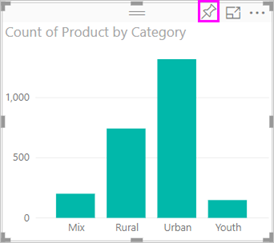

# パート 1、Power BI レポートへの視覚化の追加

この記事では、レポートで視覚化を作成する方法を簡単に説明します。 この記事は Power BI サービスと Power BI Desktop の両方に適用されます。 より高度な内容については、このシリーズの[パート 2](power-bi-report-add-visualizations-ii.md) をご覧ください。 Amanda がレポート キャンバスでのビジュアルの作成、編集、書式設定についてさまざまな方法を示します。 このデモの後に、[売上およびマーケティングのサンプル](../sample-datasets.md)を使用して、レポートを作成してみてください。

<iframe width="560" height="315" src="https://www.youtube.com/embed/IkJda4O7oGs" frameborder="0" allowfullscreen></iframe>

## レポートを開き、新しいページを追加します。

1. [レポートを編集表示で](../service-interact-with-a-report-in-editing-view.md)開きます。

    このチュートリアルでは、[売上およびマーケティングのサンプル](../sample-datasets.md)を使います。

1. **[フィールド]** ウィンドウが表示されない場合は、矢印アイコンを選んで開きます。

   

1. 空のページをレポートに追加します。

## 視覚化をレポートに追加する

1. 視覚化を作成するため、 **[フィールド]** ウィンドウでフィールドを選びます。

    **[SalesFact]**  >  **[Sales $]** のように、数値フィールドから始めます。 Power BI によって、1 つの列のみが含まれた縦棒グラフが作成されます。

    

    または、 **[名前]** 、 **[製品]** などのカテゴリ フィールドから始めます。 Power BI によってテーブルが作成され、そのフィールドが **[値]** ウェルに追加されます。

    ![[製品]、カテゴリの順に選択してテーブルを作成する動作を示す GIF。](media/power-bi-report-add-visualizations-i/pbi_agif_createchart3.gif)

    または、 **[地域]**  >  **[市区町村]** などの地理フィールドから始めます。 Power BI と Bing 地図によって、マップの視覚化が作成されます。

    

1. 視覚化を作成し、その種類を変更します。 **[商品]**  >  **[カテゴリ]** および **[商品]**  >  **[Count of Product]\(製品数\)** を選択し、その両方を **[値]** ウェルに追加します。

   ![[フィールド] ウィンドウと [値] ウェルのスクリーンショット。](media/power-bi-report-add-visualizations-i/part1table1.png)

1. **積み上げ縦棒グラフ** アイコンを選択して、視覚化を縦棒グラフに変更します。

   ![[視覚化] ウィンドウと積み上げ縦棒グラフ アイコンのスクリーンショット。](media/power-bi-report-add-visualizations-i/part1converttocolumn.png)

1. レポート内に視覚化を作成するときには、[視覚化をダッシュボードにピン留め](../service-dashboard-pin-tile-from-report.md)します。 視覚化をピン留めするには、ピン アイコン  を選択します。

   
  
## 次の手順

 次に進みます。

* [パート 2: Power BI レポートへの視覚化の追加](power-bi-report-add-visualizations-ii.md)」に進む

* レポート内の[視覚化を操作する](../consumer/end-user-reading-view.md)

* [視覚化に対しその他の操作を実行する](power-bi-report-visualizations.md)

* [レポートを保存する](../service-report-save.md)
