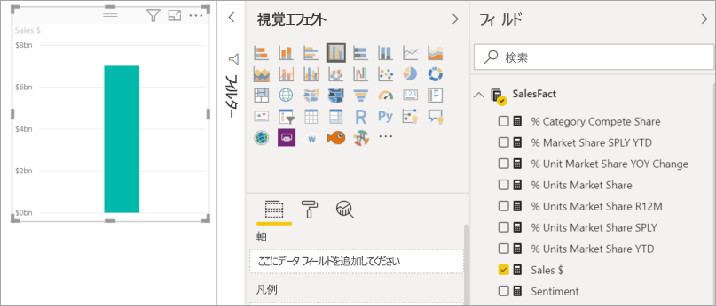
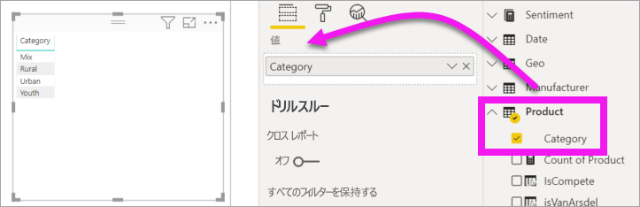
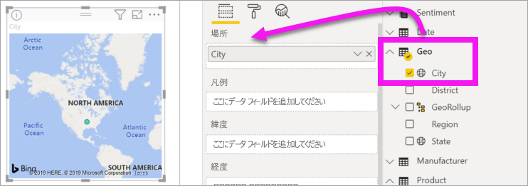

# Power BI レポートにビジュアルを追加する (パート 1)

[!INCLUDE[consumer-appliesto-nyyn](../includes/consumer-appliesto-nyyn.md)]    

[!INCLUDE [power-bi-visuals-desktop-banner](../includes/power-bi-visuals-desktop-banner.md)]

この記事では、レポートで視覚化を作成する方法を簡単に説明します。 この記事は Power BI サービスと Power BI Desktop の両方に適用されます。 より高度な内容については、このシリーズの[パート 2](power-bi-report-add-visualizations-ii.md) をご覧ください。

## 前提条件

このチュートリアルでは、[売上およびマーケティングの PBIX ファイル](https://download.microsoft.com/download/9/7/6/9767913A-29DB-40CF-8944-9AC2BC940C53/Sales%20and%20Marketing%20Sample%20PBIX.pbix)を使います。

1. Power BI Desktop メニュー バーの左上のセクションで、 **[ファイル]**  >  **[開く]** を選択します
   
2. **売上およびマーケティングのサンプル PBIX ファイル**を見つけます

1. **売上およびマーケティングのサンプル PBIX ファイル**をレポート ビュー  で開きます。

1. 選択  を選択して、新しいページを追加します。

> [!NOTE]
> Power BI を使用する同僚とレポートを共有するには、それぞれのユーザーが個別の Power BI Pro ライセンスを持っているか、レポートが Premium 容量に保存されている必要があります。 [レポートの共有](../collaborate-share/service-share-reports.md)に関するページをご覧ください

## 視覚化をレポートに追加する

1. 視覚化を作成するため、 **[フィールド]** ウィンドウでフィールドを選びます。

    **[Sales]**  >  **[TotalSales]** のように、数値フィールドから始めます。 Power BI によって、1 つの列のみが含まれた縦棒グラフが作成されます。

    

    または、 **[名前]** 、 **[製品]** などのカテゴリ フィールドから始めます。 Power BI によってテーブルが作成され、そのフィールドが **[値]** ウェルに追加されます。

    

    または、 **[地域]**  >  **[市区町村]** などの地理フィールドから始めます。 Power BI と Bing 地図によって、マップの視覚化が作成されます。

    

## 視覚化のタイプを変更する

 視覚化を作成し、その種類を変更します。 
 
 1. **[商品]**  >  **[カテゴリ]** および **[商品]**  >  **[Count of Product]\(製品数\)** を選択し、その両方を **[値]** ウェルに追加します。

    ![[フィールド] ウィンドウと [値] ウェルのスクリーンショット。](media/power-bi-report-add-visualizations-i/power-bi-create-visual.png)

1. **積み上げ縦棒グラフ** アイコンを選択して、視覚化を縦棒グラフに変更します。

   ![[視覚化] ウィンドウと積み上げ縦棒グラフ アイコンのスクリーンショット。](media/power-bi-report-add-visualizations-i/power-bi-convert.png)

1. ビジュアルの並べ替え方法を変更するには、 **[その他のアクション]** (...) を選択します。並べ替えオプションを使用して、並べ替えの方向 (昇順または降順) を変更し、並べ替えに使用する列 ( **[並べ替えの基準]** ) を変更します。

   ![[その他のアクション] ドロップダウンのスクリーンショット。](media/power-bi-report-add-visualizations-i/power-bi-sort.png)
  
## 次の手順

 次に進みます。

* [パート 2: Power BI レポートへの視覚化の追加](power-bi-report-add-visualizations-ii.md)」に進む

* レポート内の[視覚化を操作する](../consumer/end-user-reading-view.md)
