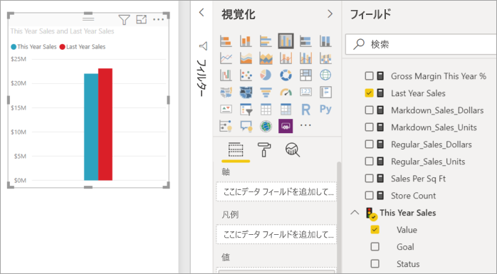
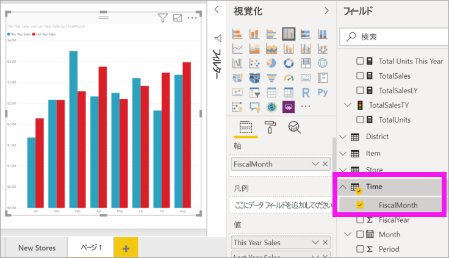
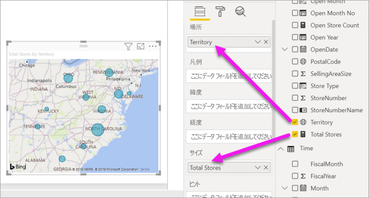

# Power BI レポートにビジュアルを追加する (パート 2)

[!INCLUDE [power-bi-visuals-desktop-banner](../includes/power-bi-visuals-desktop-banner.md)]

[パート 1](power-bi-report-add-visualizations-i.md) では、フィールド名の横にあるチェックボックスを選んで、基本的な視覚化を作成しました。  パート 2 では、ドラッグ アンド ドロップを使用し、 **[フィールド]** ペインと **[視覚化]** ペインを最大限活用して、視覚化を作成および変更する方法について説明します。

## 視覚化の新規作成
このチュートリアルでは、小売の分析のデータセットを詳しく調べ、いくつかの主要な視覚化を作成します。

## 前提条件

このチュートリアルでは、[小売の分析のサンプル PBIX ファイル](https://download.microsoft.com/download/9/6/D/96DDC2FF-2568-491D-AAFA-AFDD6F763AE3/Retail%20Analysis%20Sample%20PBIX.pbix)を使用します。

1. Power BI Desktop メニュー バーの左上のセクションで、 **[ファイル]**  >  **[開く]** を選択します
   
2. **小売の分析のサンプル PBIX ファイル**を探します。

1. **小売の分析のサンプル PBIX ファイル**をレポート ビュー  で開きます。

1. Select  を選択して、新しいページを追加します。

## 視覚化をレポートに追加する

視覚化を作成するため、 **[フィールド]** ウィンドウでフィールドを選びます。 作成される視覚化の種類は、選択したフィールドの種類によって異なります。 Power BI では、データ型を使用して、結果の表示に使用する視覚化を決定します。 [視覚化] ペインから別のアイコンを選択することにより、使用される視覚化を変更できます。 すべての視覚化でデータを表示できるわけではないことに注意してください。 たとえば、じょうごグラフや折れ線グラフを使用すると、地理データは適切に表示されません。 

### 今年の売上を昨年と比較した面グラフを追加する

1. **[セールス]** テーブルで **[This Year Sales]** (今年の売上) >  **[値]** 、 **[Last Year Sales]** (前年の売上) を選びます。 Power BI によって縦棒グラフが作成されます。  このグラフは興味深いため、詳しく分析していきましょう。 月別の売上はどのような状況でしょうか?  
   
   

2. 時間テーブルから、 **[FiscalMonth]** を **[軸]** 領域までドラッグします。  
   

3. [視覚化を面グラフに変更](power-bi-report-change-visualization-type.md)します。  選択できる視覚化には多くの種類があります。どの種類を使ったらよいか調べるには、[それぞれの種類についての説明、ベスト プラクティスのヒント、チュートリアル](power-bi-visualization-types-for-reports-and-q-and-a.md)をご覧ください。 [視覚化] ペインから [面グラフ] アイコン ![[視覚化] ペインの [面グラフ] アイコン](media/power-bi-report-add-visualizations-ii/power-bi-area-chart.png) を選びます。

4. **[その他のアクション]** (...) を選択し、 **[並べ替えの基準]**  >   **[FiscalMonth]** の順に選択して、視覚化を並べ替えます。

5. [視覚化のサイズを変更](power-bi-visualization-move-and-resize.md)するため、視覚化を選び、輪郭の円の 1 つをグラブしてドラッグします。 幅を広げればスクロール バーが不要になり、小さくすれば別の視覚化を追加する領域を確保できます。
   
   
6. [レポートを保存](../service-report-save.md)します。

### 場所別の売上を示すマップ視覚化を追加

1. **[Store]\(店舗\)** テーブルで **[Territory]** を選びます。 **[Total Stores]** (総店舗数) を [サイズ] 領域までドラッグします。 Power BI は [担当地域] が場所であることを認識するため、マップの視覚化を作成します。  
   

2. 凡例を追加します。  店舗名別にデータを表示するには、 **[Store]\(店舗\)**  >  **[Chain]\(チェーン\)** を [凡例] 領域までドラッグします。  
   ![[フィールド] リストの [Chain]\(チェーン\) から [凡例] バケットの [Chain]\(チェーン\) を指す矢印が示されたレポート キャンバス](media/power-bi-report-add-visualizations-ii/power-bi-chain.png)

## 次のステップ
* 「[Power BI レポートでの視覚化](power-bi-report-visualizations.md)」をご覧ください。  
* 他にわからないことがある場合は、 [Power BI コミュニティを利用してください](https://community.powerbi.com/)。

