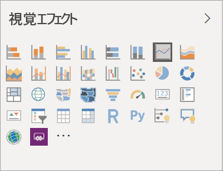

# Power BI レポートでの視覚エフェクト

[!INCLUDE[consumer-appliesto-yyyn](../includes/consumer-appliesto-yyyn.md)]    

視覚エフェクト (略してビジュアルとも呼ばれる) には、データ内で検出された分析情報が表示されます。 Power BI レポートは、ビジュアルが 1 つ使用された単一のページのこともあれば、ビジュアルが多数含まれる複数ページから成ることもあります。 Power BI サービスでは、ビジュアルを[レポートからダッシュボードにピン留め](../create-reports/service-dashboard-pin-tile-from-report.md)することができます。

レポートの "*デザイナー*" とレポートの "*コンシューマー*" とを区別することは重要です。  レポートのビルドまたは修正を行うのであれば、デザイナーということになります。  デザイナーには、レポートとその基になるデータセットに対して編集のためのアクセス許可が付与されます。 これは、Power BI Desktop では、データ ビューでデータセットを開き、レポート ビューでビジュアルを作成できることを意味し、 Power BI サービスでは、レポート エディターの[編集ビュー](../consumer/end-user-reading-view.md)で、データセットまたはレポートを開くことができることを意味します。 自分がレポートまたはダッシュボードの[共有相手](../consumer/end-user-shared-with-me.md)である場合は、レポート *コンシューマー*となります。 レポートとそのビジュアルを表示および操作することはできますが、"*デザイナー*" ほど多くの変更をすることはできません。

さまざまな種類のビジュアルを Power BI の [Visualizations]\(ビジュアル\) ペインで直接使用できます。

この他にも多くの選択肢があります。[Microsoft AppSource コミュニティ サイト](https://appsource.microsoft.com)にアクセスし、Microsoft およびコミュニティによって提供されている [Power BI ビジュアル](https://appsource.microsoft.com/marketplace/apps?page=1&product=power-bi-visuals)を見つけて、[ダウンロード](../developer/visuals/custom-visual-develop-tutorial.md)してください。

Power BI を初めて使用する場合や、復習したい場合は、以下のリンクを使用して、Power BI 視覚エフェクトの基本を確認してください。  または、目次 (この記事の左側) を使用して役に立つ情報を見つけます。

## Power BI での視覚化の追加

レポートのページに[視覚エフェクトを作成](power-bi-report-add-visualizations-i.md)します。 [使用できる視覚化と使用できる視覚化のチュートリアルの一覧](power-bi-visualization-types-for-reports-and-q-and-a.md)を参照します。 

## カスタムの視覚化をアップロードして Power BI で使用する

自分で作成した、または [Microsoft AppSource コミュニティ サイト](https://appsource.microsoft.com/marketplace/apps?product=power-bi-visuals)で見つけたカスタムの視覚エフェクトを追加します。 このサイトには、カスタムの視覚化が追加されており、ダウンロードしてダッシュボードやレポートに使用することができます。 ソース コードを調べ、[開発者ツール](../developer/visuals/custom-visual-develop-tutorial.md)を使用して新しい視覚化の種類を作成して、[コミュニティと共有](../developer/visuals/office-store.md)してください。 カスタム ビジュアルの開発について詳しくは、「[Power BI カスタム ビジュアルを開発する](../developer/visuals/custom-visual-develop-tutorial.md)」をご覧ください。

## 個人設定された [視覚化] ウィンドウ (プレビュー)

多数のレポート間で同じカスタム ビジュアルを使用している場合、[視覚化] ウィンドウにカスタム視覚エフェクトをピン留めできます。 視覚化をピン止めするには、ビジュアル上で右クリックしてウィンドウにピン留めします。

![[視覚化] ウィンドウへのピン留め](media/power-bi-report-visualizations/power-bi-pin-custom-visual-option.png)

ビジュアルがピン留めされると上に移動し、他の組み込みのビジュアルとともにライブになります。 このビジュアルは、サインインしているアカウントに関連付けられます。そのため、ビルドするすべての新しいレポートで、サインインしているという想定で、このビジュアルが自動的に含められます。 これにより、特定のビジュアルを 1 つ 1 つのレポートに追加することなく標準化するのが非常に簡単になります。

![個人設定された [視覚化] ウィンドウ](media/power-bi-report-visualizations/power-bi-personalized-visualization-pane.png)

この機能のプレビュー期間中は、ピン留めされたビジュアルのみが Power BI Desktop に表示されます。 さらに、この機能を利用するには、サインインが必要です。

## 視覚化の種類の変更

[視覚エフェクトの種類の変更](power-bi-report-change-visualization-type.md)を試して、そのデータに関して最も効果的な視覚エフェクトを確認します。

## 視覚化のピン留め

Power BI サービスでは、希望する視覚エフェクトができたら、タイルとしてその[視覚エフェクトをダッシュボードにピン留め](../create-reports/service-dashboard-pin-tile-from-report.md)します。 ピン留めした後、レポートで使用されている視覚エフェクトを変更しても、ダッシュボードのタイルは変更されません。つまり、レポート内の視覚エフェクトが折れ線グラフである場合、それをドーナツ グラフに変更しても、視覚エフェクトは折れ線グラフのままです。

## 制限事項と考慮事項
- データ ソースやフィールド数 (メジャーまたは列) によっては、ビジュアルの読み込みが遅い場合があります。  読みやすさとパフォーマンス上の理由により、ビジュアルを合計 10 から 20 個のフィールドに制限することをお勧めします。 

- ビジュアルの上限は、フィールド 100 個です (メジャーまたは列)。 ビジュアルの読み込みに失敗した場合は、フィールド数を減らします。   

## 次のステップ

* [Power BI での視覚化の種類](power-bi-visualization-types-for-reports-and-q-and-a.md)
* [Power BI ビジュアル](../developer/visuals/power-bi-custom-visuals.md)
