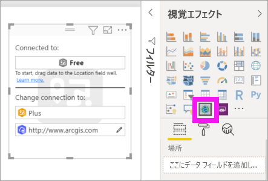
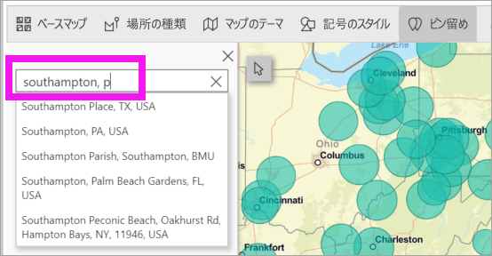
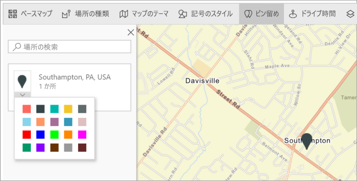
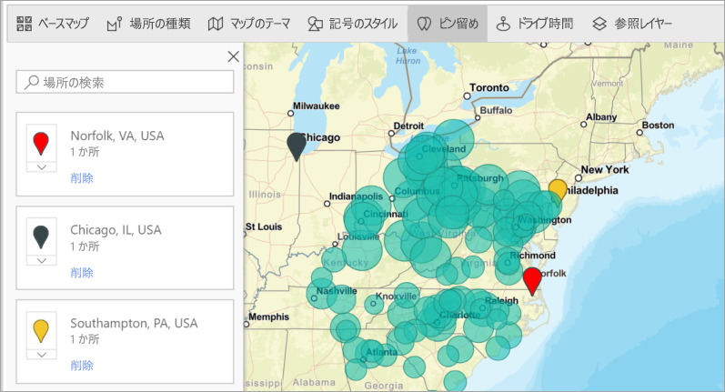
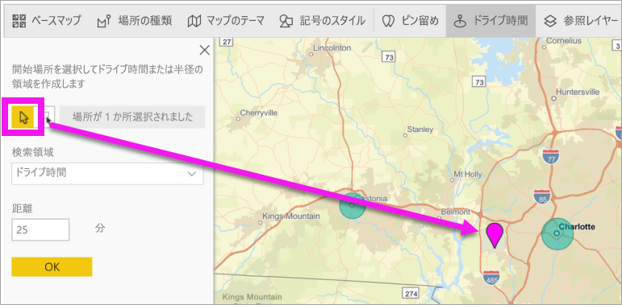
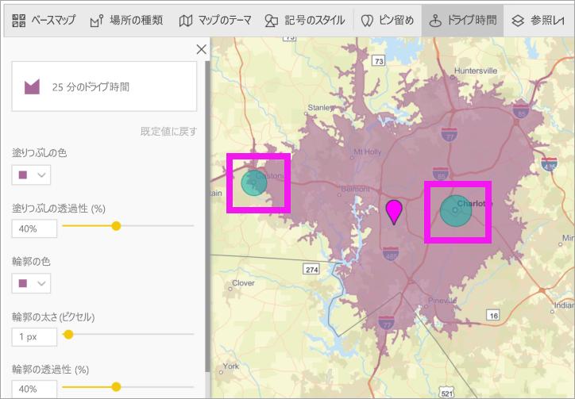
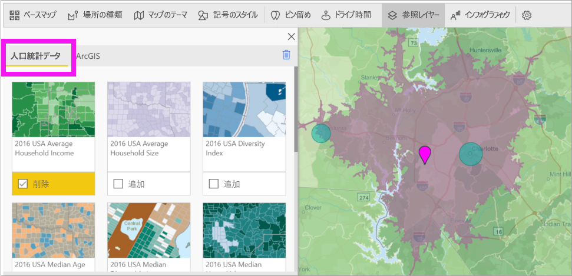
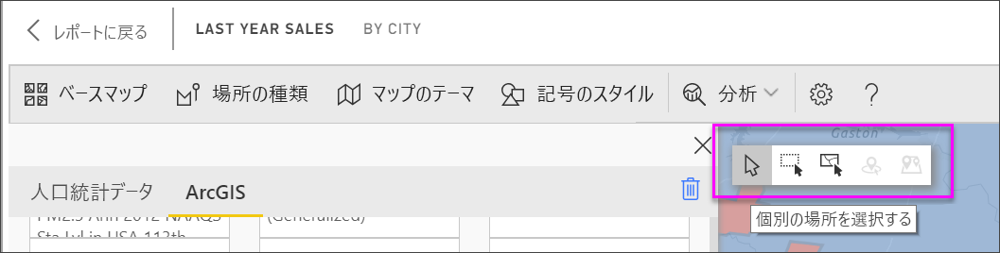
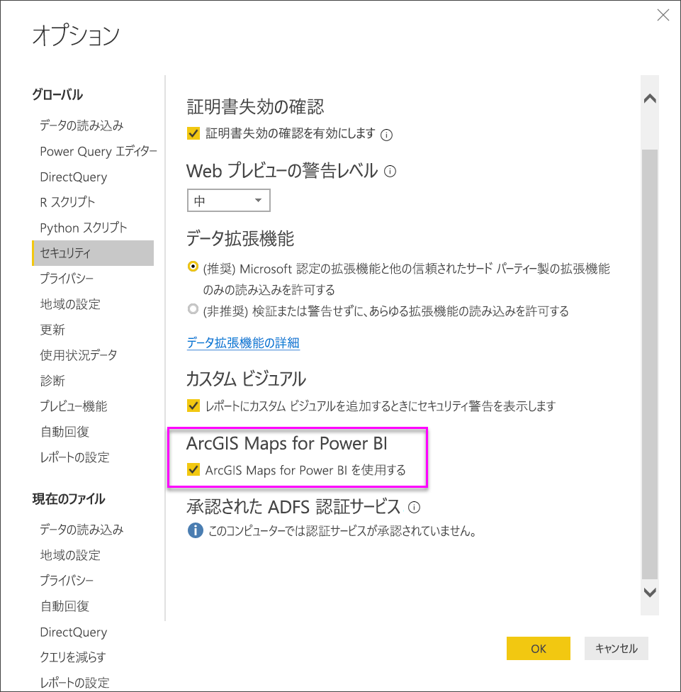
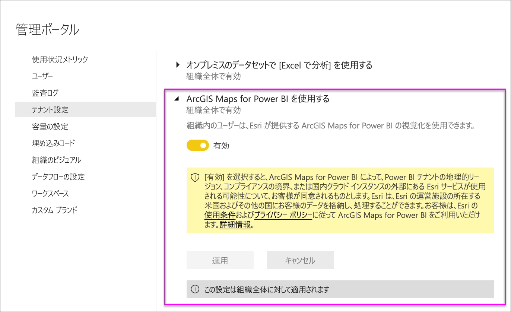

# Power BI Desktop で ArcGIS マップを作成する

[!INCLUDE [power-bi-visuals-desktop-banner](../includes/power-bi-visuals-desktop-banner.md)]

このチュートリアルは、ArcGIS Maps for Power BI を作成するユーザーの視点で書かれています。 "*デザイナー*" が同僚と ArcGIS Maps for Power BI マップを共有すると、その同僚はマップを表示および操作できますが、変更を保存することはできません。 ArcGIS マップの表示方法の詳細については、「[ArcGIS Maps for Power BI の操作](power-bi-visualizations-arcgis.md)」を参照してください。

ArcGIS マップと Power BI を組み合わせると、マッピングをマップ上のポイントの表現を越える、まったく新しいレベルに引き上げることができます。 基本マップ、場所の種類、テーマ、記号のスタイル、および参照レイヤーから選択して、すばらしい有益なマップの視覚エフェクトを作成します。 空間分析を使用してマップ上で権限のあるデータのレイヤーを組み合わせることで、より深く理解できる視覚化されたデータを伝達します。

 モバイル デバイスでは、ArcGIS Maps for Power BI マップを作成することはできませんが、表示して操作することはできます。 「[Power BI での ArcGIS マップとの対話](power-bi-visualizations-arcgis.md)」をご覧ください。

> [!NOTE]
> 現在、ArcGIS maps for Power BI は Power BI Report Server では使用できません。

> [!TIP]
> GIS は Geographic Information System (地理情報システム) の略です。

次の例では、濃い灰色のキャンバスを使用して、2016 年の平均可処分所得の人口統計レイヤーに対するヒートマップとして、地域の売上を示しています。 読み進めるとわかるように、ArcGIS Maps for Power BI を使用すると、強化されたマッピング機能、人口統計データ、さらにより説得力のあるマップの視覚エフェクトがほぼ際限なく提供されるため、最適なストーリーを伝えることができます。

> [!TIP]
> 多くの例やユーザーの声を参照するには、[Esri の ArcGIS Maps for Power BI に関するページ](https://www.esri.com/powerbi)にアクセスしてください。 その後、Esri の [ArcGIS Maps for Power BI の基本操作](https://doc.arcgis.com/en/maps-for-powerbi/get-started/about-maps-for-power-bi.htm)に関するページを参照してください。

## ユーザーの同意
ArcGIS Maps for Power BI は Esri (https://www.esri.com) によって提供されます。 Power BI の ArcGIS マップのご利用の際には、Esri の使用条件およびプライバシー ポリシーが適用されます。 Power BI の ArcGIS マップ ビジュアルの使用を希望される Power BI ユーザーは、同意ダイアログを受け入れる必要があります。

**リソース**

[使用条件](https://go.microsoft.com/fwlink/?LinkID=826322)

[プライバシー ポリシー](https://go.microsoft.com/fwlink/?LinkID=826323)

[Power BI の ArcGIS マップ製品ページ](https://www.esri.com/powerbi)

## 前提条件

このチュートリアルでは、Power BI Desktop と PBIX の[小売の分析のサンプル](https://download.microsoft.com/download/9/6/D/96DDC2FF-2568-491D-AAFA-AFDD6F763AE3/Retail%20Analysis%20Sample%20PBIX.pbix)を使用します。 また、Power BI サービスを使用して ArcGIS Maps for Power BI を作成することもできます。 

1. メニューバーの左上にある **[ファイル]** \> **[開く]** を選択します。
   
2. ローカル コンピューターに保存されている**小売の分析のサンプル PBIX ファイル**を見つけます。

1. **小売りの分析のサンプル**をレポート ビュー  で開きます。

1. 選択  を選択して、新しいページを追加します。

   
## ArcGIS Maps for Power BI マップの視覚エフェクトを作成する

何種類かの視覚エフェクトを作成したら、以下の手順を使用して、[小売の分析のサンプル .PBIX ファイル](../sample-datasets.md)を使用してみてください。
    

   > [!NOTE]
   > このビデオでは、古いバージョンの Power BI Desktop を使用しています。
   > 

> [!VIDEO https://www.youtube.com/embed/EKVvOZmxg9s]

1. [視覚化] ウィンドウで、Power BI の ArcGIS マップ アイコンを選択します。
   
    ![ArcGIS マップの [視覚化] ペイン](media/power-bi-visualization-arcgis/power-bi-viz-pane.png)    

2. Power BI では、レポート キャンバスに空のマップ テンプレートが追加されます。 このチュートリアルでは、無料バージョンを使用します。
   
   

3. **[フィールド]** ウィンドウで、データ フィールドを **[場所]** または **[緯度]** や **[経度]** バケットにドラッグします。 この例では、 **[ストア] > [市区町村]** を使用しています。
   
   > [!NOTE]
   > 選択したフィールドがマップの図形またはポイントとして最適に表示されているかどうかは、Power BI の ArcGIS マップによって自動的に検出されることに注意してください。 設定の既定値は調整することができます (下記参照)。
   > 
   > 
   
    ![ArcGIS の [フィールド] ペイン](media/power-bi-visualization-arcgis/power-bi-fields-pane3new.png)

4. **[フィールド]** ウィンドウで、メジャーを **[サイズ]** バケットにドラッグして、データの表示方法を調整します。 この例では、 **[Sales]\(売上\) > [Last Year Sales]\(昨年の売上高\)** を使用しています。
   
    

最初の ArcGIS Maps for Power BI マップを作成しました。 ここで、ベース マップ、場所の種類、テーマなどを使用してマップを調整し、書式設定してみましょう。

## ArcGIS Maps for Power BI の設定と書式設定
**Power BI の ArcGIS マップ**書式設定機能にアクセスするには、次の手順を実行します。

1. 視覚エフェクトの右上隅にある **[その他のアクション]** (...) を選択し、 **[編集]** を選択します。
   
   ![ArcGIS の [編集] ペイン](media/power-bi-visualization-arcgis/power-bi-edit2.png)
   
   視覚エフェクトが展開され、使用可能な機能が上部に表示されます。 各機能を選択すると、詳細なオプションを示す作業ウィンドウが開きます。 
   
   ![Esri の [機能] ペイン](media/power-bi-visualization-arcgis/power-bi-esri-features-new.png)
   

> [!TIP]
> **Esri** は、**Power BI の ArcGIS マップ**の機能セットに関する[包括的なドキュメント](https://go.microsoft.com/fwlink/?LinkID=828772)を提供します。

### ベース マップ
次の 4 つのベースマップが提供されています:キャンバス (ダーク グレー)、キャンバス (ライト グレー)、オープン ストリート マップ、ストリート。  "*ストリート*" は、ArcGIS の標準的なベース マップです。

ベース マップを適用するには、作業ペインで選択します。

### 場所の種類
ArcGIS Maps for Power BI では、マップにデータを表示する最適な方法が自動的に検出されます。 ポイントまたは境界から選択されます。 [場所の種類] のオプションを使用すれば、これらの選択を微調整できます。

**境界**は、データに標準の地理的な値が含まれている場合にのみ機能します。 ArcGIS Maps for Power BI では、マップに表示する図形が自動的に特定されます。 標準の地理的な値には、国、都道府県、郵便番号などが含まれます。ただし、ジオコーディングと同様に、Power BI では、フィールドを既定で境界にする必要があると検出されない可能性もあれば、データの境界が検出されない可能性もあります。  

### マップのテーマ
4 つのマップ テーマが提供されます。 Power BI では、 **[場所]** および **[サイズ]** バケットに追加したフィールドに基づいて、 **[Location only]\(場所のみ\)** または **[サイズ]** のテーマが自動的に選択されます。 このマップでは、両方のバケットにフィールドを追加したため、既定で **[サイズ]** が選択されています。 次の手順に進む前に、他のテーマも試してから、 **[サイズ]** に戻してください。  

<table>
<tr><th>切り替え</th><th>Description</th>
<tr>
<td>場所のみ</td>
<td>[場所] バケットに追加したフィールドに基づいて、マップにデータ ポイントまたは塗りつぶされた境界がプロットされます。</td>
</tr>
<tr>
<td>ヒート マップ</td>
<td>マップにデータの強度がプロットされます。 アクティビティまたは値が高くなっている領域は、より強く輝く色で表されます。 </td>
</tr>
<tr>
<td>サイズ</td>
<td>[サイズ] バケットに追加したフィールドに基づいて、マップにデータ ポイントがプロットされます。</td>
</tr>
<tr>
<td>クラスタリング</td>
<td>指定されたクラスター半径内のポイントは、マップのその領域内のポイントの数を表す 1 つの記号にグループ化されます。 </td>
</tr>
</table>

### 記号のスタイル
記号のスタイルを使用すると、マップ上にデータを表示する方法を微調整できます。 記号のスタイルは、選択した場所の種類とマップのテーマに基づき、コンテキストに依存します。 次の例では、マップのテーマが**サイズ**に設定され、いくつかの記号のスタイルで透過性、スタイル、サイズが調整されていることが示されています。 

### ピン留め
ピン留めを追加することで、マップ上のポイントに注意を促します。  

1. **[Pins]** (ピン留め) タブを選択します。
2. 検索ボックスにキーワード (住所、場所、対象の地点など) を入力し、ドロップダウン リストから選びます。 記号がマップに表示され、マップでは場所が自動的に拡大されます。 検索結果は、ピン ウィンドウに場所カードとして保存されます。 最大 10 個の場所カードを保存することができます。
   
   
3. Power BI でその場所にピン留めが追加され、ユーザーがピン留めの色を変更できます。
   
   
4. ピン留めを追加および削除します。
   
   

### ドライブ時間
ドライブ時間ウィンドウでは、場所を選択して、指定した半径またはドライブ時間の範囲内にある他のマップ機能を確認できます。 次の例は、ワシントン D.C. から半径 50 マイルを示しています。  自分のドライブ時間レイヤーを作成するには、次の手順に従います。 
    

1. 単一選択ツールを選択し、ピンまたはバブルを選択します。 この例では、シャーロット ダグラス空港に対してピンが選択されています。

   
   
   > [!TIP]
   > マップを拡大した方が場所を簡単に選択できます。 \+ アイコンまたはマウスのスクロールを使用して拡大できます。
   > 
   > 
2. たとえば、数日間シャーロット ダグラス空港に乗り入れているため、自分のチェーン店のどの店舗が空港からの車移動に適した距離にあるかを把握したいとします。 検索領域を **[ドライブ時間]** に変更し、距離を **[25]** 分に変更します。 [OK] を選択します。    
   
    

    

3. 25 分のドライブ圏内には、2 つの店舗があります。 半径は紫色で示されます。 場所を選択して詳細を表示します。 必要に応じて、色やアウトラインを変更して半径の書式を設定します。
   
    

### 参照レイヤー
#### 参照レイヤー - 人口統計
Power BI の ArcGIS マップでは、Power BI からのデータのコンテキスト化に役立つ人口統計レイヤーを選択できます。

1. **[参照レイヤー]** タブを選択し、 **[人口統計]** を選択します。
2. リストされるレイヤーにはそれぞれチェック ボックスがあります。 チェックマークを追加して、マップにそのレイヤーを追加します。  この例では、平均世帯年収を追加しました。 
   
    
3. 各レイヤーも対話型です。 バブルの上にマウス ポインターを移動すると、詳細が表示されます。 網掛けされた領域をクリックすると、グラフ形式で詳細が表示されます。 ここで、郵便番号 28227 を選択すると、2 つのグラフが表示可能になります。
   
    

#### 参照レイヤー - ArcGIS
ArcGIS Online で、組織はパブリック Web マップを発行することができます。 さらに、Esri は Living Atlas を通じて選別された Web マップ セットを提供します。 [ArcGIS] タブでは、すべてのパブリック Web マップまたは Living Atlas マップを検索し、参照レイヤーとしてマップに追加することができます。

1. **[参照レイヤー]** タブを選択し、 **[ArcGIS]** を選択します。
2. 検索語句を入力し、マップ レイヤーを選択します。 この例では、米国の下院選挙区を選択しました。
   
    
3. 詳細を表示するには、網掛け部分を選択して *[Select from reference layer]\(参照レイヤーから選択\)* を開きます。この場合、参照レイヤーの選択ツールを使用して、参照レイヤーの境界またはオブジェクトを選択します。

 

## データ ポイントを選択する
Power BI の ArcGIS マップを使用すると、データを正確かつ迅速に選択できる 5 つの選択モードを利用できます。

次の図に示すように、単一選択ツール アイコンの上にカーソルを置いて、選択モードを変更します。 これにより、非表示のバーが展開され、追加のツールが表示されます。

各ツールには、データを選択するための独自の役割があります。 

 個々のデータ ポイントを選択します。

 マップに四角形を描画し、含まれるデータ ポイントを選択します。

 参照レイヤー内で境界または多角形を使用して、含まれるデータ ポイントを選択することができます。

 バッファー レイヤーを使用してデータを選択できます。

 相互に類似したデータ ポイントを選択できます。

> [!NOTE]
> 一度に最大 250 のデータ ポイントを選ぶことができます。
> 
> 

 

## ヘルプの表示
**Esri** は、**Power BI の ArcGIS マップ**の機能セットに関する[包括的なドキュメント](https://go.microsoft.com/fwlink/?LinkID=828772)を提供します。

[**Power BI の ArcGIS マップ**](https://go.microsoft.com/fwlink/?LinkID=828771)に関する Power BI コミュニティ スレッドで、質問、最新情報の検索、問題の報告、および回答の検索を行うことができます。

改善の提案がある場合は、[Power BI のアイデア リスト](https://ideas.powerbi.com)に送信してください。

 

## 組織内での Power BI の ArcGIS マップの使用を管理する
Power BI を使用すると、デザイナー、テナント管理者、および IT 管理者は ArcGIS Maps for Power BI の使用を管理できるようになります。 以下で、各ロールで実行できる手順を確認します。 

### デザイナーのオプション
Power BI Desktop では、デザイナーは [セキュリティ] タブで ArcGIS Maps for Power BI を無効にできます。 **[ファイル]**  >  **[オプションと設定]** を選択し、 **[オプション]**  >  **[セキュリティ]** を選択します。 無効になると、ArcGIS マップは既定では読み込まれなくなります。

### テナント管理オプション
PowerBI.com では、テナント管理者はすべてのユーザーに対して ArcGIS Maps for Power BI を無効にすることができます。 **[設定]**  >  **[管理ポータル]**  >  **[テナント設定]** を選択します。 無効にした場合、Power BI の [視覚化] ペインに ArcGIS Maps for Power BI アイコンが表示されなくなります。

### IT 管理者オプション
Power BI Desktop では、組織に配置されているコンピューター全体で Power BI の ArcGIS マップを無効にするために**グループ ポリシー**を使用できます。

<table>
<tr><th>属性</th><th>値</th>
</tr>
<tr>
<td>キー</td>
<td>Software\Policies\Microsoft\Power BI Desktop&lt;/td&gt;
</tr>
<tr>
<td>valueName</td>
<td>EnableArcGISMaps</td>
</tr>
</table>

値が 1 (10 進数) の場合は、Power BI の ArcGIS マップが有効になります。

値が 0 (10 進数) の場合は、Power BI の ArcGIS マップが無効になります。

## 考慮事項と制限事項
ArcGIS Maps for Power BI は、次のサービスとアプリケーションで使うことができます。

<table>
<tr><th>サービス/アプリ</th><th>使用できるかどうか</th></tr>
<tr>
<td>Power BI Desktop</td>
<td>はい</td>
</tr>
<tr>
<td>Power BI サービス (app.powerbi.com)</td>
<td>はい</td>
</tr>
<tr>
<td>Power BI モバイル アプリケーション</td>
<td>はい</td>
</tr>
<tr>
<td>Power BI Publish to Web</td>
<td>いいえ</td>
</tr>
<tr>
<td>Power BI Embedded</td>
<td>いいえ</td>
</tr>
<tr>
<td>Power BI サービスの埋め込み (PowerBI.com)</td>
<td>いいえ</td>
</tr>
</table>

ArcGIS Maps for Power BI を使うことができないサービスまたはアプリケーションでは、視覚エフェクトが Power BI のロゴを含む空のビジュアルとして表示されます。

住所をジオコード化すると、最初の 1500 個の住所だけがジオコード化されます。 場所の名前または国のジオコーディングは、1,500 件という住所制限の対象には含まれません。

 

**ArcGIS Maps for Power BI が連携するしくみ**
ArcGIS Maps for Power BI は Esri (https://www.esri.com) によって提供されます。 Power BI の ArcGIS マップのご利用の際には、Esri の[使用条件](https://go.microsoft.com/fwlink/?LinkID=8263222)および[プライバシー ポリシー](https://go.microsoft.com/fwlink/?LinkID=826323)が適用されます。 Power BI の ArcGIS マップ ビジュアルの使用を希望される Power BI ユーザーは、同意ダイアログを受け入れる必要があります (詳細については「ユーザーの同意」をご覧ください)。  Esri の ArcGIS Maps for Power BI の使用には Esri の使用条件とプライバシー ポリシーが適用され、同意ダイアログからもリンクされています。 各ユーザーは、ArcGIS Maps for Power BI を初めて使う前に同意する必要があります。 ユーザーが同意すると、ビジュアルにバインドされたデータは少なくともジオコーディングのために Esri のサービスに送信され、マップで表すことができる緯度と経度の情報に場所情報が変換されます。 データの視覚エフェクトにバインドされているすべてのデータが Esri のサービスに送信されるものと想定する必要があります。 Esri は、基本マップ、空間分析、ジオコーディングなどのサービスを提供します。ArcGIS Maps for Power BI のビジュアルは、Esri によって提供および保持されている証明書によって保護された SSL 接続を使って、これらのサービスと対話します。 ArcGIS Maps for Power BI に関する追加情報は、Esri の [ArcGIS Maps for Power BI 製品ページ](https://www.esri.com/powerbi)から入手できます。

ユーザーが ArcGIS Maps for Power BI を通じて Esri から提供されている Plus サブスクリプションにサインアップすると、ユーザーは Esri と直接的な関係を結ぶことになります。 Power BI は、Esri にユーザーの個人情報を送信しません。 ユーザーは、自分の AAD ID を使って、Esri 提供の AAD アプリケーションにサインインして信頼します。 これにより、ユーザーは Esri と直接個人情報を共有します。 ユーザーが Plus コンテンツを ArcGIS Maps for Power BI のビジュアルに追加した場合、他の Power BI ユーザーもその内容を表示または編集するために Esri の Plus サブスクリプションが必要です。 

Esri の ArcGIS Maps for Power BI の仕組みの技術的な詳細については、サポート サイトから Esri に問い合わせてください。

**Esri にはどんなデータが送信されますか?** 
Esri に転送されるデータについては、Esri の[ドキュメント サイト](https://doc.arcgis.com/en/maps-for-powerbi/get-started/data-transfer.htm)を参照してください。

**Power BI の ArcGIS マップを使用する場合、料金はかかりますか。**

ArcGIS Maps for Power BI は、**Esri** によって追加コストなしで提供されています。 ユーザーはユーザー契約書に同意する必要があります。  

**キャッシュに空きがないというエラー メッセージが Power BI Desktop で表示されます**

これは対処中のバグです。  解決するまで、キャッシュを削除するには、C:\Users\\AppData\Local\Microsoft\Power BI Desktop\CEF にあるファイルを削除してから、Power BI を再起動してみてください。

**Power BI の ArcGIS マップで Esri シェープファイルはサポートされますか。**

Power BI の ArcGIS マップは、国/地域、都道府県、郵便番号などの標準的な境界を自動的に検出します。 独自の図形を提供する必要がある場合は、[Power BI Desktop の図形マップ](desktop-shape-map.md)を使用して行うことができます。

**オフラインで自分の ArcGIS マップを表示できますか。**

いいえ、Power BI でマップを表示するには、ネットワーク接続が必要です。

**Power BI から ArcGIS Online アカウントに接続することはできますか。**

まだできません。 [このアイデアに投票](https://ideas.powerbi.com/forums/265200-power-bi-ideas/suggestions/9154765-arcgis-geodatabases)していただければ、この機能への取り組みを開始したときに電子メールをお送りします。  

## 次の手順
[他のユーザーから共有された ArcGIS マップとの対話](power-bi-visualizations-arcgis.md)

[Power BI の ArcGIS マップの可用性を発表するブログの投稿](https://powerbi.microsoft.com/blog/announcing-arcgis-maps-for-power-bi-by-esri-preview/)

他にわからないことがある場合は、 [Power BI コミュニティで質問してみてください](https://community.powerbi.com/)。

