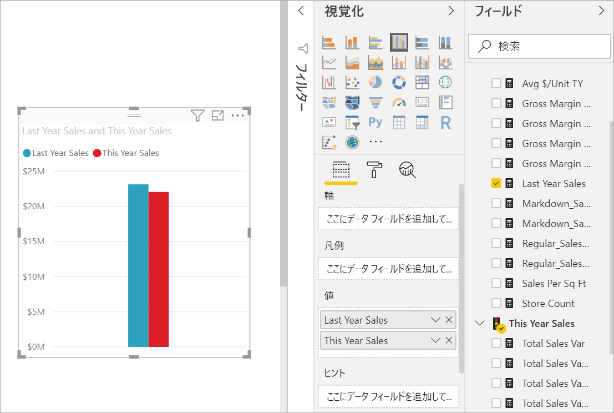
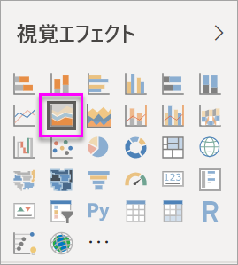
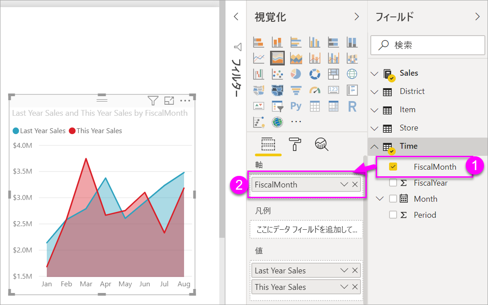

# 基本的な面グラフの作成と使用

[!INCLUDE [power-bi-visuals-desktop-banner](../includes/power-bi-visuals-desktop-banner.md)]

基本的な面グラフ (層グラフとも呼ばれます) は、折れ線グラフに基づいています。 軸と折れ線の間の領域は、量を示すために色で塗りつぶされます。 

面グラフは、時間の経過に伴う変化の大きさを強調し、トレンドの合計値に注目させるために使用できます。 たとえば、時間の経過に伴う利益を表すデータを面グラフにプロットして、総利益を強調することができます。

## 基本的な面グラフを使用すべきケース
基本的な面グラフを選ぶとよい状況を挙げます。

* 時系列全体にわたって量のトレンドを確認および比較する場合 
* 個々の系列が物理的に数えられる集合を表す場合

### 前提条件
このチュートリアルでは、[小売の分析のサンプル PBIX ファイル](https://download.microsoft.com/download/9/6/D/96DDC2FF-2568-491D-AAFA-AFDD6F763AE3/Retail%20Analysis%20Sample%20PBIX.pbix)を使用します。

1. メニューバーの左上にある **[ファイル]**  >  **[開く]** を選択します。
   
2. **小売の分析のサンプル PBIX ファイル**を探します。

1. **小売の分析のサンプル PBIX ファイル**をレポート ビュー  で開きます。

1. 選択  を選択して、新しいページを追加します。

## 基本的な面グラフの作成
 

1. これらの手順は、今年の売上と去年の売上を月ごとに表示する面グラフを作成する際に役立ちます。
   
   a. [フィールド] ウィンドウで、 **[Sales] \> [Last Year Sales]** を選択し、 **[This Year Sales] > [Value]** を選択します。

   

   b.  [視覚化] ウィンドウの [面グラフ] アイコンを選んで、グラフを基本的な面グラフに変換します。

   
   
   c.  **[時刻] \> [FiscalMonth]** の順に選択して、 **[軸]** に追加します。   
   
   
   d.  月別にグラフを表示するには、(ビジュアルの右上隅にある) 省略記号を選択し、 **[Sort by month]** (月別に並べ替え) を選択します。 並べ替え順序を変更するには、省略記号をもう一度選び、 **[昇順で並べ替え]** または **[降順で並べ替え]** を選択します。

## 強調表示とクロス フィルター処理
[フィルター] ウィンドウの使用方法については、「[Power BI でのレポートへのフィルターの追加](../power-bi-report-add-filter.md)」をご覧ください。

グラフ内の 1 つの特定の領域を強調表示するには、その領域または上部の境界を選びます。  他の視覚エフェクトの種類とは異なり、同じページに他の視覚エフェクトがある場合、基本的な面グラフを強調表示しても、レポート ページの他の視覚エフェクトはクロス フィルター処理されません。 ただし、面グラフは、レポート ページ上の他の視覚化によってトリガーされたクロス フィルター処理のターゲットになります。 

1. 面グラフを選択し、**New Store Analysis (新しい店舗の分析)** レポート ページにコピーしてみてください (Ctrl + C キーとCtrl + V キー)。
2. 面グラフの網掛けされた領域の 1 つを選択し、もう 1 つの網掛けされた領域を選択します。 ページのその他の視覚化には、何も影響がないことがわかります。
1. 次に、要素を選択します。 面グラフの変化を確認してください。クロスフィルタリングされます。

     

詳しくは、「[Power BI レポートでの視覚化の相互作用](../service-reports-visual-interactions.md)」をご覧ください。

## 考慮事項とトラブルシューティング   
* [障碍を持つユーザーのためにレポートをより使いやすくする](../desktop-accessibility.md)
* 基本的な面グラフは、複数層の面の重なりによって値がわかりにくくなるため、値の比較には有効ではありません。 Power BI では、面の重なりを示すために透過が使用されます。 ただし、透過は 2 つか 3 つの異なる面についてのみうまく機能します。 4 つ以上のメジャーとトレンドを比較する必要がある場合は、折れ線グラフを使用してみてください。 4 つ以上のメジャーと量を比較する必要がある場合は、ツリーマップを使用してみてください。

## 次のステップ
[Power BI のレポート](power-bi-visualization-card.md)  

