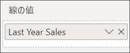
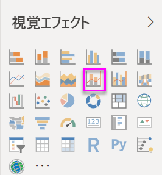
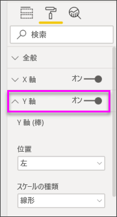
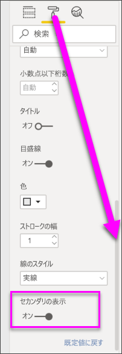

# Power BI での複合グラフ

[!INCLUDE [power-bi-visuals-desktop-banner](../includes/power-bi-visuals-desktop-banner.md)]

Power BI の複合グラフは、折れ線グラフと縦棒グラフを組み合わせた 1 つの視覚化です。 2 つのグラフを 1 つに組み合わせると、データの比較をよりすばやく行うことができます。

複合グラフには、1 つまたは 2 つの Y 軸を保持できます。

## 複合グラフを使用するケース
複合グラフは、次のような場合に最適な選択肢になります。

* 同じ X 軸を持つ折れ線グラフと縦棒グラフがある場合。
* 値の範囲が異なる複数のメジャーを比較する場合。
* 2 つのメジャーの間の相関関係を 1 つの視覚化で示す場合。
* あるメジャーが別のメジャーで定義されているターゲットを満たすかどうかを調べる場合
* キャンバスのスペースを節約する場合。

### 前提条件
このチュートリアルでは、[小売の分析のサンプル PBIX ファイル](http://download.microsoft.com/download/9/6/D/96DDC2FF-2568-491D-AAFA-AFDD6F763AE3/Retail%20Analysis%20Sample%20PBIX.pbix)を使用します。

1. メニューバーの左上にある **[ファイル]**  >  **[開く]** を選択します。
   
2. **小売の分析のサンプル PBIX ファイル**を探します。

1. **小売の分析のサンプル PBIX ファイル**をレポート ビュー  で開きます。

1. 選択  を選択して、新しいページを追加します。

## 基本的な 1 つの軸の複合グラフを作成する
このビデオでは、売上およびマーケティングのサンプルを使って複合グラフを作成する様子をご覧いただけます。
   > [!NOTE]
   > このビデオでは、古いバージョンの Power BI Desktop を使用しています。
   > 
   > 
<iframe width="560" height="315" src="https://www.youtube.com/embed/lnv66cTZ5ho?list=PL1N57mwBHtN0JFoKSR0n-tBkUJHeMP2cP" frameborder="0" allowfullscreen></iframe>  

1. 空のレポート ページから、今年の売上と粗利益を月単位で表示する縦棒グラフを作成します。

    a.  [フィールド] ウィンドウで、 **\[Sales] \(売上)** \> **\[This Year Sales] \(今年の売上)**  >  **[値]** を選択します。

    b.  **[Sales]** \> **[Gross Margin This Year]** を **[値]** にドラッグします。

    c. **[Time]** \> **[Fiscal Month]** の順に選択して、 **[軸]** に追加します。

    
5. 視覚エフェクトの右上隅にある省略記号 (...) を選び、 **[並べ替え] > [FiscalMonth]** を選択します。 並べ替え順序を変更するには、省略記号をもう一度選び、 **[昇順で並べ替え]** または **[降順で並べ替え]** を選択します。 この例では、 **[昇順で並べ替え]** を使用します。

6. 縦棒グラフを複合グラフに変換します。 次の 2 つの複合グラフを使用できます: **[折れ線グラフおよび積み上げ縦棒グラフ]** と **[折れ線グラフおよび集合縦棒グラフ]** 。 縦棒グラフを選んだ状態で **[視覚化]** ウィンドウから **[折れ線グラフおよび集合縦棒グラフ]** を選びます。

    
7. **[フィールド]** ウィンドウで、 **[Sales]** \> **[Last Year Sales]** を **[線の値]** バケットにドラッグします。

   

   複合グラフは次のようになります。

   

## 2 つの軸を持つ複合グラフを作成する
このタスクでは、粗利と売上を比較します。

1. **前年の粗利 (%)** を**会計年度**で追跡する新しい折れ線グラフを作成します。 省略記号を選択して、**月ごと**に**昇順**で並べ替えます。  
1 月の粗利 (%) は 35% で、4 月には最高値の 45% になり、7 月に下がって 8 月に再びピークに達しました。 前年と本年は同じ売上パターンになるでしょうか?

   
2. **[This Year Sales] > [Value]** と **[Last Year Sales]** を折れ線グラフに追加します。 **[Gross Margin Last Year %]\(前年の粗利 (%)\)** の目盛が **[Sales]\(売上\)** の目盛よりかなり小さいため、比較が困難です。      

   
3. ビジュアルの読みやすく分かりやすくするため、折れ線グラフを「折れ線グラフおよび積み上げ縦棒グラフ」に変換します。

   

4. **[Gross Margin% Last Year]** (前年の粗利 (%)) を **[各棒の値]** から **[線の値]** にドラッグします。 Power BI によって 2 つの軸が作成されるため、各データ セットを異なる縮尺でプロットできます。つまり、左側の測定単位はドル売上高で、右側の測定単位は割合です。 質問に対する回答は "はい" であり、同様のパターンとなります。

       

## タイトルを各軸に追加する
1. ペイント ローラー アイコン 
1.  を選択して、[書式設定] ウィンドウを開きます。
1. 下矢印を選んで、 **Y 軸** のオプションを展開します。
1. **[Y 軸 (棒)]** で、 **[位置]** を **[左]** に、 **[タイトル]** を **[オン]** に、 **[スタイル]** を **[タイトルのみを表示]** に、 **[表示単位]** を **[百万]** に、それぞれ設定します。

   
4. **[Y 軸 (棒)]** の下を **[セカンダリの表示]** が表示されるまでスクロール ダウンします。 Y 軸には多数のオプションがあるため、両方のスクロール バーの使用する必要がある場合があります。 [セカンダリの表示] セクションに、複合グラフの折れ線グラフの部分を書式設定するオプションが表示されます。

   
5. **[Y 軸 (折れ線)]** で、 **[位置]** は **[右]** にし、 **[タイトル]** を **[オン]** にして、 **[スタイル]** を **[タイトルのみを表示]** に設定します。

   複合グラフに 2 つの軸とそれぞれのタイトルが表示されるようになります。

   

6. 必要に応じて、グラフの表示および読みやすさが向上するように、テキストのフォント、サイズ、色を変更し、その他の書式設定オプションも設定します。

ここからは次のことができます。

* [複合グラフをダッシュボード タイルとして追加](../service-dashboard-tiles.md)します。
* [レポートを保存](../service-report-save.md)します。
* [障碍を持つユーザーのためにレポートをより使いやすくします](../desktop-accessibility.md)。

## クロスハイライトとクロス フィルター処理

複合グラフ内の縦棒または折れ線を強調表示すると、レポートのページ上の他の視覚化がクロスハイライトおよびクロス フィルター処理されます。逆の場合も同様です。 [[ビジュアル対話]](../service-reports-visual-interactions.md) を使用すれば、この既定の動作を変更できます。

## 次の手順

[Power BI のドーナツ グラフ](power-bi-visualization-doughnut-charts.md)

[Power BI での視覚化の種類](power-bi-visualization-types-for-reports-and-q-and-a.md)
