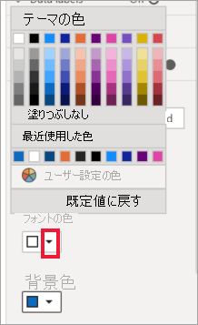
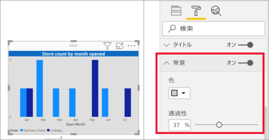

# 視覚エフェクトのタイトル、背景、および凡例をカスタマイズする

このチュートリアルでは、視覚化をカスタマイズする、さまざまな方法について説明します。 視覚化をカスタマイズするオプションは多数あります。 そのすべてを学習するには、 **[形式]** ウィンドウ (ペイント ローラー アイコンを選択) を調べることをお勧めします。 その手始めとして、この記事では視覚化のタイトル、凡例、背景をカスタマイズする方法とテーマを追加する方法を説明します。

一部の視覚化についてはカスタマイズできません。 詳細については、[完全なリスト](#visualization-types-that-you-can-customize)をご覧ください。

## 前提条件

- Power BI サービスまたは Power BI Desktop

- 小売りの分析のサンプル レポート

## レポートの視覚エフェクトのタイトルをカスタマイズする

まず、Power BI Desktop にサインインし、[小売りの分析のサンプル](../sample-datasets.md) レポートを開きます。

> [!NOTE]
> 視覚エフェクトをダッシュボードにピン留めすると、その視覚エフェクトはダッシュボード タイルになります。 タイル自体も、[新しいタイトルとサブタイトル、ハイパーリンク、およびサイズの変更](../service-dashboard-edit-tile.md)でカスタマイズできます。

1. **小売りの分析のサンプル** レポートの **[新しいストア]** ページに移動します。

1. "**開店月別、チェーン別の開店店舗数**" 集合縦棒グラフを選択します。

1. **[視覚化]** ウィンドウで、ペイントローラー アイコンを選択して、形式オプションを表示します。

1. **[タイトル]** を選択してセクションを展開します。

   ![[形式] ウィンドウ、ペイント ローラー アイコン、および [タイトル] ドロップダウンを指している矢印のスクリーンショット。](media/power-bi-visualization-customize-title-background-and-legend/power-bi-format-menu.png)

1. **[タイトル]** スライダーを **[オン]** にします。

1. タイトルを変更するには、 *[タイトル テキスト]* フィールドに「**月別の開店した店舗数**」と入力します。

    ![タイトル テキストが入力された [形式] ウィンドウのスクリーンショット。](media/power-bi-visualization-customize-title-background-and-legend/power-bi-title.png)

1. **[フォント色]** を白に、 **[背景色]** を青に変更します。    

    a. ドロップダウンを選択し、 **[テーマの色]** 、 **[最近使用した色]** 、または **[ユーザー設定の色]** から色を選択します。
    
    

    b. ドロップダウンを選択して、色ウィンドウを閉じます。

1. テキスト サイズを **16 ポイント**に増やします。

1. 最後のカスタマイズとして、グラフのタイトルを視覚化の中央に配置します。

    ![[中央揃え] オプションが選択されている [配置] コントロールのスクリーンショット。](media/power-bi-visualization-customize-title-background-and-legend/power-bi-align.png)

    チュートリアルのこの時点で、集合縦棒グラフのタイトルは次のように表示されます。

    

行った変更を保存して、次のセクションに移動します。

すべての変更を既定値に戻す必要がある場合は、 **[タイトル]** カスタマイズ ウィンドウの下部にある **[既定値に戻す]** を選択します。

![[既定値に戻す] オプションのスクリーンショット。](media/power-bi-visualization-customize-title-background-and-legend/power-bi-revert.png)

## 視覚エフェクトの背景をカスタマイズする

同じ集合縦棒グラフを選択して、 **[背景]** オプションを展開します。

1. **[背景]** スライダーを **[オン]** にします。

1. ドロップダウン リストを選択し、灰色を選択します。

1. **[透明度]** を **[74%]** に変更します。

チュートリアルのこの時点で、集合縦棒グラフの背景は次のように表示されます。

行った変更を保存して、次のセクションに移動します。

すべての変更を既定値に戻す必要がある場合は、 **[背景]** カスタマイズ ウィンドウの下部にある **[既定値に戻す]** を選択します。

## 視覚エフェクトの凡例をカスタマイズする

1. **[概要]** レポート ページを開き、"**年度別および地域マネージャー別の総売上差異**" グラフを選択します。

1. **[視覚化]** タブで、ペイント ローラー アイコンを選択して、[形式] ウィンドウを開きます。

1. **[凡例]** オプションを展開します。

    ![[凡例] カードのスクリーンショット。](media/power-bi-visualization-customize-title-background-and-legend/power-bi-legends.png)

1. **[凡例]** スライダーを **[オン]** にします。

1. 凡例を視覚エフェクトの左側に移動します。

1. **[タイトル]** を **[オン]** に切り替えて、凡例にタイトルを追加します。

1. *[凡例名]* フィールドに「**マネージャー**」と入力します。

1. **[色]** を黒に変更します。

行った変更を保存して、次のセクションに移動します。

すべての変更を既定値に戻す必要がある場合は、 **[凡例]** カスタマイズ ウィンドウの下部にある **[既定値に戻す]** を選択します。

## テーマを使用して色をカスタマイズする

レポートのテーマでは、コーポレート カラーを使用したり、アイコン セットを変更したり、ビジュアルの新しい既定の形式を適用したりなど、デザインの変更をお使いのレポート全体に適用できます。 レポートのテーマを適用すると、お使いのレポートのすべてのビジュアルで、ご自身が選択したテーマの色と書式設定が使用されます。

お使いのレポートにテーマを適用するには、メニュー バーから **[テーマの切り替え]** を選択します。 テーマを選択します。  次のレポートでは、 **[太陽]** のテーマが使用されています。

 
![黄色、オレンジ、赤の [太陽] のテーマを使用したレポート](media/power-bi-visualization-customize-title-background-and-legend/power-bi-theme.png)

## カスタマイズ可能な視覚化の種類

視覚化と、各視覚化で使用できるカスタマイズ オプションの一覧を次に示します。

| 視覚エフェクト | Title | バックグラウンド | 凡例 |
|:--- |:--- |:--- |:--- |
| 面 | はい | はい |はい |
| 横棒 | はい | はい |はい |
| カード | はい | はい |該当なし |
| 複数行カード | はい | はい | 該当なし |
| 列 | はい | はい | はい |
| 複合 | はい | はい | はい |
| ドーナツ | はい | はい | はい |
| 塗り分け地図 | はい | はい | はい |
| じょうごグラフ | はい | はい | 該当なし |
| ゲージ | はい | はい | 該当なし |
| Key Influencer\(主要なインフルエンサー\) | はい | はい | 該当なし |
| KPI | はい | はい | 該当なし |
| 線 | はい | はい | はい |
| マップ | はい | はい | はい |
| マトリックス | はい | はい | 該当なし |
| 円 | はい | はい | はい |
| 質疑応答 | はい | はい | 該当なし |
| 散布 | はい | はい | はい |
| 図形 | はい | はい | はい |
| スライサー | はい | はい | 該当なし |
| Table | はい | はい | 該当なし |
| テキスト ボックス | いいえ | はい | 該当なし |
| Treemap | はい | はい | はい |
| ウォーターフォール | はい | はい | はい |

## 次のステップ

- [X 軸と Y 軸のプロパティのカスタマイズ](power-bi-visualization-customize-x-axis-and-y-axis.md)

- [色の書式設定と軸のプロパティの概要](service-getting-started-with-color-formatting-and-axis-properties.md)

他にわからないことがある場合は、 [Power BI コミュニティを利用してください](https://community.powerbi.com/)。
