- 年間の粗利益 (%) の線はどこですか? 複数の棒グラフは可能ですが、複数の折れ線グラフはそうではありません。

# X 軸と Y 軸のプロパティのカスタマイズ

[!INCLUDE [power-bi-visuals-desktop-banner](../includes/power-bi-visuals-desktop-banner.md)]

このチュートリアルでは、ビジュアルの X 軸と Y 軸をカスタマイズする、さまざまな方法について説明します。 すべての視覚化に軸があるわけではありません。 たとえば、円グラフには軸はありません。 また、カスタマイズのオプションは視覚化によって異なります。 オプションの数が多すぎて 1 つの記事では扱いきれないため、よく使われるカスタマイズの一部を見ていくほか、Power BI レポート キャンバスでビジュアルの **[書式]** ペインを使いこなせるようにします。  

Amanda が X 軸と Y 軸をカスタマイズするようすをご覧ください。 また、ドリルダウンとドリルアップを使用するときにさまざまな方法で連結を制御する方法も紹介します。

> [!NOTE]
> このビデオでは、古いバージョンの Power BI を使用しています。

<iframe width="560" height="315" src="https://www.youtube.com/embed/9DeAKM4SNJM" frameborder="0" allowfullscreen></iframe>

## 前提条件

- Power BI Desktop

- [小売りの分析のサンプル](https://download.microsoft.com/download/9/6/D/96DDC2FF-2568-491D-AAFA-AFDD6F763AE3/Retail%20Analysis%20Sample%20PBIX.pbix)

## 新しい視覚化を追加する

視覚化をカスタマイズする前に、それを構築する必要があります。

1. Power BI Desktop で、小売りの分析のサンプルを開きます。  

2. 下部にある黄色のプラス記号のアイコンを選択して、新しいページを追加します。 

    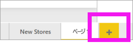

1. **[視覚化]** ウィンドウから、積み上げ縦棒グラフ アイコンを選択します。 レポート キャンバスに空のテンプレートが追加されます。

    ![[視覚化] ウィンドウと空の積み上げ縦棒グラフのスクリーンショット](media/power-bi-visualization-customize-x-axis-and-y-axis/power-bi-column-chart.png)

1. X 軸の値を設定するには、 **[フィールド]** ペインから **[Time]\(時間\)**  >  **[FiscalMonth]** を選択します。

1. Y 軸の値を設定するには、 **[フィールド]** ペインから、 **[Sales]\(売上\)**  >  **[Last Year Sales]\(昨年の売上\)** および **[Sales]\(売上\)**  >  **[This Year Sales]\(今年の売上\)**  >  **[値]** を選択します。

    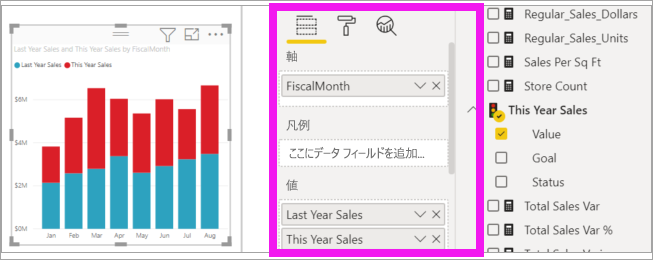

    これで X 軸をカスタマイズできます。 Power BI には、視覚化を書式設定するためのほぼ無制限のオプションが用意されています。 

## X 軸をカスタマイズする
X 軸に対してカスタマイズできる機能は多数あります。 データ ラベルと X 軸のタイトルを追加および変更できます。 カテゴリについては、横棒、縦棒、線、領域の幅、サイズ、パディングを変更できます。 また、値については、表示単位、小数点以下桁数、グリッド線を変更できます。 次の例は、縦棒グラフのカスタマイズを示しています。 オプションの使い方に慣れるためにいくつかカスタマイズを追加してから、他のオプションも自分で確認してみましょう。

### X 軸のラベルをカスタマイズする
X 軸のラベルは、グラフの縦棒の下に表示されます。 現在、小さく淡色で表示されているので、読み取りにくくなっています。 それを変更してみましょう。

1. **[視覚化]** ペインで、 **[書式]** (ペイント ローラー アイコン  ) を選択して、カスタマイズのオプションを表示します。

2. X 軸のオプションを展開します。

   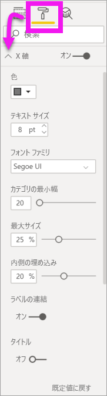

3. **[X 軸]** スライダーを **[オン]** に移動します。

    ![[オン] のスライダーのスクリーンショット。](media/power-bi-visualization-customize-x-axis-and-y-axis/power-bi-slider-on.png)

    X 軸を **[オフ]** に設定する理由としては、ラベルがなくても視覚化が一目瞭然である場合や、情報量の多いレポート ページにさらに多くのデータを表示するためのスペースが必要な場合などが考えられます。

4. テキストの色、サイズ、フォントを設定します。

    - **色**:黒を選択します

    - **文字のサイズ**:「*14*」と入力します

    - **フォント ファミリ**: **[Arial Black]** を選択します

    - **内側のパディング**: 「*40%* 」と入力します

        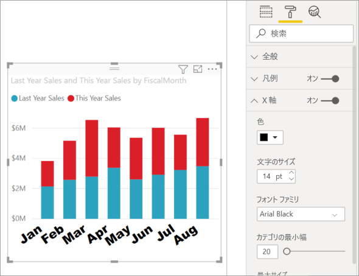
    
5. X 軸のテキストが斜めに表示されるのは、気に入らないかもしれません。 いくつかのオプションがあります。 
    - テキスト サイズを 14 より小さい値に変更する。
    - 視覚化のサイズを大きくする。 
    - **[カテゴリの最小幅]** を大きくして、表示する縦棒を少なくし、スクロール バーを追加する。 
    
    ここでは、2 つ目のオプションを選択して、サイズ変更バーの 1 つをドラッグして視覚化の幅を広げました。 これで、テキストを斜めまたはスクロール バー付きで表示する必要なく、14 ポイントのテキストを使用できるようになりました。 

   

### X 軸のタイトルをカスタマイズする
X 軸のタイトルが **[オン]** になっている場合、X 軸のタイトルは X 軸のラベルの下に表示されます。 

1. まず、X 軸のタイトルを **[オン]** にします。  

    ![[タイトル] スライダー](media/power-bi-visualization-customize-x-axis-and-y-axis/power-bi-title-on.png)

    最初に、既定の X 軸のタイトルが視覚化に表示されていることに気付きます。  この例では、**FiscalMonth** です。

   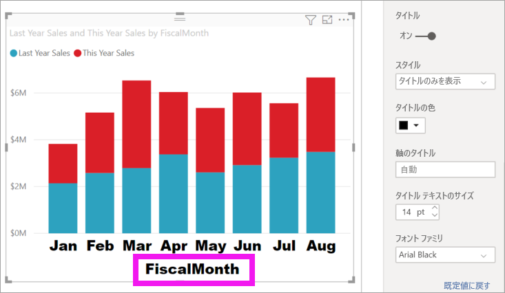

1. タイトルのテキストの色、サイズ、フォントを設定します。

    - **タイトルの色**:オレンジ色を選択します

    - **軸のタイトル**:「*Fiscal Month*」(スペースを含む) と入力します

    - **タイトル テキストのサイズ**:「*18*」と入力します

    カスタマイズが完了すると、積み上げ縦棒グラフは次のようになります。

    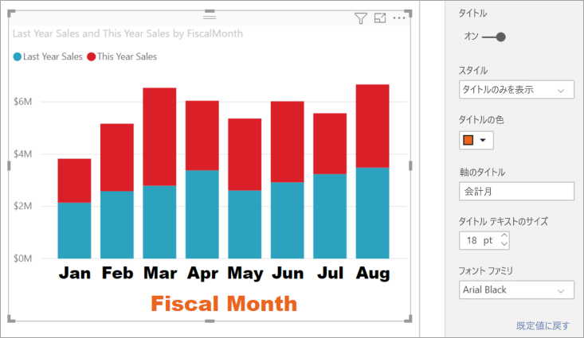

1. 行った変更を保存して、次のセクションに移動します。 すべての変更を既定値に戻す必要がある場合は、 **[X 軸]** カスタマイズ ウィンドウの下部にある **[既定値に戻す]** を選択します。 次に、Y 軸をカスタマイズします。

## Y 軸をカスタマイズする
Y 軸に対してカスタマイズできる機能は多数あります。 データ ラベル、Y 軸のタイトル、グリッド線を追加および変更できます。 値については、表示単位、小数点以下桁数、開始点、終了点を変更できます。 また、カテゴリについては、横棒、縦棒、線、領域の幅、サイズ、パディングを変更できます。 

次の例では、引き続き縦棒グラフをカスタマイズします。 オプションの使い方に慣れてるよういくつか変更を加えてから、他のオプションも自分で確認してみましょう。

### Y 軸のラベルをカスタマイズする
Y 軸のラベルは、既定では左側に表示されます。 現在、小さく淡色で表示されているので、読み取りにくくなっています。 それを変更してみましょう。

1. Y 軸のオプションを展開します。

   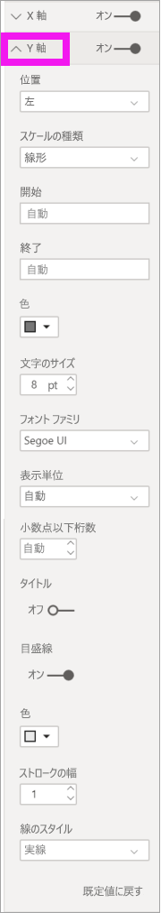

1. **[Y 軸]** スライダーを **[オン]** に移動します。  

    ![[オン] のスライダーのスクリーンショット。](media/power-bi-visualization-customize-x-axis-and-y-axis/power-bi-y-axis-on.png)

    Y 軸をオフにする理由の 1 つとして、より多くのデータが表示されるように領域を確保することが考えられます。

1. テキストの色、サイズ、フォントを設定します。

    - **色**:黒を選択します

    - **文字のサイズ**:「*10*」と入力します

    - **表示単位**: **[百万]** を選択します

    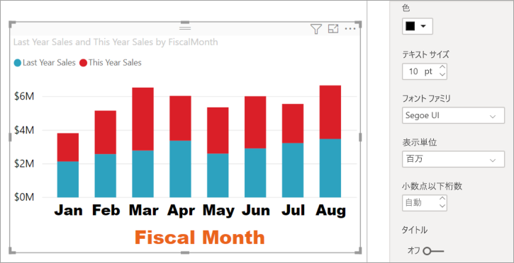

### Y 軸のタイトルをカスタマイズする
Y 軸のタイトルが **[オン]** になっている場合、Y 軸のタイトルは Y 軸のラベルの横に表示されます。 この視覚化の場合、Y 軸にタイトルを表示してもビジュアルがわかりやすくなることはないので、 **[タイトル]** は **[オフ]** のままにします。 このチュートリアルでは、後で 2 つの軸を持つビジュアルに Y 軸のタイトルを追加します。 

### グリッド線をカスタマイズする
色とストロークを変更して、グリッド線が目立つようにします。

- **色**:オレンジ色を選択します

- **ストローク**:「*2*」と入力します

これらのカスタマイズをすべて完了すると、棒グラフは次のように表示されるはずです。

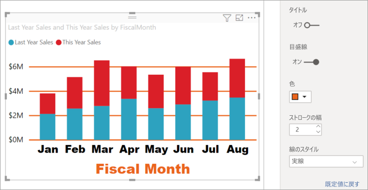

## 2 つの Y 軸を持つ視覚化をカスタマイズする

視覚化には、2 つの Y 軸を使用するとメリットが得られるものもあります。 複合グラフはよい例です。 2 つの Y 軸を書式設定する前に、売上と粗利益の傾向を比較する複合グラフを作成します。  

### 2 つの Y 軸を持つグラフを作成する

1. 縦棒グラフを選択し、これを *[折れ線グラフおよび積み上げ縦棒グラフ]* に変更します。 この種類の視覚化では、単一の折れ線グラフ値と複数の積み重ね可能な列値がサポートされています。 

    ![折れ線グラフおよび積み上げ縦棒グラフのアイコンが強調された [視覚化] ウィンドウのスクリーンショット。](media/power-bi-visualization-customize-x-axis-and-y-axis/power-bi-combo.png)
   

2. [フィールド] ペインから **[Sales]\(売上\)**  >  **[Gross Margin Last Year %]\(前年の粗利 (%)\)** を **[線の値]** バケットにドラッグします。

    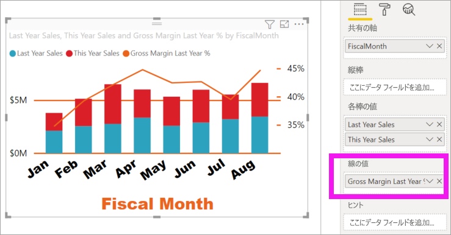

    
3. 視覚化の書式を変更して、X 軸のラベルの傾斜を取り除きます。 

   ![フォント サイズが 12 に縮小された複合グラフと [書式] ペイン](media/power-bi-visualization-customize-x-axis-and-y-axis/power-bi-font-size.png)

   Power BI では 2 つの Y 軸が作成されるため、値をそれぞれ拡大縮小できます。 左の軸は販売 (ドル) の測定値で、右の軸は粗利率の測定値です。

### 2 番目の Y 軸の書式を設定する
1 つの Y 軸が書式設定された視覚化から開始したので、Power BI は同じ設定を使用して 2 番目の Y 軸を作成しました。 ただし、これは変更できます。 

1. **[視覚化]** ウィンドウで、ペイント ローラーのアイコンを選択して、書式設定のオプションを表示します。

1. Y 軸のオプションを展開します。

1. **[セカンダリを表示]** オプションが見つかるまで、下にスクロールします。 **[オン]** になっていることを確認します。 2 番目の Y 軸は折れ線グラフを表します。

   ![[セカンダリを表示] オプションのスクリーンショット。](media/power-bi-visualization-customize-x-axis-and-y-axis/power-bi-show-secondary.png)

1. (省略可能) 2 つの軸のフォントの色、サイズ、表示単位をカスタマイズします。 棒の軸または線の軸の**位置**を切り替えた場合、2 つの軸の左右が切り替わります。

### 両方の軸にタイトルを追加する

複雑な視覚化では、軸のタイトルの追加が有用です。  タイトルにより、同僚は視覚化の内容を理解しやすくなります。

1. **「Y 軸 (棒)」** と **「Y 軸 (折れ線)」** の **[タイトル]** を **[オン]** に切り替えます。

1. 両方とも、 **[スタイル]** を **[タイトルの表示のみ]** に設定します。

   ![[タイトル] オプションと [スタイル] オプションのスクリーンショット。](media/power-bi-visualization-customize-x-axis-and-y-axis/power-bi-show-title.png)

1. これで、複合グラフに 2 つの軸がともにタイトル付きで表示されます。

   

1. タイトルの書式を設定します。 この例では、タイトルの 1 つを短くし、両方のフォント サイズを縮小しています。 
    - フォント サイズ: **9**
    - 最初の Y 軸 (縦棒グラフ) の **[軸のタイトル]** を次のように短縮しましました: Sales last year & this year

    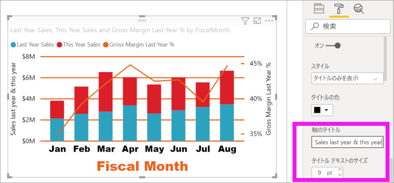

詳細については、「[Power BI における色の書式設定に関するヒントとコツ](service-tips-and-tricks-for-color-formatting.md)」および「[視覚化のタイトル、凡例、および背景をカスタマイズする](power-bi-visualization-customize-title-background-and-legend.md)」を参照してください。 また、タイトルの書式設定に関する新しい更新プログラムが近日中に公開される予定です。 

## 次の手順

- [Power BI レポートでの視覚化](power-bi-report-visualizations.md)

他にわからないことがある場合は、 [Power BI コミュニティを利用してください](https://community.powerbi.com/)。
