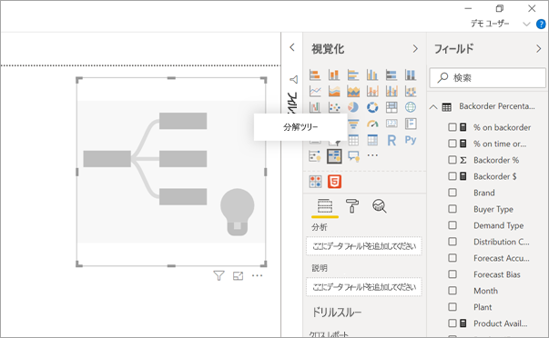
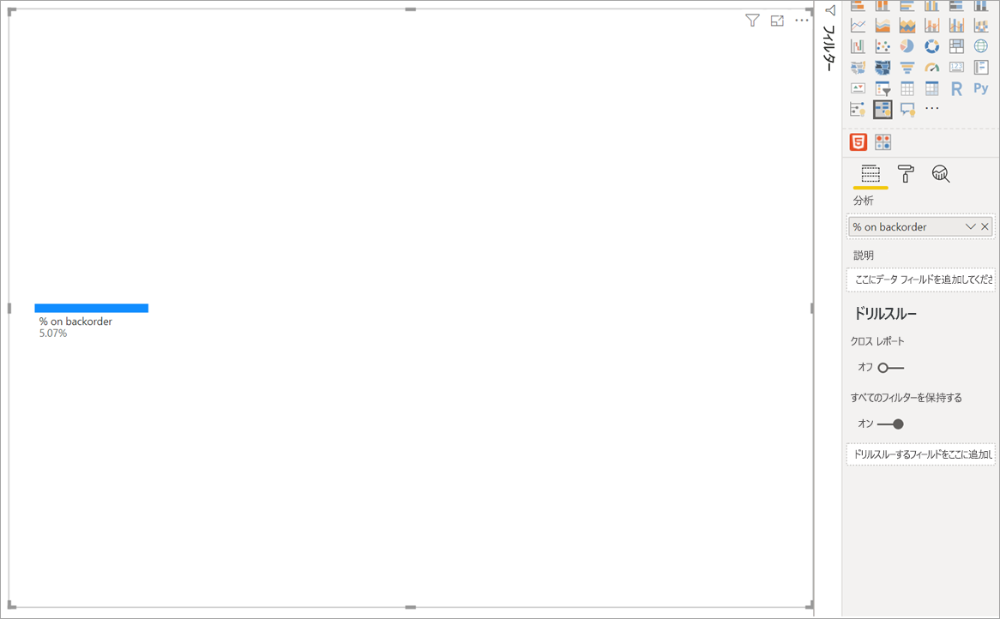
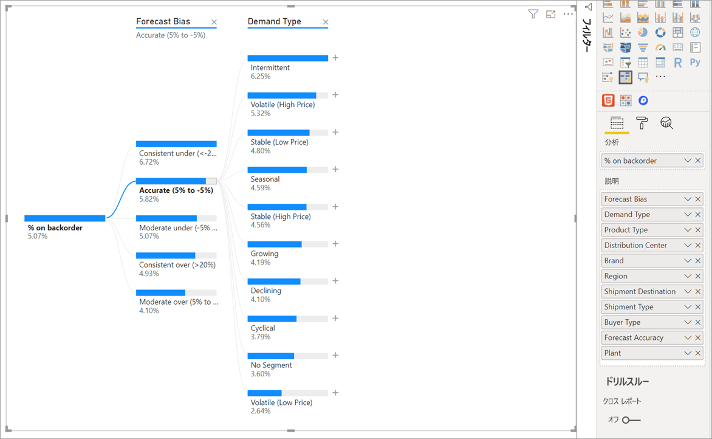
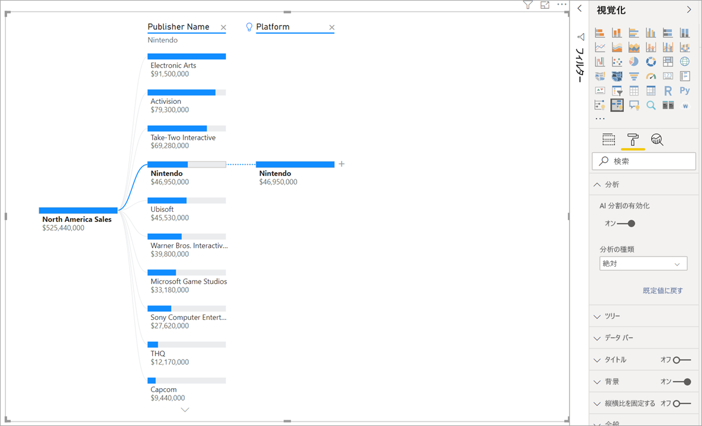
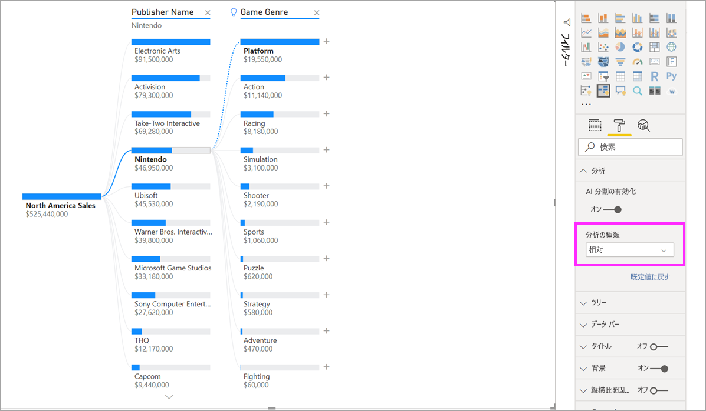
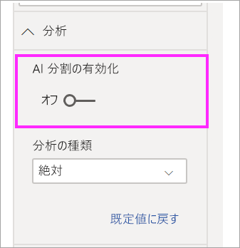

# Power BI で分解ツリー ビジュアルを作成して表示する

[!INCLUDE[consumer-appliesto-nyyn](../includes/consumer-appliesto-nyyn.md)]

[!INCLUDE [power-bi-visuals-desktop-banner](../includes/power-bi-visuals-desktop-banner.md)]

Power BI の分解ツリー ビジュアルを使用して、複数のディメンションのデータを視覚化できます。 データが自動的に集計され、任意の順序でディメンションをドリルダウンできるようになります。 それは人工知能 (AI) による視覚化でもあるため、特定の条件に基づいて、ドリルダウンする次のディメンションを検出するように要求することができます。 これにより、アドホック探索や根本原因分析に役立つ重要なツールになります。

このチュートリアルでは、次の 2 つの例を使用します。

- 企業が受注残 (在庫切れ) として持っている製品の割合を分析するサプライ チェーン シナリオ。  
- ゲームのジャンルや発行元などのさまざまな要因によってビデオ ゲームの売上を分類する販売シナリオ。

サプライチェーンのシナリオで使用されている pbix は、以下にあります: [Supply Chain Sample.pbix](
https://github.com/microsoft/powerbi-desktop-samples/blob/master/Sample%20Reports/Supply%20Chain%20Sample.pbix)。

> [!NOTE]
> Power BI を使用する同僚とレポートを共有するには、それぞれのユーザーが個別の Power BI Pro ライセンスを持っているか、レポートが Premium 容量に保存されている必要があります。    

## 作業の開始
[視覚化] ペインから [分解ツリー] アイコンを選択します。

視覚化には次の 2 種類の入力が必要です。

 - **分析** – 分析するメトリック。 これは、メジャーまたは集計である必要があります。  
 - **説明** - ドリルダウンする 1 つ以上のディメンション。

メジャーをフィールド ウェルにドラッグすると、ビジュアルが集計メジャーの表示によって更新されます。 次の例では、製品の受注残の平均% (5.07%) が視覚化されています。

次の手順は、ドリルダウンする 1 つ以上のディメンションを指定することです。 これらのフィールドを **[説明]** バケットに追加します。 ルート ノードの横にプラス記号が表示されることに注意してください。 [+] を選択すると、ドリルダウンするフィールドを選択できます (任意の順序でフィールドをドリルダウンできます)。

![スクリーンショットは、プラス アイコンが選択され、[説明] リストのオプションが表示された状態を示しています。](media/power-bi-visualization-decomposition-tree/tree-menu.png)

**[予測バイアス]** を選択すると、ツリーが展開され、列の値によってメジャーが分割されます。 ドリルダウンする別のノードを選択することで、このプロセスを繰り返すことができます。

最後のレベルのノードを選択すると、データがクロスフィルター処理されます。 前のレベルのノードを選択すると、パスが変更されます。

他のビジュアルを操作すると、分解ツリーがクロスフィルター処理されます。 結果的にレベル内のノードの順序が変更されることがあります。
下の例では、[Ubisoft] によってツリーをクロスフィルター処理しています。 パスが更新され、Xbox の売上が先頭から 2 番目に移動し、PlayStation が先頭になります。 

次に、[Nintendo] によってツリーをクロスフィルター処理すると、Xbox の売上は空白になりますが、これは Xbox 用に開発されたニンテンドー ゲームがないためです。 Xbox は、その後続のパスと共に、ビューから除外されます。

パスが消失しても、既存のレベル (この場合は [Game Genre]\(ゲームのジャンル\)) はツリーに固定されたままになります。 したがって、[Nintendo] ノードを選択すると、ツリーは自動的に [Game Genre]\(ゲームのジャンル\) まで展開されます。

## AI 分割

"AI 分割" を使用して、どのデータを次に調べる必要があるかを見つけ出すことができます。 これらの分割は一覧の一番上に表示され、電球のマークが付きます。 これらの分割によって、データの高値と低値を自動的に見つけることができます。

分析は、基本設定に応じて 2 つの方法で機能できます。 既定の動作は次のとおりです。

 - **高値**:使用可能なすべてのフィールドが考慮され、分析対象のメジャーの最大値を取得するためにドリルインするものが決定されます。  
 - **低値**:使用可能なすべてのフィールドが考慮され、分析対象のメジャーの最小値を取得するためにドリルインするものが決定されます。  

受注残の例で **[高値]** を選択すると、結果は次のようになります。

**[Product Type]\(製品の種類\)** の横に電球が表示され、これが "AI 分割" であることが示されます。 受注残の最大値 (9.2%) が **[Patient Monitoring]\(患者の監視\)** であるため、このノードを推奨する点線もツリーに表示されます。 

電球の上にマウス ポインターを合わせると、ツールヒントが表示されます。 この例では、ツールヒントは、"[Product Type]\(製品の種類\) が [Patient Monitoring]\(患者の監視\) の場合、受注残の割合が最も高い" になります。

**絶対的**ではなく**相対的**な AI 分割を検出するようにビジュアルを構成できます。 

相対モードでは、(列内の他のデータと比較したときに) 目立つ値が検索されます。 これを説明するために、例を見てみましょう。

上のスクリーンショットでは、ビデ オゲームの [North America sales]\(北米での売上\) を調べています。 まず、ツリーを **[Publisher Name]\(発行元の名前\)** で分割し、次に [Nintendo] でドリルダウンします。 **[高値]** を選択すると、ツリーが展開され、 **[プラットフォーム] は [Nintendo] である**ことが表示されます。 Nintendo (発行元) は Nintendo コンソールのみを対象としているため、値は 1 つしか存在しません。したがって、それが高値であるのは当然です。

もっと興味深い分割は、同じ列の他の値と比較してどの値が相対的に大きいかを調べることです。 [分析の種類] を **[絶対]** から **[相対]** に変更すると、Nintendo に対して次の結果が得られます。

今回は、推奨値は、 **[Game Genre]\(ゲームのジャンル\) 内の [プラットフォーム]** です。  [プラットフォーム] では、[Nintendo] よりも高い絶対値は発生しません ($19,950,000 と $46,950,000)。 それでも、それは目立つ値です。

より正確に言えば、[Game Genre ]\(ゲームのジャンル\) には 10 個の値があるため、均等に分割された場合の [プラットフォーム] の予測値は $4,600,000 になります。 [プラットフォーム] の値はほぼ $20,000,000 であり、予測される結果の 4 倍になっているため、これは興味深い結果です。

計算式を次に示します。

北米でのプラットフォームの売上/ Abs(Avg(北米でのゲームのジャンルの売上))  
対  
北米での Nintendo の売上/ Abs(Avg(北米でのプラットフォームの売上))  

これを言い換えると次のようになります。

19,550,000 / (19,550,000 + 11,140,000 + ... + 470,000 + 60,000 /10) = 4.25x  
対  
46,950,000/ (46,950,000/1) = 1x  

ツリーで AI 分割を使用しない場合は、 **[Analysis formatting]\(分析のフォーマット\)** オプションの下にそれらをオフにするオプションがあります。  

## AI 分割でのツリーの相互作用

複数の AI レベルが表示されることがあります。 さらに、異なる種類の AI レベルが混在することがあります ([高値] から [低値] に移動し、[高値] に戻る)。

ツリー内で別のノードを選択すると、AI 分割は最初から再計算されます。 次の例では、 **[予測バイアス]** レベルで選択したノードを変更しました。 後続のレベルは、正しい高値と低値を生成するように変更されます。

AI レベルは、別のビジュアルで分解ツリーをクロスフィルター処理した場合も再計算されます。 下の例では、受注残の割合が最も高いのは [Plant]\(プラント\) #0477 であることがわかります。

ただし、横棒グラフで **[4 月]** を選択すると、変化の幅が最も大きいのは、 **[Product Type]\(製品の種類\) が [Advanced Surgical]\(高度な手術\)**  になります。 この場合、並べ替えられたのはノードだけでなく、まったく異なる列が選択されています。 

Ai レベルを非 AI レベルのように動作させる場合は、電球を選択して、動作を既定値に戻します。 

複数の AI レベルが連結されることがありますが、非 AI レベルを AI レベルに続けることはできません。 AI 分割の後に手動で分割を行うと、AI レベルの電球は消え、そのレベルは通常のレベルに変換されます。 

## ロック

コンテンツ作成者は、レポート コンシューマーに対してレベルをロックできます。 レベルがロックされると、削除も変更も実行できなくなります。 コンシューマーは、ロックされたレベル内で異なるパスを調べることができますが、レベル自体を変更することはできません。 作成者は、既存のレベルにマウスポインターを合わせことで、ロック アイコンを表示できます。 必要な数だけレベルをロックできますが、ロックされていないレベルの後続のレベルをロックすることはできません。

次の例では、最初の 2 つのレベルがロックされています。 これは、レポート コンシューマーがレベル 3 と 4 を変更し、さらに新しいレベルを追加することもできることを意味します。 ただし、最初の 2 つのレベルは変更できません。

## 既知の制限事項

ツリーのレベルの最大数は 50 です。 ツリーで一度に視覚化できるデータ ポイントの最大数は 5000 です。 上位 n を表示するようにレベルを切り詰めます。 現在、レベルごとに上位 n が 10 に設定されます。 

次のシナリオでは、分解ツリーはサポートされていません。  
-   オンプレミスの Analysis Services

AI 分割は、次のシナリオではサポートされていません。  
-   Azure Analysis Services
-   Power BI Report Server
-   Web に公開
-   [分析] の拡張スキーマからの複雑なメジャーとメジャー

その他の制限事項:
- Q & A 内でのサポート

## 次の手順

[Power BI のドーナツ グラフ](power-bi-visualization-doughnut-charts.md)

[Power BI の視覚化](power-bi-report-visualizations.md)

