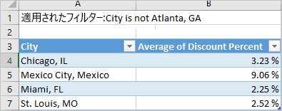
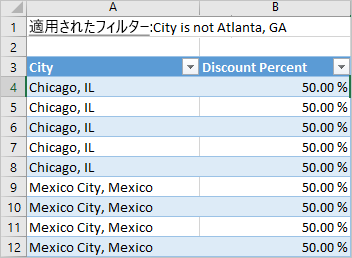

# ビジュアルからデータをエクスポートする

Power BI での視覚化の作成に使用されるデータを確認したい場合は、[Power BI でデータを表示できます](service-reports-show-data.md)。 そのデータを *.xlsx* または *.csv* ファイルとして Excel にエクスポートすることもできます。 データをエクスポートするオプションを使用するには、Pro ライセンスまたは Premium ライセンスに加えて、データセットとレポートへの編集アクセス許可が必要です。

Watch では、レポート内の視覚化の 1 つからデータをエクスポートし、 *.xlsx* ファイルとして保存して、Excel で開くことができます。 その後、ビデオで説明されている手順に従って、ご自分でやってみてください。

<iframe width="560" height="315" src="https://www.youtube.com/embed/KjheMTGjDXw" frameborder="0" allowfullscreen></iframe>

## Power BI ダッシュボードからデータをエクスポートする

1. 視覚化の右上隅にある省略記号を選択します。

    

1. **[データをエクスポート]** アイコンを選択します。

    ![省略記号ドロップダウンと [データをエクスポート] オプションのスクリーンショット。](media/power-bi-visualization-export-data/pbi_export_dash.png)

1. データが *.csv* ファイルにエクスポートされます。 視覚化をフィルター処理すると、ダウンロードされたデータがフィルター処理されます。

1. お使いのブラウザーから、ファイルを保存するように求められます。  保存されたら、 *.csv* ファイルを Excel で開きます。

    

## レポートからデータをエクスポートする

先に進む前に、[調達の分析サンプル レポート](../sample-procurement.md)を編集ビューで開いてください。 新しい空のレポート ページを追加します。 その後、手順に従って、集計および視覚化レベルのフィルターを追加します。

1. 新しい**積み上げ縦棒グラフ**を作成します。

1. **[フィールド]** ウィンドウで、 **[場所] > [市区町村]** および **[Invoice]\(請求書\) > [割引率]** の順に選択します。  場合によっては、 **[割引率]** も **[値]** ウェルに移動する必要があります。

    ![視覚化と、組み込まれた [都市] および [Count of Discount Percent]\(割引率の数\) のスクリーンショット。](media/power-bi-visualization-export-data/power-bi-export-data3.png)

1. "**Discount Percent**" の集計を **[カウント]** から **[平均]** に変更します。 **[値]** ウェルで、 **[割引率]** ( **[Count of Discount Percent]\(割引率の数\)** になっているかもしれません) の右側の矢印を選択し、 **[平均]** を選択します。

    ![集計の一覧と [平均] オプションのスクリーンショット。](media/power-bi-visualization-export-data/power-bi-export-data6.png)

1. フィルターを **[市区町村]** に追加し、すべての都市を選択して、 **[アトランタ]** を削除します。

    ![[Atlanta, GA]\(アトランタ、GA\) チェック ボックスがオフになっている [市区町村] フィルターのスクリーンショット。](media/power-bi-visualization-export-data/power-bi-export-data4.png)

   これで、データをエクスポートする両方のオプションを試す準備ができました。

1. 視覚化の右上隅にある省略記号を選択します。 **[データのエクスポート]** を選択します。

    ![右上にある省略記号ボタンと [データのエクスポート] オプションのスクリーンショット。](media/power-bi-visualization-export-data/power-bi-export-data2.png)

    Power BI オンラインでご自身の視覚化に集計がある場合は (たとえば、 **[カウント]** を *[平均]* 、 *[合計]* 、または *[最小]* に変更した場合)、次の 2 つのオプションがあります。

    - **概要データ**

    - **基になるデータ**

    Power BI Desktop には、 **[概要データ]** のオプションのみがあります。 集計について理解するには、「[Power BI での集計](../service-aggregates.md)」を参照してください。

1. **[データをエクスポート]** から **[概要データ]** を選択し、 *[.xlsx]* または *[.csv]* を選択して、 **[エクスポート]** を選択します。 データがエクスポートされます。

    ![[データをエクスポート] と、[概要データ]、[xlsx]、および [エクスポート] オプションのスクリーンショット。](media/power-bi-visualization-export-data/power-bi-export-data5.png)

    視覚化にフィルターを適用した場合は、フィルターが適用された状態でデータがエクスポートされます。 **[エクスポート]** を選ぶと、ファイルを保存するように求められます。 保存したら、Excel でファイルを開きます。

    **概要データ**: そのビジュアルで表示されている内容のデータをエクスポートする場合は、このオプションを選択します。  この種類のエクスポートでは、ビジュアルの作成に選択したデータ (列とメジャー) のみが表示されます。  ビジュアルに集計がある場合、概要データをエクスポートします。 たとえば、4 つの棒を含む横棒グラフがある場合は、4 行のデータが作成されます。 概要データは、 *.xlsx* および *.csv* で使用できます。

    この例の Excel へのエクスポートでは、都市ごとに 1 つのタイトルが表示されています。 除外したアトランタは結果には含まれません。 スプレッドシートの最初の行には、データを抽出するときに使用されたフィルターが示されています。

    

1. 次に、 **[基になるデータ]** 、 *.xlsx*、 **[エクスポート]** の順に選択してみます。 データがエクスポートされます。 

    > [!NOTE]
    > レポートの設定に応じて、基になるデータをエクスポートするオプションが表示される場合と、表示されない場合があります。

    視覚化にフィルターを適用した場合は、フィルターが適用された状態でデータがエクスポートされます。 **[エクスポート]** を選ぶと、ファイルを保存するように求められます。 保存したら、Excel でファイルを開きます。

    >[!WARNING]
    >基になるデータをエクスポートすると、ユーザーがすべての詳細データ、つまりすべての列のデータを表示できます。 Power BI サービスの管理者は自分の組織に対してこれをオフにできます。 データセット所有者の場合は、Desktop または Power BI サービスの **[フィールド]** リストに表示されないように、所有権列を**非表示**に設定できます。

    **基になるデータ**: このオプションは、ビジュアルのデータ***と***モデルの追加データを表示する場合に選択します (詳細については下のグラフをご覧ください)。 視覚化に集計がある場合、 *[基になるデータ]* を選択すると集計が削除されます。 **[エクスポート]** を選択すると、データが *.xlsx* ファイルにエクスポートされ、お使いのブラウザーからファイルを保存するよう求められます。 保存したら、Excel でファイルを開きます。

    この例の Excel エクスポートでは、データセットの 1 つの都市行ごとに 1 つの行が作成され、その 1 つのエントリの割引率が示されます。 データがフラット化されます。 集計は行われません。 スプレッドシートの最初の行には、データを抽出するときに使用されたフィルターが示されています。  

    

## 基になるデータの詳細をエクスポートする

**[基になるデータ]** を選択したときに表示される内容は変わることがあります。 これらの詳細を理解するには、管理者や IT 部署のサポートが必要になることがあります。 Power BI Desktop またはサービスのレポート ビューでは、"*メジャー*" が、電卓アイコン () とともに **[フィールド]** リストに表示されます。 Power BI Desktop ではメジャーが作成されますが、 Power BI サービスでは作成されません。

| ビジュアルに含まれる内容 | エクスポートに表示される内容  |
|---------------- | ---------------------------|
| 集計 | *最初*の集計と、その集計に対してテーブル全体から得られる非表示以外のデータ |
| 集計 | 関連データ - 集計を含むデータ テーブルに "*関連付けられている*" 他のデータ テーブルのデータがビジュアルで使用されている場合 (そのリレーションシップが \*:1 か 1:1 である場合に限り) |
| メジャー | ビジュアルのすべてのメジャー*と*、ビジュアルで使用されているメジャーを含むすべてのデータ テーブルのすべてのメジャー |
| メジャー | そのメジャーを含むテーブルのすべての非表示以外のデータ (そのリレーションシップが \*:1 か 1:1 の場合) |
| メジャー | \*:1 または 1:1 のチェーンを介してメジャーを含むテーブルに関連するすべてのテーブルのすべてのデータ |
| メジャーのみ | すべての関連テーブルのすべての非表示以外の列 (メジャーを拡張するため) |
| メジャーのみ | モデル メジャーのあらゆる重複行に対する概要データ |

### エクスポートのオプションを設定する

Power BI レポート デザイナーは、コンシューマーが使用できるデータ エクスポート オプションの種類を制御します。 次の選択肢があります。

- 集計したデータを、エンド ユーザーが Power BI サービスまたは Microsoft Power BI Report Server からエクスポートすることを許可します

- 集計したデータと基になるデータの両方を、エンド ユーザーがサービスからエクスポートすることを許可します

- エンド ユーザーがデータをサービスまたはレポート サーバーからエクスポートすることを許可しません

    > [!IMPORTANT]
    > レポート デザイナーには古いレポートに再度アクセスし、必要に応じてエクスポート オプションを手動でリセットすることをお勧めします。

これらのオプションを設定するには:

1. Power BI Desktop を開始します。

1. 左上から **[ファイル]**  >  **[オプションと設定]**  >  **[オプション]** を選択します。

1. **[現在のファイル]** の **[レポートの設定]** を選択します。

    

1. **[データのエクスポート]** セクションから選択します。

Power BI サービスでこの設定を更新することもできます。

Power BI 管理ポータルの設定がエクスポート データのレポートの設定と競合した場合、管理者の設定の方がエクスポート データの設定よりも優先される点に注意してください。

## 制限事項と考慮事項
次の制限事項と考慮事項は、Power BI Desktop と Power BI サービス (Power BI Pro および Power BI Premium を含む) に適用されます。

- データをビジュアルからエクスポートするには、[基になるデータセットのビルド アクセス許可](https://docs.microsoft.com/power-bi/service-datasets-build-permissions#build-permissions-for-shared-datasets)が必要です。

-  **Power BI Desktop** および **Power BI サービス**で**インポート モード レポート**から *.csv* ファイルにエクスポートできる最大行数は、30,000 です。

- アプリケーションで**インポート モード レポート**から *.xlsx* ファイルにエクスポートできる最大行数は、150,000 です。

- "*基になるデータ*" を使用したエクスポートは、次の場合は動作しません。

  - データ ソースが Analysis Services ライブ接続である。

  - バージョンが 2016 年より古い。

  - モデルのテーブルに一意のキーがない。
    
  -  管理者またはレポート デザイナーがこの機能を無効にした。

- Power BI によるエクスポート対象の視覚化に対して *[データのない項目を表示する]* オプションが有効になっている場合、"*基になるデータ*" を使用したエクスポートは機能しません。

- DirectQuery を使用している場合、Power BI でエクスポートできるデータの最大量は 16 MB (非圧縮データ) です。 このためエクスポートされた行数が最大行数よりも少なくなることがあります。 これは次の場合に発生する可能性があります。

    - 列の数が多い。

    - 圧縮が困難なデータがある。

    - ファイル サイズが大きくなり、エクスポートされる行数が減る他の要因がある。

- 視覚化で複数のデータ テーブルからのデータが使用されるとき、データ モデルでそれらのテーブルに対してリレーションシップが存在しない場合、Power BI でエクスポートされるのは最初のテーブルのデータのみです。

- 現在、カスタム ビジュアルと R ビジュアルはサポートされていません。

- 内部ユーザーが共有したダッシュボードを使用している組織外のユーザーは、エクスポート データを使用することができません。

- Power BI でフィールド (列) の名前を変更するには、そのフィールドをダブルクリックし、新しい名前を入力します。 この新しい名前は、Power BI では "*エイリアス*" と呼ばれます。 Power BI レポートのフィールド名に重複が発生することがありますが、Excel では重複は許可されていません。 そこで、Power BI によってデータが Excel にエクスポートされるとき、フィールドのエイリアスは元のフィールド (列) 名に戻ります。  

- *.csv* ファイルに Unicode 文字がある場合、Excel のテキストは正しく表示されないことがあります。 Unicode 文字の例としては、通貨記号と外来語があります。 ファイルをメモ帳で開くと、Unicode は適切に表示されます。 Excel でファイルを開く場合、この問題が発生しないようにするには、 *.csv* にインポートします。 ファイルを Excel にインポートするには:

  1. Excel を開きます。

  1. **[データ]** タブに移動します。
  
  1. **[外部データの取り込み]**  >  **[テキストから]** の順に選択します。
  
  1. ファイルが保存されているローカル フォルダーに移動し、 *.csv* を選択します。

- Power BI 管理者は、データのエクスポートを無効にできます。

他にわからないことがある場合は、 [Power BI コミュニティで質問してみてください](http://community.powerbi.com/)。
