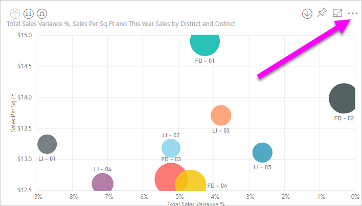
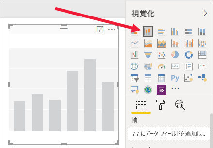

# 視覚エフェクトの作成に使用されたデータをエクスポートする

> [!IMPORTANT]
> すべてのユーザーがすべてのデータを表示またはエクスポートできるとは限りません。 レポート デザイナーおよび管理者が、ダッシュ ボードやレポートを作成する際に使用するセーフガードがあります。 一部のデータは制限付き、非表示、または機密扱いになり、特別なアクセス許可がなければ、表示またはエクスポートすることはできません。 

## データをエクスポートできるユーザー

データへのアクセス許可がある場合、Power BI で視覚エフェクトの作成に使用されるデータを表示およびエクスポートすることができます。 多くの場合、データは機密であるか、アクセスが特定のユーザーに制限されます。 そのような場合、そのデータを表示またはエクスポートすることはできません。 詳細については、このドキュメントの最後にある「**制限事項と考慮事項**」セクションを参照してください。 

## データの表示とエクスポート

Power BI での視覚化の作成に使用されるデータを確認したい場合は、[Power BI でデータを表示できます](service-reports-show-data.md)。 そのデータを *.xlsx* または *.csv* ファイルとして Excel にエクスポートすることもできます。 データをエクスポートするオプションを使用するには、Pro ライセンスまたは Premium ライセンスに加えて、データセットとレポートへの編集アクセス許可が必要です。 ダッシュボードまたはレポートに対するアクセス権を持っていても、データが "*極秘*" に分類されている場合は、Power BI でデータをエクスポートすることはできません。

Watch では、レポート内の視覚化の 1 つからデータをエクスポートし、 *.xlsx* ファイルとして保存して、Excel で開くことができます。 その後、ビデオで説明されている手順に従って、ご自分でやってみてください。 このビデオでは、古いバージョンの Power BI を使用していることに注意してください。

<iframe width="560" height="315" src="https://www.youtube.com/embed/KjheMTGjDXw" frameborder="0" allowfullscreen></iframe>

## Power BI ダッシュボードからデータをエクスポートする

1. 視覚エフェクトの右上隅にある [その他のアクション] (...) を選択します。

    

1. **[CSV にエクスポートする]** オプションを選択します。

    ![省略記号ドロップダウンと [データをエクスポート] オプションのスクリーンショット。](media/power-bi-visualization-export-data/power-bi-export-data.png)

1. データが *.csv* ファイルにエクスポートされます。 視覚エフェクトをフィルター処理すると、.csv エクスポートもフィルター処理されます。 

1. お使いのブラウザーから、ファイルを保存するように求められます。  保存されたら、 *.csv* ファイルを Excel で開きます。

    

## レポートからデータをエクスポートする

先に進む前に、Power BI サービスの編集ビューで[調達の分析サンプル レポート](../create-reports/sample-procurement.md)を開いてください。 新しい空のレポート ページを追加します。 その後、次の手順に従って、集計、階層、視覚化レベルのフィルターを追加します。

### 積み上げ縦棒グラフを作成する

1. 新しい**積み上げ縦棒グラフ**を作成します。

    

1. **[フィールド]** ウィンドウで、 **[場所] > [市区町村]** 、 **[場所] > [国/地域]** 、 **[請求書] > [割引率]** の順に選択します。  場合によっては、 **[割引率]** も **[値]** ウェルに移動する必要があります。

    ![視覚化と、組み込まれた [都市] および [Count of Discount Percent]\(割引率の数\) のスクリーンショット。](media/power-bi-visualization-export-data/power-bi-build.png)

1. "**Discount Percent**" の集計を **[カウント]** から **[平均]** に変更します。 **[値]** ウェルで、 **[割引率]** ( **[Count of Discount Percent]\(割引率の数\)** になっているかもしれません) の右側の矢印を選択し、 **[平均]** を選択します。

    ![集計の一覧と [平均] オプションのスクリーンショット。](media/power-bi-visualization-export-data/power-bi-export-data6.png)

1. フィルターを **[市区町村]** に追加し、すべての都市を選択して、 **[アトランタ]** を削除します。

    ![[Atlanta, GA]\(アトランタ、GA\) チェック ボックスがオフになっている [市区町村] フィルターのスクリーンショット。](media/power-bi-visualization-export-data/power-bi-filter.png)

   
1. 階層内で 1 レベル下にドリルダウンします。 詳細表示をオンにして、 **[市区町村]** レベルにドリルダウンします。 

    

これで、データをエクスポートする両方のオプションを試す準備ができました。

### ***概要***データをエクスポートする
そのビジュアルで表示されている内容のデータをエクスポートする場合、 **[概要データ]** オプションを選択します。  この種類のエクスポートでは、ビジュアルの作成に使用されているデータ (列とメジャー) のみが表示されます。  ビジュアルに集計がある場合、概要データをエクスポートします。 たとえば、4 つの棒を表示する横棒グラフがある場合、4 行の Excel データが作成されます。 概要データは、Power BI サービスでは *.xlsx* および *.csv* として、Power BI Desktop では .csv として使用できます。

1. 視覚化の右上隅にある省略記号を選択します。 **[データのエクスポート]** を選択します。

    ![右上にある省略記号ボタンと [データのエクスポート] オプションのスクリーンショット。](media/power-bi-visualization-export-data/power-bi-export-data2.png)

    Power BI サービスの場合は、視覚エフェクトに集計が含まれている ( **[カウント]** から *[平均]* に変更した) ため、次の 2 つのオプションが表示されます。

    - **概要データ**

    - **基になるデータ**

    集計について理解するには、「[Power BI での集計](../create-reports/service-aggregates.md)」を参照してください。

    > [!NOTE]
    > Power BI Desktop の場合は、概要データを .csv ファイルとしてエクスポートするオプションのみが表示されます。 
    
    
1. **[データをエクスポート]** から **[概要データ]** を選択し、 *[.xlsx]* または *[.csv]* を選択して、 **[エクスポート]** を選択します。 データがエクスポートされます。

    ![[データをエクスポート] と、[概要データ]、[xlsx]、および [エクスポート] オプションのスクリーンショット。](media/power-bi-visualization-export-data/power-bi-export-data5.png)

1. **[エクスポート]** を選ぶと、ファイルを保存するように求められます。 保存したら、Excel でファイルを開きます。

    

    この例の Excel へのエクスポートでは、都市ごとに 1 つのタイトルが表示されています。 除外したアトランタは結果には含まれません。 スプレッドシートの最初の行には、データを抽出するときに使用されたフィルターが示されています。
    
    - ビジュアルの対象となっている現在のドリル レベルで使用されているデータだけではなく、階層で使用されているすべてのデータがエクスポートされます。 たとえば、市区町村レベルにドリルダウンしましたが、エクスポートには国のデータも含まれます。  

    - エクスポートされたデータは集計されます。 合計 (都市ごとに 1 行) を取得します。

    - 視覚エフェクトにフィルターを適用したため、エクスポートされるデータは、フィルターが適用された状態でエクスポートされます。 最初の行には、「**適用されたフィルター: 市区町村が次の値と等しくない Atlanta, GA**」と表示されることに注意してください。 

### ***基になる***データをエクスポートする

このオプションは、ビジュアルのデータ***と***データセットから追加されたデータを表示する場合に選択します (詳細については下の図を参照してください)。 視覚化に集計がある場合、 **[基になるデータ]** を選択すると集計が削除されます。 この例の Excel エクスポートでは、データセットの 1 つの都市行ごとに 1 つの行が作成され、その 1 つのエントリの割引率が示されます。 Power BI ではデータがフラット化されます。集計は行われません。  

**[エクスポート]** を選択すると、データが *.xlsx* ファイルにエクスポートされ、お使いのブラウザーからファイルを保存するよう求められます。 保存したら、Excel でファイルを開きます。

1. 視覚エフェクトの右上隅にある省略記号を選択します。 **[データのエクスポート]** を選択します。

    ![右上にある省略記号ボタンと [データのエクスポート] オプションのスクリーンショット。](media/power-bi-visualization-export-data/power-bi-export-data2.png)

    Power BI サービスの場合は、視覚エフェクトに集計が含まれている ( **[カウント]** から **[平均]** に変更した) ため、次の 2 つのオプションが表示されます。

    - **概要データ**

    - **基になるデータ**

    集計について理解するには、「[Power BI での集計](../create-reports/service-aggregates.md)」を参照してください。

    > [!NOTE]
    > Power BI Desktop の場合は、概要データをエクスポートするオプションのみが表示されます。 
    
    
1. **[データのエクスポート]** で、 **[基になるデータ]** 、 **[エクスポート]** の順に選択します。 データがエクスポートされます。

    ![[基になるデータ] が選択された [データのエクスポート] のスクリーンショット。](media/power-bi-visualization-export-data/power-bi-underlying.png)

1. **[エクスポート]** を選ぶと、ファイルを保存するように求められます。 保存したら、Excel でファイルを開きます。

    
    
    - Excel ファイルには 100,000 行以上が含まれており、このスクリーンショットは、その一部のみを示しています。  
    
    - ビジュアルの対象となっている現在のドリル レベルで使用されているデータだけではなく、階層で使用されているすべてのデータがエクスポートされます。 たとえば、市区町村レベルにドリルダウンしましたが、エクスポートには国のデータも含まれます。  

    - 視覚エフェクトにフィルターを適用したため、エクスポートされるデータは、フィルターが適用された状態でエクスポートされます。 最初の行には、「**適用されたフィルター: 市区町村が次の値と等しくない Atlanta, GA**」と表示されることに注意してください。 

## データのエクスポートのユーザー エクスペリエンスをカスタマイズする

レポートへのアクセスが許可されているユーザーには、[行レベル セキュリティ (RLS)](../admin/service-admin-rls.md) によってアクセスが制限されない限り、**基になるデータセット全体へのアクセスが許可されます**。 レポート作成者と Power BI 管理者は、以下で説明する機能を使用してユーザー エクスペリエンスをカスタマイズできます。

- レポート作成者は、ユーザーが使用できる ["*エクスポート オプション*" を決定します](#set-the-export-options)。  

- Power BI 管理者は、組織のデータ エクスポートに関するオプションの一部またはすべてを無効にできます。  

- データセット所有者は、行レベルのセキュリティ (RLS) を設定できます。 RLS は、アクセスを読み取り専用のユーザーに制限します。 ただし、アプリのワークスペースを構成し、メンバーに編集アクセス許可を付与している場合、RLS ロールはメンバーに適用されません。 詳細については、[行レベルのセキュリティ](../admin/service-admin-rls.md)に関するページを参照してください。

- レポート作成者は、列が **[フィールド]** リストに表示されないように、非表示にすることができます。 詳細については、「[データセットのプロパティ](../developer/automation/api-dataset-properties.md)」を参照してください。

**このようなカスタマイズされたユーザー エクスペリエンスによって、ユーザーがアクセスできるデータセットのデータが制限されることはありません。個人の資格情報によってアクセスできるデータが決定されるように、データセットの[行レベルセキュリティ (RLS)](../admin/service-admin-rls.md) を使用します。**

## Power BI の外部にエクスポートされたデータを保護する

- レポート作成者は、Microsoft Information Protection の[秘密度ラベル](../admin/service-security-data-protection-overview.md)を使用して、レポートの分類とラベル付けを行うことができます。 秘密度ラベルに保護設定が含まれている場合、Power BI では、Excel、PowerPoint、または PDF ファイルにレポート データをエクスポートするときに、これらの保護設定が適用されます。 承認されているユーザーのみが保護されたファイルを開くことができます。

- セキュリティ および Power BI 管理者は、[Microsoft Cloud App Security](../admin/service-security-data-protection-overview.md) を使用して、ユーザーのアクセスとアクティビティの監視、リアルタイムのリスク分析の実行、ラベル固有の制御の設定を行うことができます。 たとえば、組織では Microsoft Cloud App Security を使用して、ユーザーが Power BI から管理されていないデバイスに機密データをダウンロードできないようにするポリシーを構成できます。

## 基になるデータの詳細をエクスポートする

**[基になるデータ]** を選択したときに表示される内容は変わることがあります。 これらの詳細を理解するには、管理者や IT 部署のサポートが必要になることがあります。 

>

| ビジュアルに含まれる内容 | エクスポートに表示される内容  |
|---------------- | ---------------------------|
| 集計 | *最初*の集計と、その集計に対してテーブル全体から得られる非表示以外のデータ |
| 集計 | 関連データ - 集計を含むデータ テーブルに "*関連付けられている*" 他のデータ テーブルのデータがビジュアルで使用されている場合 (そのリレーションシップが \*:1 か 1:1 である場合に限り) |
| メジャー* | ビジュアルのすべてのメジャー*と*、ビジュアルで使用されているメジャーを含むすべてのデータ テーブルのすべてのメジャー |
| メジャー* | そのメジャーを含むテーブルのすべての非表示以外のデータ (そのリレーションシップが \*:1 か 1:1 の場合) |
| メジャー* | \*:1 または 1:1 のチェーンを介してメジャーを含むテーブルに関連するすべてのテーブルのすべてのデータ |
| メジャーのみ | すべての関連テーブルのすべての非表示以外の列 (メジャーを拡張するため) |
| メジャーのみ | モデル メジャーのあらゆる重複行に対する概要データ |

\*Power BI Desktop またはサービスのレポート ビューでは、"*メジャー*" が、電卓アイコン  とともに **[フィールド]** リストに表示されます。 メジャーは、Power BI Desktop で作成できます。

### エクスポートのオプションを設定する

Power BI レポート デザイナーは、コンシューマーが使用できるデータ エクスポート オプションの種類を制御します。 次の選択肢があります。

- 集計したデータを、エンド ユーザーが Power BI サービスまたは Microsoft Power BI Report Server からエクスポートすることを許可します

- 集計したデータと基になるデータの両方を、エンド ユーザーがサービスからエクスポートすることを許可します

- エンド ユーザーがデータをサービスまたはレポート サーバーからエクスポートすることを許可しません

    > [!IMPORTANT]
    > レポート デザイナーには古いレポートに再度アクセスし、必要に応じてエクスポート オプションを手動でリセットすることをお勧めします。

これらのオプションを設定するには:

1. Power BI Desktop を開始します。

1. 左上から **[ファイル]**  >  **[オプションと設定]**  >  **[オプション]** を選択します。

1. **[現在のファイル]** の **[レポートの設定]** を選択します。

    

1. **[データのエクスポート]** セクションから選択します。

Power BI サービスでこの設定を更新することもできます。

Power BI 管理ポータルの設定がエクスポート データのレポートの設定と競合した場合、管理者の設定の方がエクスポート データの設定よりも優先される点に注意してください。

## 制限事項と考慮事項
次の制限事項と考慮事項は、Power BI Desktop と Power BI サービス (Power BI Pro および Power BI Premium を含む) に適用されます。

- データをビジュアルからエクスポートするには、[基になるデータセットのビルド アクセス許可](../connect-data/service-datasets-build-permissions.md)が必要です。

-  **Power BI Desktop** および **Power BI サービス**で**インポート モード レポート**から *.csv* ファイルにエクスポートできる最大行数は、30,000 です。

- アプリケーションで**インポート モード レポート**から *.xlsx* ファイルにエクスポートできる最大行数は、150,000 です。

- "*基になるデータ*" を使用したエクスポートは、次の場合は動作しません。

  - バージョンが 2016 より古い。

  - モデルのテーブルに一意のキーがない。
    
  -  管理者またはレポート デザイナーがこの機能を無効にした。

- Power BI によるエクスポート対象の視覚化に対して *[データのない項目を表示する]* オプションが有効になっている場合、"*基になるデータ*" を使用したエクスポートは機能しません。

- DirectQuery を使用している場合、Power BI でエクスポートできるデータの最大量は 16 MB (非圧縮データ) です。 意図しない結果として、エクスポートされる行数が最大行数である 150,000 行よりも少なくなることがあります。 これは次の場合に発生する可能性があります。

    - 列が多すぎる。 列の数を減らしてから、もう一度エクスポートしてみてください。

    - 圧縮が困難なデータがある。

    - ファイル サイズが大きくなり、エクスポートされる行数が減る他の要因がある。

- 視覚化で複数のデータ テーブルからのデータが使用されるとき、データ モデルでそれらのテーブルに対してリレーションシップが存在しない場合、Power BI でエクスポートされるのは最初のテーブルのデータのみです。

- 現在、Power BI ビジュアルと R ビジュアルはサポートされていません。

- Power BI でフィールド (列) の名前を変更するには、そのフィールドをダブルクリックし、新しい名前を入力します。 この新しい名前は、Power BI では "*エイリアス*" と呼ばれます。 Power BI レポートのフィールド名に重複が発生することがありますが、Excel では重複は許可されていません。 そこで、Power BI によってデータが Excel にエクスポートされるとき、フィールドのエイリアスは元のフィールド (列) 名に戻ります。  

- *.csv* ファイルに Unicode 文字がある場合、Excel のテキストは正しく表示されないことがあります。 Unicode 文字の例としては、通貨記号と外来語があります。 ファイルをメモ帳で開くと、Unicode は適切に表示されます。 Excel でファイルを開く場合、この問題が発生しないようにするには、 *.csv* にインポートします。 ファイルを Excel にインポートするには:

  1. Excel を開きます。

  1. **[データ]** タブに移動します。
  
  1. **[外部データの取り込み]**  >  **[テキストから]** の順に選択します。
  
  1. ファイルが保存されているローカル フォルダーに移動し、 *.csv* を選択します。

- *.csv* にエクスポートするとき、Excel で開いたときにスクリプトが実行されないようにするため、特定の文字が先頭の **'** でエスケープされます。 これは次の場合に発生します。
  - 列がデータ モデルで "テキスト" 型として定義される場合、"**_かつ_**"
  - テキストの最初の文字が **=、@、+、-** のいずれかである場合

- Power BI 管理者は、データのエクスポートを無効にできます。

他にわからないことがある場合は、 [Power BI コミュニティで質問してみてください](https://community.powerbi.com/)。