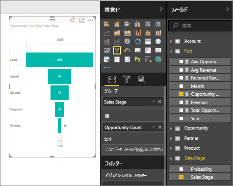

# じょうごグラフの作成と使用

[!INCLUDE[consumer-appliesto-nyyn](../includes/consumer-appliesto-nyyn.md)]

[!INCLUDE [power-bi-visuals-desktop-banner](../includes/power-bi-visuals-desktop-banner.md)]

じょうごグラフは、順番につながっている各段階がある線形プロセスを視覚化するために役立ちます。 たとえば、次のような段階にわたって顧客を追跡する販売のじょうごグラフがあります:リード \> 見込みのあるリード \> 見込顧客 \> 契約 \> 契約の締結。  じょうごの形状は、追跡しているプロセスの正常性がひとめでわかります。

じょうごの各段階は、全体のうちの割合を表します。 そして、ほとんどの場合、じょうごグラフの形は、最初の段階が最も大きく、それ以降の各段階はその前の段階よりも小さくなり、じょうごのような形になります。  洋ナシの形のじょうごグラフも役立ち、プロセスにおける問題を特定することができます。  ただし、通常は「インテーク」段階と呼ばれる最初の段階が最も大きくなります。

> [!NOTE]
> Power BI を使用する同僚とレポートを共有するには、それぞれのユーザーが個別の Power BI Pro ライセンスを持っているか、レポートが Premium 容量に保存されている必要があります。    

## じょうごグラフを使用すべきケース
じょうごグラフは、次のような場合に最適な選択肢になります。

* データが順番に発生し、少なくとも 4 つの段階を経る場合。
* 最初の段階の「項目」の数が最終段階のその数よりも大きいと想定される場合。
* 段階ごとの可能性 (収益額/売上額/契約数など) を計算する場合。
* コンバージョン率および顧客維持率を計算して追跡する場合。
* 線形プロセスのボトルネックを明らかにする場合。
* ショッピング カートのワークフローを追跡する場合。
* クリックスルー広告/マーケティング キャンペーンの進捗と成功を追跡する場合。

## じょうごグラフを使った作業
じょうごグラフ:

* 並べ替えられます。
* 倍数をサポートしています。
* 同じレポート ページの他の視覚化による強調表示およびクロス フィルター処理ができます。
* 同じレポート ページの他の視覚化を強調表示およびクロス フィルター処理するために使うことができます。
   > [!NOTE]
   > このビデオでは、売上およびマーケティングのサンプルを使ってじょうごグラフを作成する様子をご覧いただけます。 その後は、ビデオで説明されている手順に従い、営業案件の分析の PBIX サンプル ファイルを使ってご自身でお試しください。
   > 
   > 
## 前提条件

このチュートリアルでは、[営業案件の分析のサンプル PBIX ファイル](https://download.microsoft.com/download/9/1/5/915ABCFA-7125-4D85-A7BD-05645BD95BD8/Opportunity%20Analysis%20Sample%20PBIX.pbix
)を使用します。

1. メニューバーの左上にある **[ファイル]**  >  **[開く]** を選択します。
   
2. **営業案件の分析のサンプル PBIX ファイル**を探します。

1. **営業案件の分析のサンプル PBIX ファイル**をレポート ビュー  で開きます。

1. 選択  を選択して、新しいページを追加します。

## 基本的なじょうごグラフを作成する
このビデオでは、売上およびマーケティングのサンプルを使ってじょうごグラフを作成する様子をご覧いただけます。

<iframe width="560" height="315" src="https://www.youtube.com/embed/qKRZPBnaUXM" frameborder="0" allow="autoplay; encrypted-media" allowfullscreen></iframe>

それでは、営業の各段階にある営業案件の数を示す独自のじょうごグラフを作成してみましょう。

1. 空のレポート ページで開始し、 **[営業段階]** \> **[営業段階]** フィールドを選びます。
   
    

1. じょうごアイコンを選択し  縦棒グラフをじょうごグラフに変換します。

2. **[フィールド]** ウィンドウで **[ファクト]** \> **[営業案件数]** を選択します。
   
    
4. 横棒の上にポインターを合わせると、以下の情報が表示されます。
   
   * 段階の名前
   * この段階にある現在の営業案件の数
   * 全体のコンバージョン率 (潜在顧客のうちの %) 
   * ある段階から次の段階 (ドロップ率とも呼ばれる): これは、前の段階の件数に占める次の段階の件数の % です (この例では、Proposal Stage/Solution Stage になります)
     
     

6. [レポートを保存](../create-reports/service-report-save.md)します。

## 強調表示とクロス フィルター処理
[フィルター] ウィンドウの使用方法については、「[Power BI でのレポートへのフィルターの追加](../create-reports/power-bi-report-add-filter.md)」をご覧ください。

じょうごグラフ内の横棒を強調表示すると、レポート ページにある他の視覚化がクロス フィルター処理されます。逆の場合も同様です。 作業を進めるために、じょうごグラフを含むレポートページにより多くのビジュアルを追加します。

1. じょうごグラフ上で、横棒の **[Proposal]** を選択します。 これにより、ページ上の他の視覚化がクロス強調表示されます。 複数選択を行うには、Ctrl キーを使用してください。
   
   
2. ビジュアル相互間のクロスフィルター処理とクロス強調表示を設定するには、「[Power BI における視覚エフェクト](../create-reports/service-reports-visual-interactions.md)」を参照してください。

## 次の手順

[Power BI のゲージ](power-bi-visualization-radial-gauge-charts.md)

[Power BI での視覚化の種類](power-bi-visualization-types-for-reports-and-q-and-a.md)

