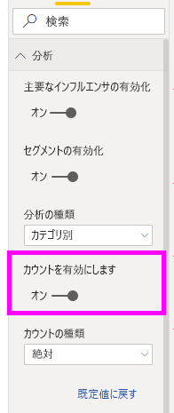
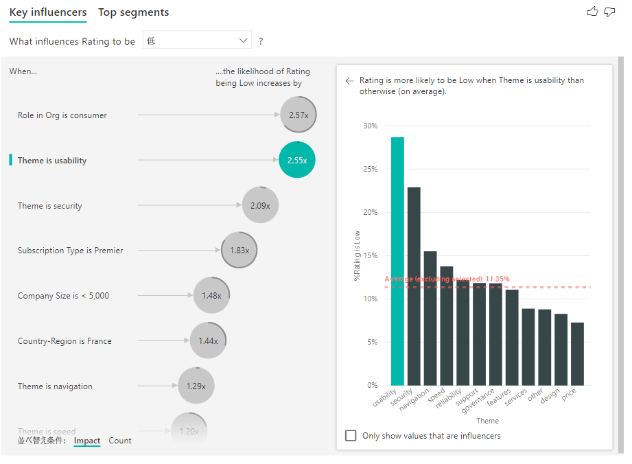
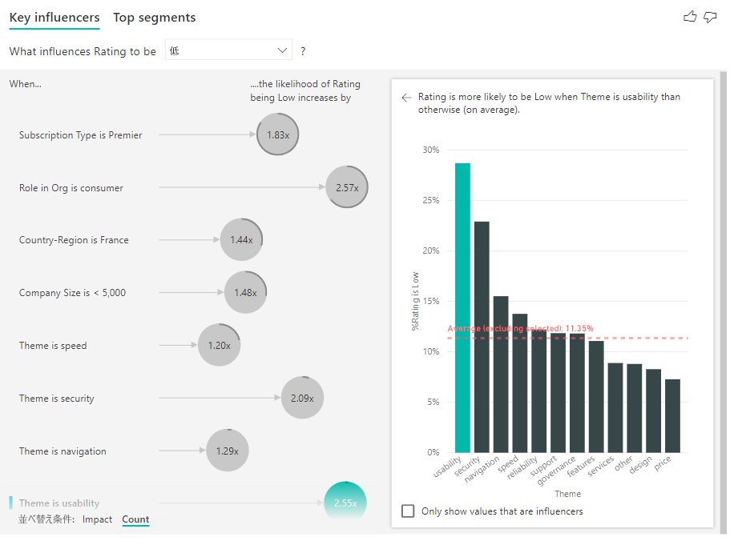
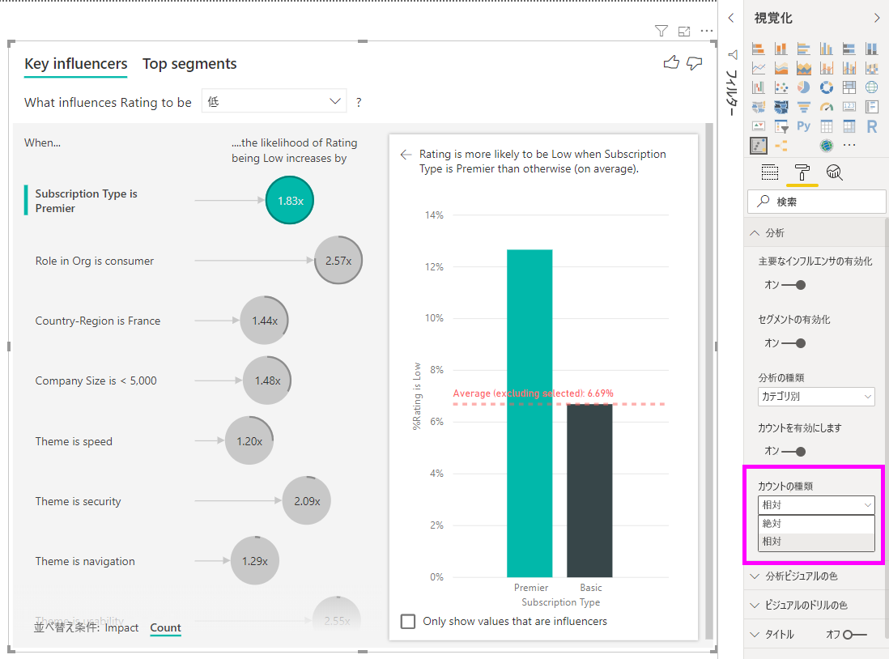
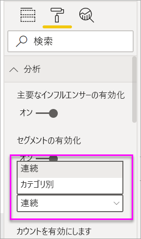
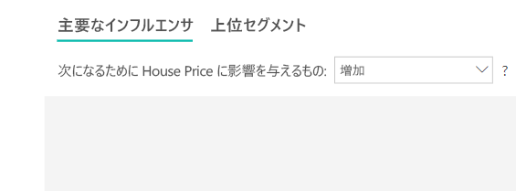
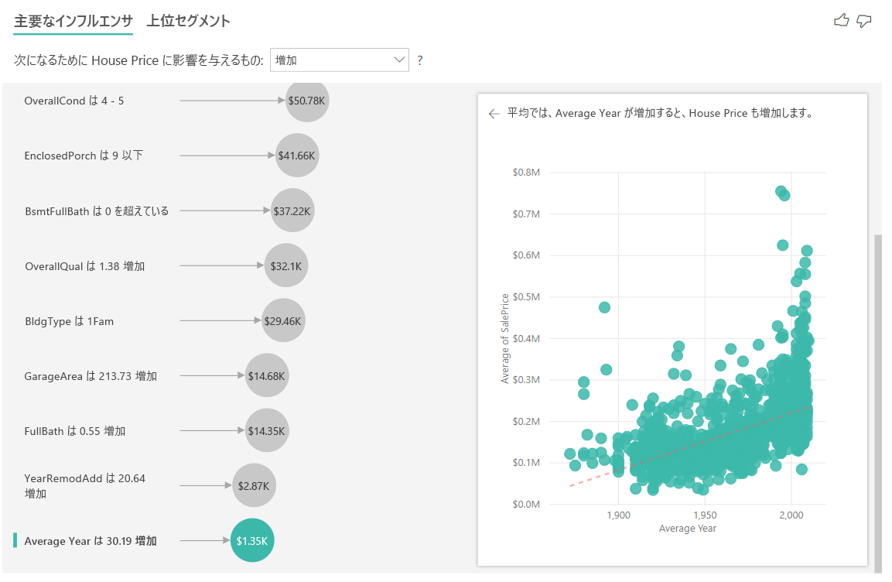
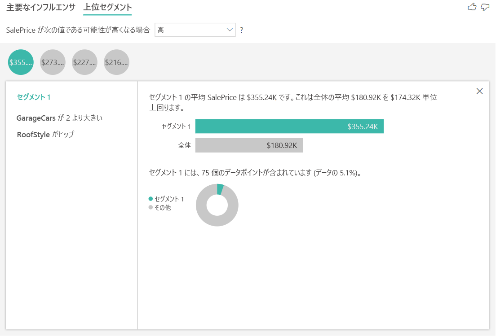
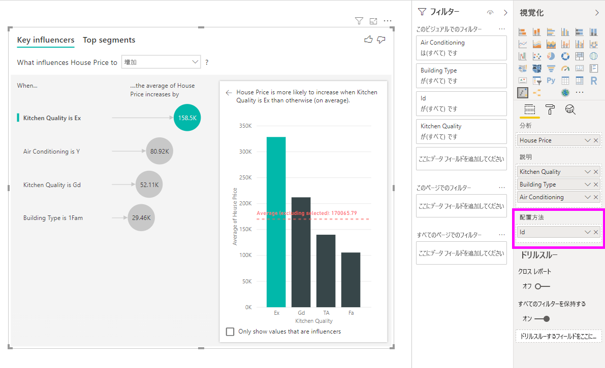

# 主要なインフルエンサの視覚エフェクト
主要なインフルエンサーは、関心のあるメトリックを動作させる要因を理解するのに役立ちます。 データを分析し、重要な要因にランクを付け、主要なインフルエンサとして表示します。 たとえば、従業員の離職率 (チャーンとも呼ばれます) に何が影響するかを把握したいとします。 要因は雇用契約期間である場合や、従業員の年齢である場合があります。 
 
## 主要なインフルエンサーを使用するタイミング 
主要なインフルエンサーの視覚化は、次のような場合に最適な選択です。 
- 分析対象のメトリックに影響する要因を確認する。
- これらの要因の相対的重要度を比較する。 短期契約は、長期契約の場合よりもチャーンへの影響が大きくなるかなど。 

## 主要なインフルエンサーの視覚化の機能

1. **タブ**:タブを選択して、ビューを切り替えます。 **[主要なインフルエンサー]** では、選択されたメトリック値に影響した上位の要素が示されます。 **[上位セグメント]** では、選択されたメトリック値に影響した上位のセグメントが示されます。 *セグメント* は、値の組み合わせで構成されます。 たとえば、1 つのセグメントで、西部地域に 20 年以上住んでいる顧客を示している場合があります。 

2. **ドロップダウン ボックス**:調査中のメトリックの値。 この例では、**評価**のメトリックを調べます。 選択された値は **[低]** です。

3. **修正**:左側のウィンドウの視覚化を解釈するのに役立ちます。

4. **左側のウィンドウ**:左側のウィンドウには 1 つの視覚化が含まれています。 この場合、左側のウィンドウには、上位の主要なインフルエンサーのリストが示されています。

5. **修正**:右側のウィンドウの視覚化を解釈するのに役立ちます。

6. **右側のウィンドウ**:右側のウィンドウには 1 つの視覚化が含まれています。 この場合、縦棒グラフには、主要なインフルエンサー (左側のウィンドウで選択されている**テーマ**) のすべての値が表示されています。 左側のウィンドウから**使いやすさ**の特定の値が緑色で示されています。 **テーマ**の他のすべての値は黒で表示されています。

7. **平均線**:**使いやすさ** (選択されたインフルエンサー) を除く、**テーマ**のすべての有効な値の平均が計算されています。 したがって、計算は黒のすべての値に適用されています。 低評価となったその他の**テーマ**の割合がわかります。 この例では、11.35% が低評価でした (点線で示されています)。

8. **チェック ボックス**:右側のウィンドウでビジュアルをフィルター処理して、そのフィールドに対するインフルエンサーである値のみを表示します。 この例では、これによりビジュアルは使いやすさ、セキュリティ、ナビゲーションにフィルター処理されます。

## カテゴリのメトリックを分析する
 
このビデオをご覧になり、カテゴリ メトリックで主要なインフルエンサーの視覚化を作成する方法について学習してください。 その後、次の手順に従って、1 つ作成します。 

<iframe width="560" height="315" src="https://www.youtube.com/embed/fDb5zZ3xmxU" frameborder="0" allow="accelerometer; autoplay; encrypted-media; gyroscope; picture-in-picture" allowfullscreen></iframe>

あなたは、プロダクト マネージャーから顧客が自社のクラウド サービスについて否定的なレビューをすることにつながる要因を把握するように指示されています。 理解するには、Power BI Desktop で[カスタマー フィードバック PBIX ファイル](https://github.com/Microsoft/powerbi-desktop-samples/blob/master/2019/customerfeedback.pbix)を開きます。 [Power BI サービスまたは Power BI Desktop 用のカスタマー フィードバック Excel ファイル](https://github.com/Microsoft/powerbi-desktop-samples/blob/master/2019/customerfeedback.xlsx)をダウンロードすることもできます。 

> [!NOTE]
> カスタマー フィードバック データセットは、[Moro et al., 2014] S. Moro, P. Cortez, and P. Rita. "A Data-Driven Approach to Predict the Success of Bank Telemarketing." *Decision Support Systems*, Elsevier, 62:22-31, June 2014 に基づくものです。 

1. レポートを開き、**主要なインフルエンサー**のアイコンを選択します。 

    ![[視覚エフェクト] ウィンドウから、主要なインフルエンサのテンプレートを選択する](media/power-bi-visualization-influencers/power-bi-template-new.png)

2. 調査するメトリックを **[分析]** フィールドに移動します。 サービスに対する顧客の評価が低くなる要因を確認するには、 **[顧客テーブル]**  >  **[評価]** の順に選択します。

3. **評価**に影響したと思われるフィードを **[説明]** フィールドにドラッグします。 フィールドは好きな数だけ移動することができます。 この場合、以下で始まります。
    - 国/地域 
    - 組織でのロール 
    - サブスクリプションの種類 
    - 企業規模 
    - テーマ
    
4. **[配置方法]** フィールドは空のままにします。 このフィールドは、メジャーまたは集計されたフィールドを分析する場合にのみ使用されます。 

5. 否定的な評価に集中するには、 **[What influences Rating to be]\(評価が次のようになる場合に影響するもの\)** のドロップダウンで **[低]** を選択します。  

    ![ドロップダウン ボックスから [低] を選択する](media/power-bi-visualization-influencers/power-bi-key-influencers.png)

分析対象のフィールドのテーブル レベルで分析が行われます。 この場合は、**評価**メトリックです。 このメトリックは、顧客レベルで定義されます。 各顧客は高いスコアまたは低いスコアのいずれかを付けています。 すべての説明要因は、視覚化で利用するために顧客レベルで定義する必要があります。 

上記の例では、すべての説明要因にはメトリックと一対一または多対一のリレーションシップがあります。 このケースでは、各顧客が 1 つのテーマを評価に割り当てました。 同様に、顧客は 1 つの国に属しており、1 つのメンバーシップの種類を持ち、組織内で 1 つのロールを実行します。 説明要素は既に顧客の属性であり、変換は必要ありません。 視覚化ではそれらをすぐに利用できます。 

このチュートリアルで後ほど、一対多リレーションシップのより複雑な例を見ていきます。 その場合、分析を実行する前に、まず、列を顧客レベルまで集計する必要があります。 

説明要因として使用されたメジャーと集計も、**分析**メトリックのテーブル レベルで評価されます。 この記事で後ほどいくつか例を示します。 

## カテゴリ別の主要なインフルエンサーを解釈する 
低評価の主要なインフルエンサーを見ていきましょう。 

### 低評価の確率に影響する上位の単一要因

この例の顧客は、コンシューマー、管理者、およびパブリッシャーの 3 つのロールを持つことができます。 コンシューマーは、低評価に影響する上位の要因です。 

![[Role in Org is consumer]\(組織でのロールはコンシューマー\) を選択する](media/power-bi-visualization-influencers/power-bi-role-consumer.png)

より正確に言えば、コンシューマーは、サービスに否定的なスコアを付ける可能性が 2.57 倍高くなっています。 主要なインフルエンサー グラフの左側のリストには、まず、 **[Role in Org is consumer]\(組織でのロールはコンシューマー\)** が示されます。 **[Role in Org is consumer]\(組織でのロールはコンシューマー\)** を選択することで、Power BI によって追加の詳細が右側のウィンドウに示されます。 低評価の確率に対する各ロールの影響の比較が示されます。
  
- 14.93% のコンシューマーが低いスコアを付けています。 
- 平均すると、その他のすべてのロールが付けたある時点の低いスコアは 5.78% となります。
- コンシューマーは、他のすべてのロールと比べて、低いスコアを付ける可能性が 2.57 倍高くなっています。 これは、緑の棒を赤の点線で分割することで判断できます。 

### 低評価の確率に影響する 2 番目の単一要因

主要なインフルエンサーの視覚化では、さまざまな変数からの要因を比較してランク付けすることができます。 2 番目のインフルエンサーは、**組織でのロール**とは関係ありません。リストの 2 番目のインフルエンサーである **[Theme is usability]\(テーマは使いやすさ\)** を選択します。 

![[Theme is usability]\(テーマは使いやすさ\) を選択する](media/power-bi-visualization-influencers/power-bi-theme.png)

2 番目に重要な要因は、顧客のレビューのテーマに関連しています。 製品の使いやすさについてコメントした顧客は、信頼性、設計、速度などの他のテーマにコメントした顧客に比べ、低いスコアを付ける可能性が 2.55 倍高くなっています。 

視覚化の赤い点線で示されている平均が 5.78% から 11.34% に変わりました。 平均は、その他のすべての値の平均に基づいているため動的です。 最初のインフルエンサーの場合、平均では顧客ロールが除外されています。 2 番目のインフルエンサーの場合、使いやすさのテーマが除外されています。 
 
**[インフルエンサーの値のみを表示します]** チェック ボックスを選択して、影響がある値のみを使用してフィルター処理します。 この場合、これらがスコアを低くするロールです。 Power BI によって特定された低い評価の要因となるテーマが、12 個から 4 個に削減されます。 

## 他の視覚化の操作 
 
キャンバス上のスライサー、フィルター、またはその他の視覚化を選択するたびに、主要なインフルエンサーの視覚化によってデータの新しい部分の分析が再実行されます。 たとえば、レポートに**企業規模**を移動し、それをスライサーとして使用できます。 それを使用して、エンタープライズ顧客の主要なインフルエンサーが、一般集団と異なるかどうかを確認します。 エンタープライズの企業規模は、従業員数 50,000 人超です。
 
**[>50,000]** を選択すると、分析が再実行され、インフルエンサーが変更されたことがわかります。 大規模なエンタープライズ顧客の場合、低評価の上位インフルエンサーのテーマはセキュリティに関するものになっています。 さらに調査して、大企業の顧客が不満を持つ特定のセキュリティ機能があるかどうかを確認することをお勧めします。 

## 継続的な主要なインフルエンサーを解釈する 
 
これまで、視覚化を使用して、さまざまなカテゴリ別フィールドが低評価にどのように影響するかを見てきました。 **[説明]** フィールドに継続的な要因 (年齢、高さ、価格など) を入力することもできます。 顧客テーブルから **[期間]** が **[説明]** に移動されるとどうなるかを見てみましょう。 期間は、顧客がサービスをどのくらい使用しているかを示します。 
 
期間が増えるほど、低い評価を受ける可能性も増えます。 この傾向は、期間が長い顧客ほど否定的なスコアを付ける可能性が高いことを示しています。 この分析情報は興味深く、後でフォローアップした方がよいものです。 
 
視覚化では、期間が 13.44 か月増えるごとに、平均して、低評価を受ける確率が 1.23 倍高くなることが示されています。 この場合、13.44 か月は期間の標準偏差を示しています。 したがって、得られた分析情報により、期間が標準量 (期間の標準偏差) だけ増えると、低評価を受ける確率にどのように影響するかがわかります。 
 
右側のウィンドウの散布図では、期間の値ごとに低評価の平均率がプロットされます。 傾向線によって傾きが強調表示されます。

## ビン分割された継続的な主要インフルエンサー

場合によっては、継続的な要因が自動的にカテゴリ別要因に変換されていることに気付くことがあります。 これは、変数間の関係が線形ではないことが判明し、上の例でしたように関係を単なる増加または減少として表現することができないためです。

ターゲットに関してインフルエンサーがどの程度線形であるかは、相関テストを実行して判断しています。 ターゲットが継続的な場合はピアソン相関テストを実行し、ターゲットがカテゴリ別である場合は点双列相関テストを実行します。 関係が十分に線形でないことが検出された場合は、監視ビン分割を行い、最大で 5 つのビンを生成します。どのビンが最も意味があるかを判断するために、説明要因と分析対象の関係を調べる監視ビン分割手法が使用されます。

## メジャーと集計を主要なインフルエンサーとして解釈する 
 
分析内の説明要因として、メジャーと集計を使用することもできます。 たとえば、顧客サポート チケットの数または開いているチケットの平均期間が、受け取るスコアにどのような影響を与えるかを確認できます。 
 
この場合、顧客が持つサポート チケットの数が、その顧客が付けるスコアに影響するかどうかを確認します。 ここで、サポート チケット テーブルから**サポート チケット ID** を取り込みます。 顧客は複数のサポート チケットを持つことができるため、ID を顧客レベルに集計します。 分析は顧客レベルで実行されるため、集計は重要です。そのため、細分性のレベルですべての要因が定義される必要があります。 
 
ID の数を見てみましょう。 各顧客の行には、関連付けられているサポート チケットの数があります。 この場合、サポート チケットの数が増えると、評価が低くなる確率が 5.51 倍高くなります。 右側の視覚化には、顧客レベルで評価された異なる**評価**値によるサポート チケットの平均数が表示されます。 

## 結果を解釈する:上位セグメント 
 
**[主要なインフルエンサー]** タブを使用して、各要素を個別に評価できます。 また、 **[上位セグメント]** タブを使用して、要因の組み合わせが分析対象のメトリックにどのように影響するかを確認することもできます。 
 
上位セグメントでは、最初に、Power BI によって検出されたすべてのセグメントの概要が表示されます。 次の例では、6 つのセグメントが検出されたことを示しています。 これらのセグメントは、セグメント内の低評価の割合でランク付けされます。 たとえば、セグメント 1 では、低い顧客評価が 74.3% となっています。 バブルの位置が高いほど、低評価の割合が高くなっています。 バブルのサイズはセグメント内の顧客数を表します。 

![[上位セグメント] タブを選択する](media/power-bi-visualization-influencers/power-bi-top-segments-tab.png)

バブルを選択すると、そのセグメントの詳細が表示されます。 たとえば、セグメント 1 を選択すると、比較的定着した顧客で構成されていることがわかります。 これらは顧客になってから 29 か月を超えており、4 枚超のサポート チケットを持っています。 最後に、これらはパブリッシャーではないため、コンシューマーか管理者のいずれかになります。 
 
このグループでは、顧客の 74.3% が低い評価を付けました。 その時点で低い評価を付けた顧客の平均が 11.7% なので、このセグメントの低評価の割合は大きくなっています。 63 パーセンテージ ポイント高くなっています。 また、セグメント 1 には約 2.2% のデータが含まれているため、母集団の指定可能な部分を表しています。 

## カウントの追加

場合によっては、大きな影響を与えるインフルエンサーにデータがほとんど表示されないことがあります。 たとえば、"**Theme** is **usability**" は、低評価に対する 2 番目に大きいインフルエンサーです。 しかし、使いやすさに不満を訴えている顧客は少数だけである可能性があります。 カウントを使用すると、注目すべきインフルエンサーの優先順位を決めることができます。

カウントは、書式設定ウィンドウの**分析カード**を使用して有効にすることができます。

カウントを有効にすると、各インフルエンサーのバブルの周囲にリングが表示されます。これは、インフルエンサーに含まれるデータのおおよその割合を表します。 リングで囲まれているバブルの部分が多いほど、それに含まれるデータが多くなります。 "**Theme** is **usability**" に含まれるデータの割合が非常に少ないことがわかります。

また、ビジュアルの左下にある [並べ替え条件] トグルを使用すると、影響ではなく最初にカウントでバブルを並べ替えることもできます。 "**Subscription Type** is **Premier**" は、カウントに基づくトップのインフルエンサーです。

円がリングで完全に囲まれていると、そのデータの 100% がインフルエンサーに含まれることを意味します。 書式設定ウィンドウの**分析カード**の **[カウントの種類]** ドロップダウンを使用して、カウントの種類を相対から最大インフルエンサーに変更できます。 データ量が最も多いインフルエンサーが完全なリングによって表され、他のすべてのカウントはそれに対して相対的になります。

## 数値のメトリックを分析する

集計されていない数値フィールドを **[分析]** フィールドに移動すると、そのシナリオの処理方法を選択できます。 **書式設定ウィンドウ**に移動して、**カテゴリ別の分析タイプ**と**継続的な分析タイプ**を切り替えることで、視覚化の動作を変更することができます。

**カテゴリ別の分析タイプ**は、前述のとおりに動作します。 たとえば、1 から 10 までのアンケート スコアを見て、'アンケート スコアが 1 になるのに影響するものは何か' という質問ができます。

**継続的な分析タイプ**は、質問を継続的なものに変更します。 上記の例では、新しい質問は、'アンケート スコアの増加/減少に影響するものは何か' になるでしょう。

この区別は、分析しているフィールド内に多数の一意の値がある場合に非常に便利です。 次の例では住宅価格について調べます。 '住宅価格が 156,214 になるのに影響するものは何か' という質問は、 非常に具体的で、パターンを推測するためのデータが十分にない可能性があるため、あまり意味がありません。

代わりに '住宅価格の上昇に影響するものは何か' と質問することで、 住宅価格を個別の値ではなく範囲として扱うことができます。

## 結果を解釈する:主要なインフルエンサ 

このシナリオでは、'住宅価格の上昇に影響するものは何か' について調べます。 **Year Built** (家が建築された年)、**KitchenQual** (キッチンの品質)、**YearRemodAdd** (家が改築された年) など、住宅価格に影響を及ぼす可能性がある多くの説明要因を見ていきます。 

次の例では、キッチンの品質が優れている上位のインフルエンサーを調べます。 結果は、いくつかの重要な相違点があるカテゴリ別のメトリックを分析したときに見たものと非常に似ています。

- 右側の縦棒グラフはパーセンテージではなく、平均を示しています。 そのため、優れたキッチンがない住宅の平均価格 (点線) と比較して、優れたキッチンがある住宅の平均価格 (緑色の棒) がどのくらいかを示しています。
- バブル内の数字でも、赤い点線と緑色の棒との間には差がありますが、確率 (1.93 倍) ではなく数値 ($158.49K) として表されています。 そのため、優れたキッチンがある住宅は、優れたキッチンがない住宅よりも平均で約 16 万ドル高くなっています。

次の例では、住宅価格に影響を与える継続的な要因 (家が改築された年) を調べます。 カテゴリ別のメトリックの継続的インフルエンサーを分析する方法と比べて、違いは次のとおりです。

-   右側のウィンドウの散布図は、改築した年の個別の値に対して住宅の平均価格をプロットしたものです。 
-   バブル内の値は、住宅が改築された年がその標準偏差 (この場合は 20 年) の分増加するときに、住宅の平均価格がどのくらい上昇 (この場合は 2,870 ドル) するかを示しています。

最後に、メジャーの場合は、家が建築された平年を調べます。 ここでの分析は次のとおりです。

-   右側のウィンドウの散布図は、テーブル内の個別の値に対して住宅の平均価格をプロットしたものです。
-   バブル内の値は、平年がその標準偏差 (この場合は 30 年) の分増加するときに、住宅の平均価格がどのくらい上昇 (この場合は 1,350 ドル) するかを示しています。

## 結果を解釈する:上位セグメント

数値ターゲットの上位セグメントは、住宅価格の平均が全体のデータセット内よりも高いグループを示します。 たとえば、次では、**セグメント 1** が、**GarageCars** (ガレージに収まる車の台数) が 2 より大きく、**RoofStyle** がヒップである家で構成されています。 これらの特徴を持つ住宅の平均価格 355,000 ドルが、データ内の全体の平均 180,000 ドルと比較されました。

## メジャーまたは集計された列であるメトリックを分析する

メジャーまたは集計された列の場合、分析の既定値は[上](https://docs.microsoft.com/en-us/power-bi/visuals/power-bi-visualization-influencers#analyze-a-metric-that-is-numeric)で説明した**継続的な分析タイプ**になります。 これは変更できません。 メジャー/集計された列の分析と、集計されていない数値列の分析の最大の違いは、分析が実行されるレベルです。

集計されていない列の場合、分析は常にテーブル レベルで実行されます。 上の家の価格の例では、**House Price** メトリックを分析して、家の価格の上昇/低下に影響を与えるものを確認しました。 分析はテーブル レベルで自動的に実行されます。 テーブルには家ごとに一意の ID があるので、分析は家のレベルで実行されます。

メジャーと集計された列の場合は、分析レベルはすぐにはわかりません。 **House Price** が **Average** として集計されている場合は、この平均住宅価格計算のレベルを考慮する必要があります。 それは、近所レベルでの平均住宅価格でしょうか。 それとも、地域レベルでしょうか。

メジャーおよび集計された列は、使用されている **[説明]** のフィールドのレベルで自動的に分析されます。 **[説明]** の次の 3 つのフィールドに関心があるとします: **Kitchen Quality**、**Building Type**、**Air Conditioning**。 **平均住宅価格**は、これら 3 つのフィールドの一意の組み合わせごとに計算されます。 多くの場合、テーブル ビューに切り替えて、どのようなデータが評価されているのかを確認すると役に立ちます。

この分析は非常に要約されているため、回帰モデルで学習できるデータ内のパターンを見つけることは困難です。 より良い結果を得るには、さらに詳細なレベルで分析を実行する必要があります。 住宅レベルで家の価格を分析する場合は、**ID** フィールドを分析に明示的に追加する必要があります。 それでも、家の ID をインフルエンサーと考えたくはありません。 家の ID が大きくなると家の価格が上昇することを学習しても役に立ちません。 このような場合は、 **[配置方法]** フィールドウェル オプションが役に立ちます。 **[配置方法]** を使用すると、新しいインフルエンサーを探さずに、分析のレベルを設定するために使用するフィールドを追加できます。

**[配置方法]** に **ID** を追加すると視覚エフェクトがどのようになるか見てみましょう。 メジャーを評価するレベルを定義すると、インフルエンサーの解釈は、[集計されていない数値列](https://docs.microsoft.com/en-us/power-bi/visuals/power-bi-visualization-influencers#analyze-a-metric-that-is-numeric)の場合とまったく同じになります。

主要なインフルエンサーの視覚化を使用してメジャーを分析する方法の詳細については、次のチュートリアルをご覧ください。

<iframe width="1167" height="631" src="https://www.youtube.com/embed/2X1cW8oPtc8" frameborder="0" allow="accelerometer; autoplay; encrypted-media; gyroscope; picture-in-picture" allowfullscreen></iframe>

## 考慮事項とトラブルシューティング 
 
**視覚化の制限事項とは** 
 
主要なインフルエンサーの視覚化には、次のような制限があります。

- 直接クエリはサポートされていません
- Azure Analysis Services および SQL Server Analysis Services へのライブ接続はサポートされていません
- Web への公開はサポートされていません
- .NET Framework 4.6 以降が必要です

**インフルエンサーまたはセグメントが見つからないというエラーが表示されます。これはなぜですか。** 

このエラーは、 **[説明]** にフィールドを含めたのに、インフルエンサーが見つからない場合に発生します。 
- **[分析]** と **[説明]** の両方に分析していたメトリックを含めました。 それを **[説明]** から削除します。 
- 説明フィールドに含まれる、観測値がほとんどないカテゴリが多すぎます。 この状況が、視覚化でどの要因がインフルエンサーかを特定するのを困難にしています。 わずかな観測値に基づいて一般化するのは困難です。 数値フィールドを分析している場合は、 **[分析]** カードの下の**書式設定ウィンドウ**で**カテゴリ別の分析**から**継続的な分析**に切り替えることをお勧めします。
- 説明要因には一般化するのに十分な数の観測値はありますが、視覚化では報告するための意味のある相関関係が見つかりませんでした。
 
**分析対象のメトリックに分析を行うための十分なデータがないというエラーが表示されます。これはなぜですか。** 

視覚化は、あるグループを他のグループと比較してデータ内のパターンを調べることで機能します。 たとえば、高評価を付けた顧客と比較して低評価を付けた顧客を検索します。 モデル内のデータの観測値が少ししかない場合は、パターンを見つけるのは困難です。 視覚化に意味のあるインフルエンサーを見つけるのに十分なデータがない場合、分析を行うにはさらにデータが必要であることが示されます。 

選択した状態に対して少なくとも 100 個の観測値を持つことをお勧めします。 この場合、状態は解約する顧客です。 比較のために使用する状態にも、少なくとも 10 個の観測値が必要です。 この場合、比較の状態は、解約しない顧客です。

数値フィールドを分析している場合は、 **[分析]** カードの下の**書式設定ウィンドウ**で**カテゴリ別の分析**から**継続的な分析**に切り替えることをお勧めします。

**"分析" が集計されていないときは、分析は常に親テーブルの行レベルで実行されるというエラーが表示されます。[配置方法] フィールドでこのレベルを変更することは許可されていません。これはなぜですか。**

数値列またはカテゴリ列を分析する場合、分析は常にテーブル レベルで実行されます。 たとえば、家の価格を分析していて、テーブルに ID 列が含まれている場合、分析は自動的に家の ID レベルで実行されます。 

メジャーまたは集計された列を分析するときは、分析を実行するレベルを明示的に指定する必要があります。 **[配置方法]** を使用すると、新しいインフルエンサーを追加せずに、メジャーおよび集計された列の分析レベルを変更できます。 **住宅価格**がメジャーとして定義されている場合は、 **[配置方法]** に家の ID 列を追加して、分析のレベルを変更できます。

***[説明]* 内のフィールドが、分析対象のメトリックを含むテーブルに一意に関係していないというエラーが表示されます。これはなぜですか。**
 
分析対象のフィールドのテーブル レベルで分析が行われます。 たとえば、サービスに対する顧客フィードバックを分析する場合、顧客が付けた評価が高いか低いかを示すテーブルがある場合があります。 この場合、顧客テーブルのレベルで分析が行われます。 

メトリックを含むテーブルより詳細なレベルで定義されている関連テーブルがある場合、このエラーが表示されます。 次に例を示します。 
 
- 顧客がサービスを低く評価する要因を分析します。
- 顧客がサービスを利用しているデバイスが、その顧客によって与えられたレビューに影響するかどうかを確認したいと思っています。
- 顧客は複数の異なる方法でサービスを利用することができます。
- 次の例では、顧客 10000000 はブラウザーとテーブルの両方を使用して、サービスと対話しています。

説明要因としてデバイス列を使用しようとすると、以下のエラーが表示されます。 

このエラーが表示されるのは、デバイスが顧客レベルで定義されていないためです。 1 人の顧客が複数のデバイス上でサービスを利用できます。 視覚化でパターンを見つける場合、デバイスが顧客の属性になる必要があります。 ビジネスの理解に応じて、いくつかのソリューションがあります。 
 
- カウントするデバイスの概要作成を変更できます。 たとえば、デバイスの数がその顧客が付けるスコアに影響する可能性がある場合は、カウントを使用します。 
- デバイス列をピボットすることで、特定のデバイス上でのサービスの利用が顧客の評価に影響するかどうかを確認できます。
 
この例では、データは、ブラウザー、モバイル、およびタブレット用の新しい列を作成するためにピボットされました (データをピボットした後、モデリング ビューで関係を削除して再作成するようにしてください)。 これで **[説明]** でこれらの特定のデバイスが使えます。 すべてのデバイスがインフルエンサーで、ブラウザーが顧客スコアに最も大きな影響があることがわかりました。

より正確に言えば、サービスを利用するのにブラウザーを使用していない顧客は、使用している顧客より低いスコアを付ける可能性が 3.79 倍高くなります。 リストの下のほうを見ると、モバイルの場合、その逆の true となっています。 モバイル アプリを使用している顧客が、使用していない顧客より低いスコアを付ける可能性が高くなっています。 

**分析に測定値が含まれていないという警告が表示されます。これはなぜですか。** 

分析対象のフィールドのテーブル レベルで分析が行われます。 顧客離れを分析する場合、顧客が解約したかどうかが示されるテーブルがある場合があります。 この場合、顧客テーブルのレベルで分析が行われます。
 
メジャーと集計は、既定で、そのテーブル レベルで分析されます。 平均月間支出のメジャーがあった場合、それは顧客テーブル レベルで分析されたものです。 

顧客テーブルに一意識別子がない場合、メジャーを評価できず、分析で無視されます。 このような状況を回避するために、メトリックがあるテーブルに一意識別子があることを確認します。 この場合は、顧客テーブルと一意識別子が顧客 ID です。 Power Query を使用してインデックス列を追加するのも簡単です。
 
**分析対象のメトリックに 10 個を超える値があり、この量が分析の質に影響する可能性があるという警告が表示されます。これはなぜですか。** 

AI 視覚化では、カテゴリ別フィールドと数値フィールドを分析できます。 カテゴリ別のフィールドの場合は、解約がはいかいいえ、顧客満足度が高、中、低のいずれかになる可能性があります。 分析するカテゴリの数が増えると、カテゴリあたりの観測値が少なくなることを意味します。 このような状況では、視覚化でデータ内のパターンを見つけるのが難しくなります。 

数値フィールドを分析するときに、数値フィールドをテキストのように扱うことを選択できます。この場合、カテゴリ別のデータに行うのと同じ分析 (**カテゴリ別分析**) を実行します。 多くの個別の値がある場合は、数値を個別の値として扱うよりも、数値が増加または減少したタイミングからパターンを推測できるため、分析を**継続的な分析**に切り替えることをお勧めします。 **[分析]** カードの下の**書式設定ウィンドウ**で**カテゴリ別の分析**から**継続的な分析**に切り替えることができます。

より強力なインフルエンサーを見つけるために、類似する値を単一ユニットにグループ化することをお勧めします。 たとえば、価格のメトリックがある場合、類似する価格を高、中、低のカテゴリにグループ化する方が、個別の価格ポイントを使用するよりも良い結果が得られる可能性があります。 

**データに含まれる要因が主要なインフルエンサーのように見えますが、そうではありません。どうしてこのようになるのですか。**

次の例では、コンシューマーである顧客が、低評価の 14.93% を占めており、低評価の要因となっています。 管理者ロールの低評価 (13.42%) の割合も高くなっていますが、インフルエンサーとは見なされていません。 

この判断の理由は、視覚化ではインフルエンサーを見つけるときに、データ ポイントの数も考慮されるからです。 次の例では、29,000 人を超えるコンシューマーと、その 10 分の 1 の数の約 2,900 人の管理者がいます。 そのうちの 390 人だけが低い評価を付けました。 視覚化には、一度調べただけで管理者評価のパターンを見つけられたかどうかを判断するための十分なデータがありません。 

**カテゴリ別の分析に対して主要なインフルエンサーをどのように計算しますか。**

AI の視覚化では、バックグラウンドで [ML.NET](https://dotnet.microsoft.com/apps/machinelearning-ai/ml-dotnet) を使用してロジスティック回帰が実行され、主要なインフルエンサーが計算されます。 ロジスティック回帰は、さまざまなグループを互いに比較する統計モデルです。 

低評価の要因を確認する場合、ロジスティック回帰で、低いスコアを付けた顧客が高いスコアを付けた顧客とどう違うのかを確認します。 高、中、低のスコアのように複数のカテゴリがある場合、低い評価を付けた顧客と低い評価を付けなかった顧客との違いを調べます。 この場合、低いスコアを付けた顧客は、高いスコアまたはどちらともいえないスコアを付けた顧客とどのように違っているでしょうか。 
 
ロジスティック回帰では、データ内のパターンを検索して、低く評価した顧客と、高く評価した顧客にどのような違いがあるのかを見つけます。 たとえば、より多くのサポート チケットを持っている顧客は、持っているサポート チケットの数が少ない、あるいはサポート チケットを持っていない顧客より、低評価の割合が高くなることがわかる場合があります。
 
ロジスティック回帰では、存在するデータポイントの数も考慮されます。 たとえば、管理者ロールを実行する顧客が比例的により多くの否定的なスコアを付けているが、管理者はごく少数である場合、この要因は影響力があるとは見なされません。 パターンを推測するのに十分なデータ ポイントがないため、このように判断されました。 要因をインフルエンサーと見なすかどうかを判断するには、統計テスト (ワルド検定とも呼ばれます) を使用します。 視覚エフェクトでは 0.05 の p 値を使用して、しきい値を判断します。 

**数値の分析に対して主要なインフルエンサーをどのように計算しますか。**

AI の視覚化では、バックグラウンドで [ML.NET](https://dotnet.microsoft.com/apps/machinelearning-ai/ml-dotnet) を使用して線形回帰が実行され、主要なインフルエンサーが計算されます。 線形回帰は、説明要因に基づいて、分析対象のフィールドの結果がどのように変化するかを調べる統計モデルです。

たとえば、住宅価格を分析している場合、線形回帰で、優れたキッチンがあることが家の価格に与える影響を調べます。 優れたキッチンがある家は、優れたキッチンがない家と比べて、一般的に住宅価格は低くなるまたは高くなるでしょうか。

線形回帰では、データ ポイントの数も考慮されます。 たとえば、テニス コートがある家の価格はより高くなりますが、テニス コートがある家は非常に少ないため、この要因は影響力があるとは見なされません。 パターンを推測するのに十分なデータ ポイントがないため、このように判断されました。 要因をインフルエンサーと見なすかどうかを判断するには、統計テスト (ワルド検定とも呼ばれます) を使用します。 視覚エフェクトでは 0.05 の p 値を使用して、しきい値を判断します。 

**セグメントはどのように計算するのですか。**

AI の視覚化では、バックグラウンドで [ML.NET](https://dotnet.microsoft.com/apps/machinelearning-ai/ml-dotnet) を使用してデシジョン ツリーが実行され、興味深いサブグループが発見されます。 デシジョン ツリーの目的は、最終的に、関心のあるメトリックで比較的高いデータ ポイントのサブグループを見つけることです。 これは、低い評価を付けた顧客や価格の高い家などが考えられます。

デシジョン ツリーでは各説明要因を使用し、最適な*分割*の要因の判断を試みます。 たとえば、大企業の顧客のみを含めるようにデータをフィルター処理した場合、それで高く評価した顧客と低く評価した顧客を分けられるでしょうか。 あるいは、セキュリティについてコメントした顧客のみを含めるように、データをフィルター処理したほうがよいのでしょうか。 

デシジョン ツリーは、分割後、データのサブグループを取得して、そのデータの次善の分割を決定します。 この場合、サブグループは、セキュリティについてコメントした顧客です。 各分割の後、このグループが、パターンを推測する元となるくらい代表的なものにするのに十分なデータ ポイントがあるかどうか、またはデータ内の異常であって実際のセグメントではないかどうかについても考慮します。 別の統計テストが、0.05 の p 値で、分割条件の統計的有意性を確認するために適用されます。 

デシジョン ツリーで実行が完了すると、セキュリティのコメントや大企業などのすべての分割を使用して、Power BI フィルターが作成されます。 このフィルターの組み合わせは、視覚エフェクトのセグメントとしてパッケージ化されます。 
 
***[説明]* フィールドにさらにフィールドをドラッグすると、特定の要因がインフルエンサーになるか、インフルエンサーでなくなるのはなぜですか。**

視覚エフェクトでは、説明要因をすべてまとめて評価します。 要因そのものがインフルエンサーの場合もありますが、他の要因とともに考慮される場合は、そうではありません。 たとえば、説明要因として寝室と家のサイズを使用して、住宅の価格を高くする要因を分析するとします。

- 寝室を増やすだけで、家屋の価格を高くする要因になる場合があります。
- 分析に家のサイズを含めると、家のサイズを一定のままで、寝室がどうなるかを調べることができます。
- 家のサイズを 1,500 平方フィートに固定した場合、寝室の数における継続的な増加により住宅価格が劇的に上昇する可能性はほとんどありません。 
- 寝室は、家のサイズを考慮する前ほどには重要な要因ではないでしょう。 

## 次の手順
- [Power BI の複合グラフ](power-bi-visualization-combo-chart.md)
- [Power BI での視覚化の種類](power-bi-visualization-types-for-reports-and-q-and-a.md)
