# チュートリアル:Power BI レポートに Power Apps ビジュアルを埋め込む

このチュートリアルでは、Power Apps ビジュアルを使用して、サンプル Power BI レポートに埋め込まれる新しいアプリを作成します。 このアプリでは、そのレポート内の他のビジュアルとの対話が行われます。

Power Apps サブスクリプションをお持ちでない場合は、開始する前に[無料アカウントを作成](https://web.powerapps.com/signup?redirect=marketing&email=)してください。

このチュートリアルで学習する内容は次のとおりです。
> [!div class="checklist"]
> * Power BI レポートに Power Apps ビジュアルを追加する
> * Power Apps で、Power BI レポートのデータを使用する新しいアプリを作成する操作を行う
> * レポート内に Power Apps ビジュアルを表示して操作する

## 前提条件

* [Google Chrome](https://www.google.com/chrome/browser/) または [Microsoft Edge](https://www.microsoft.com/windows/microsoft-edge) ブラウザー
* [営業案件の分析のサンプル](https://docs.microsoft.com/power-bi/sample-opportunity-analysis#get-the-content-pack-for-this-sample)がインストールされた [Power BI サブスクリプション](https://docs.microsoft.com/power-bi/service-self-service-signup-for-power-bi)
* [Power Apps でアプリを作成する](https://docs.microsoft.com/powerapps/maker/canvas-apps/data-platform-create-app-scratch)方法と [Power BI レポートを編集する](https://docs.microsoft.com/power-bi/service-the-report-editor-take-a-tour)方法を理解している

## 新しいアプリの作成
Power Apps ビジュアルをレポートに追加すると、Power Apps と Power BI 間のライブ データ接続を使用して Power Apps Studio が起動されます。

1. 営業案件の分析のサンプル レポートを開き、 *[Upcoming Opportunities]\(今後の案件\)* ページを選択します。 

2. 新しいビジュアル用のスペースを確保するために、レポート タイルの一部を移動してサイズを変更します。

    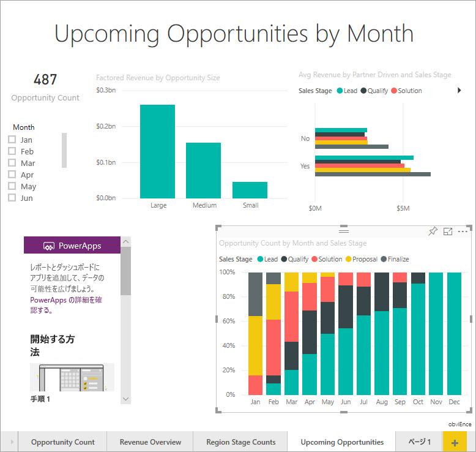

2. [視覚化] ペインで、[Power Apps] アイコンを選択し、作成したスペースに合うようにビジュアルのサイズを変更します。

    ![[Powe Apps] アイコンが選択されている [視覚化] ウィンドウ](media/power-bi-visualization-powerapp/power-bi-powerapps-icon.jpg)

3. **[フィールド]** ウィンドウで、 **[名前]** 、 **[製品コード]** 、 **[営業段階]** を選択します。 

    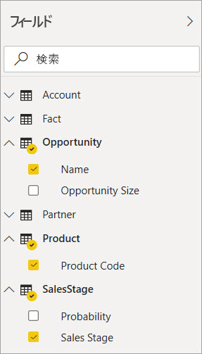

4. Power Apps ビジュアルで、アプリを作成する Power Apps 環境を選択し、 **[新規作成]** を選択します。

    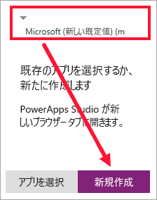

    Power Apps Studio では、基本的なアプリが作成され、Power BI で選択したフィールドの 1 つが "*ギャラリー*" に表示されます。

    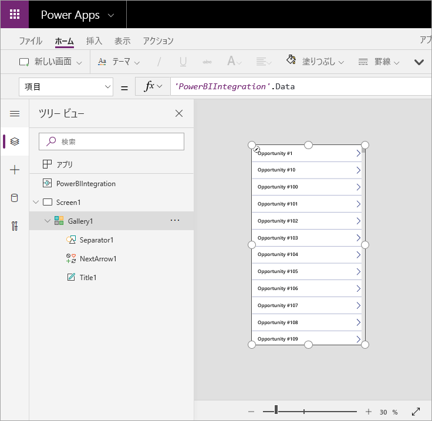

5.  画面の半分のみを占めるようにギャラリーのサイズを変更します。 

6. 左側のペインで、 **[Screen1]** を選択し、画面の **[塗りつぶし]** プロパティを (レポートで目立つように) [LightBlue] に設定します。

    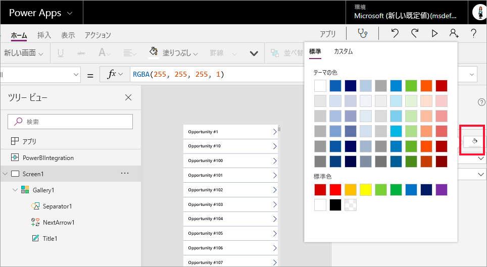

6. ラベル コントロール用のスペースを作成します。 

    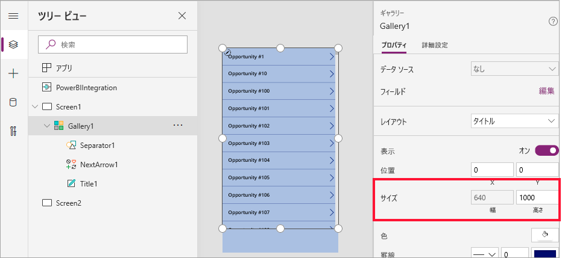

8. **[ギャラリー]** の下に、テキスト ラベル コントロールを挿入します。

   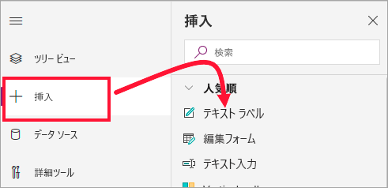

7. ラベルをビジュアルの一番下にドラッグします。 **[テキスト]** プロパティを `"Opportunity Count: " & CountRows(Gallery1.AllItems)` に設定します。 これで、データ セット内の営業案件の総数が表示されます。

    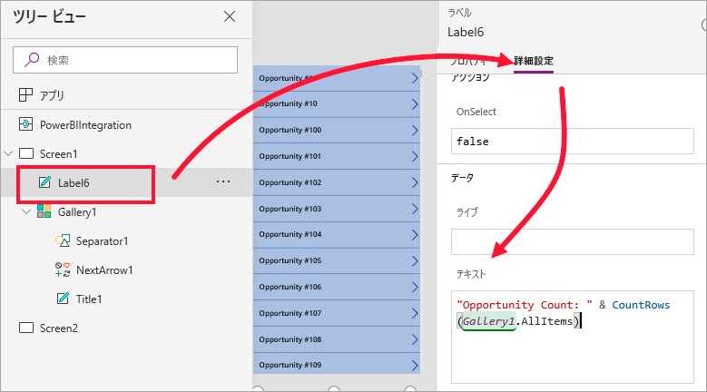

    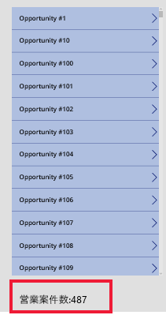

7. 「営業案件」という名前でアプリを保存します。 

    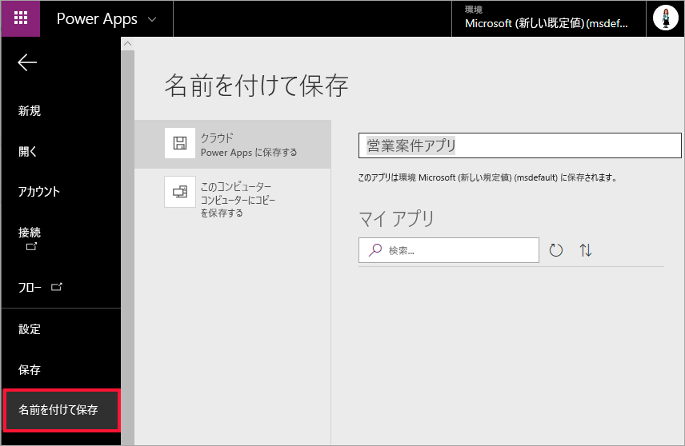

## レポートでアプリを確認する
Power BI レポートでアプリを使用できるようになりました。アプリは他のビジュアルと対話できます。これは、同じデータ ソースを共有しているためです。

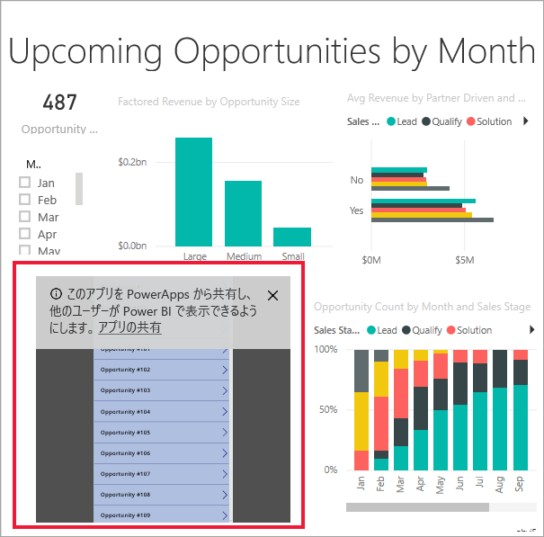

Power BI レポートのスライサーで **[1 月]** を選択します。これで、アプリ内のデータを含むレポート全体がフィルター処理されます。

アプリの営業案件数が、レポートの左上の数と一致することに注目してください。 レポートの他の項目を選択すると、アプリのデータが更新されます。

## リソースをクリーンアップする
営業案件の分析のサンプルをもう使用しない場合は、ダッシュボード、レポート、およびデータセットを削除できます。

## 制限事項と考慮事項
トラブルシューティングの詳細については、「[Power BI 用の Power Apps ビジュアル](https://docs.microsoft.com/powerapps/maker/canvas-apps/powerapps-custom-visualbranch=pr-en-us-2943#limitations-of-the-power-apps-visual)」を参照してください。

## 次の手順
[Q&A ビジュアル](power-bi-visualization-types-for-reports-and-q-and-a.md)    
[チュートリアル: Power BI レポートに Power Apps ビジュアルを埋め込む](https://docs.microsoft.com/powerapps/maker/canvas-apps/powerapps-custom-visual)    
