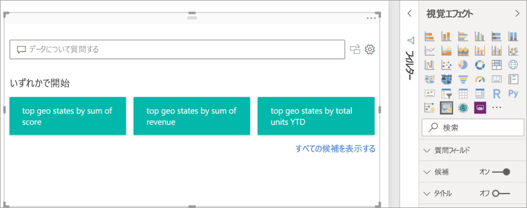
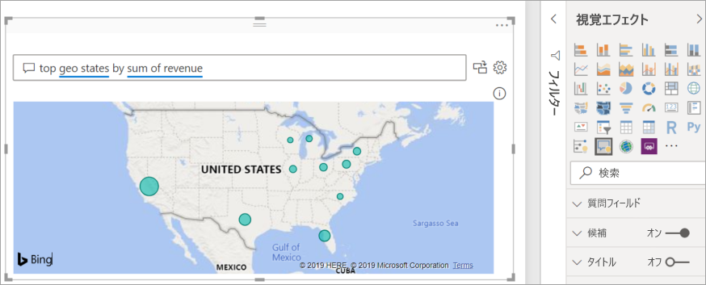
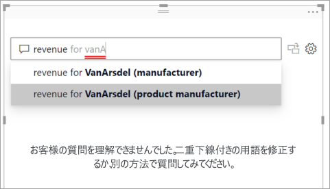
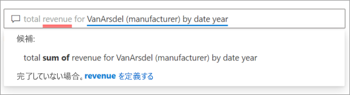
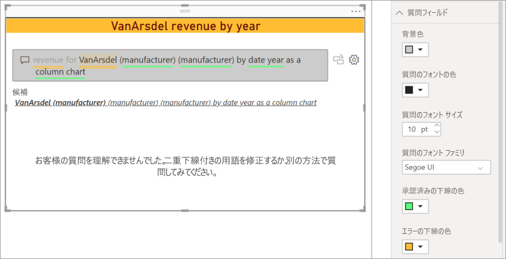
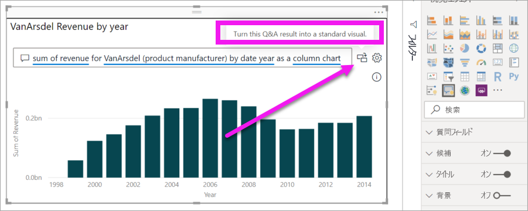
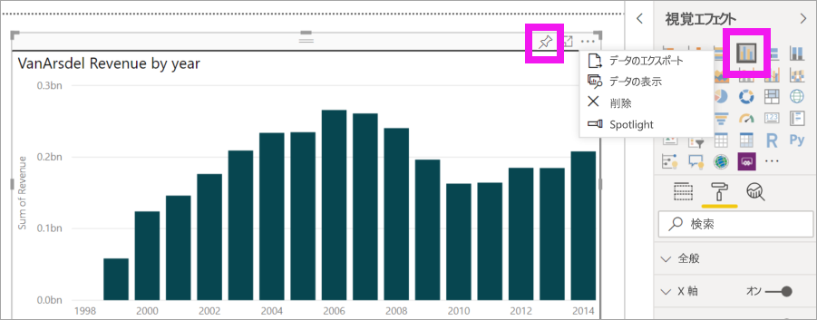
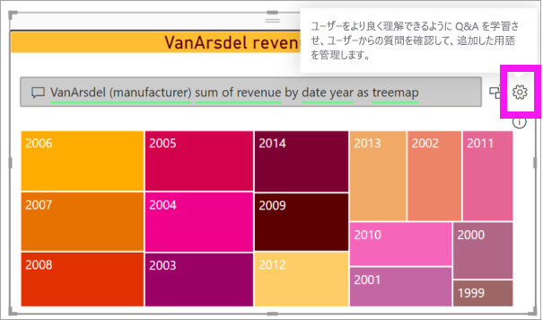

# Power BI Q&A のビジュアル化の概要

[!INCLUDE [power-bi-service-new-look-include](../includes/power-bi-service-new-look-include.md)]

## Q&A のビジュアル化とは

Q&A ビジュアルでは、ユーザーが自然言語で質問すると、その回答がビジュアルの形式で得られます。 

[!INCLUDE [power-bi-visuals-desktop-banner](../includes/power-bi-visuals-desktop-banner.md)]

Q&A ビジュアルは、"*コンシューマー*" がデータに対する回答をすばやく得るためのツールとして使用できます。また、"*デザイナー*" がレポート内にビジュアルを作成する際に、レポート上の任意の場所をダブルクリックし、自然言語を使って開始するだけで済ますために使用することもできます。 Q&A ビジュアルは、他のビジュアルと同様に動作するため、クロスフィルター処理またはクロス強調表示が可能で、ブックマークもサポートされます。 Q&A ビジュアルでは、Power BI 内で使用できるテーマとその他の既定の書式設定オプションもサポートされます。

Q&A ビジュアルは、4 つのコア コンポーネントで構成されています。

- 質問ボックス。 これは、ユーザーが質問を入力する場所であり、質問を完了するのに役立つ提案が表示される場所です。
- 推奨される質問の事前設定された一覧。
- Q&A ビジュアルを標準ビジュアルに変換するためのアイコン。 
- 基になる自然言語エンジンをデザイナーが構成できる Q&A ツールを開くためのアイコン。

## 前提条件

1. このチュートリアルでは、[売上およびマーケティングのサンプル PBIX ファイル](https://download.microsoft.com/download/9/7/6/9767913A-29DB-40CF-8944-9AC2BC940C53/Sales%20and%20Marketing%20Sample%20PBIX.pbix)を使います。 

1. Power BI Desktop メニュー バーの左上のセクションで、 **[ファイル]**  >  **[開く]** の順に選択します
   
2. **売上およびマーケティングのサンプル PBIX ファイル**のコピーを見つけます

1. レポート ビューでファイルを開きます .

1. 選択  を選択して、新しいページを追加します。

Q&A ビジュアルの作成時にエラーが表示される場合は、[制限事項](../natural-language/q-and-a-limitations.md)に関するセクションを参照して、データソース構成がサポートされているかどうかを確認してください。

## 提案された質問を使用して Q&A ビジュアルを作成する
この演習では、提案された質問の 1 つを選択して、Q&A ビジュアルを作成します。 

1. 空白のレポート ページで開始し、[Visualizations]\(視覚エフェクト\) ペインから Q&A ビジュアル アイコンを選択します。

    ![Q&A ビジュアル アイコンが枠で囲まれた [Visualizations]\(視覚エフェクト\) ペイン](media/power-bi-visualization-q-and-a/power-bi-icon.png)

2. 境界線をドラッグして、ビジュアルのサイズを変更します。

    

3. ビジュアルを作成するには、提案された質問のいずれかを選択するか、質問ボックスへの入力を開始します。 この例では、 **[top geo states by sum of revenue]** を選択しました。 Power BI によって最善であると判断される視覚化タイプが、使用するものとして選択されます。 この例ではマップです。

    

    ただし、使用する視覚化タイプは、自然言語クエリに追加することで、Power BI に対して明示的に指定することができます。 実際のデータに対してすべての視覚化タイプが妥当であるとは限らないので注意してください。 たとえば、このデータから意味のある散布図は生成されません。 しかし、塗り分け地図としてなら機能します。

    

## 自然言語クエリを使用して Q&A ビジュアルを作成する
上の例では、提案された質問の 1 つを選択して、Q&A ビジュアルを作成しました。  この演習では、独自の質問を入力します。 質問を入力する際は、Power BI のオートコンプリート、入力ヒント、フィードバック機能を利用できます。

どのような質問をするべきか、またどのような用語を使用すべきかがわからない場合は、 **[すべての候補を表示する]** を展開するか、キャンバスの右側にある [フィールド] ペインを確認します。 そうすることで、売上およびマーケティング データセットの用語と内容について詳しく知ることができます。

![[すべての候補を表示する] を含むキャンバスと、枠で囲まれた [フィールド] ペイン](media/power-bi-visualization-q-and-a/power-bi-terminology.png)

1. Q&A フィールドに質問を入力します。 Power BI で認識できない単語には、赤い下線が追加されます。 Power BI では可能な限り、認識されない単語の定義が支援されます。  次の最初の例では、いずれかの候補を選択するとうまくいきます。  

    

2. 質問をさらに入力すると、Power BI によって質問が理解されていないことが示され、その解決が試行されます。 下の例では、Power BI によって "候補" というメッセージが表示され、データセット内の用語を使用して別の質問文が提案されています。 

    

5. Power BI の支援機能によって、すべて認識可能な用語で質問することができました。 Power BI により、結果が折れ線グラフとして表示されます。 

    

6. ビジュアルを縦棒グラフに変更してみましょう。 

    

7.  レポート ページにビジュアルをさらに追加し、Q&A ビジュアルがページ上の他のビジュアルとどのようにやりとりするかを確認します。 この例の Q&A ビジュアルでは、折れ線グラフとマップのクロスフィルター処理と、棒グラフのクロス強調表示が完了しています。

    

## Q&A ビジュアルを書式設定してカスタマイズする
Q&A ビジュアルは、書式設定ペインを使用したりテーマを適用したりすることによってカスタマイズできます。 

### テーマを適用する
テーマを選択すると、そのテーマはレポート ページ全体に適用されます。 選択できるテーマは多数あるため、お望みの外観になるまで試してみてください。 

1. メニュー バーで、 **[ホーム]** タブを選択し、 **[テーマの切り替え]** を選択します。 

    ![[テーマの切り替え] が選択されたデスクトップ](media/power-bi-visualization-q-and-a/power-bi-themes.png)

    
    
2. この例では、 **[その他のテーマ]**  >  **[Color blind safe]\(色の識別が困難なユーザー対応\)** を選択しました。

    

### Q&A ビジュアルを書式設定する
Q&A ビジュアル、質問フィールド、候補の表示方法を書式設定します。 タイトルの背景から、認識されない単語をポイントしたときの色まで、あらゆるものを変更できます。 ここでは、質問ボックスに灰色の背景を追加し、下線を黄色と緑色に変更しています。 タイトルは中央に配置され、背景が黄色になっています。 

## Q&A ビジュアルを標準ビジュアルに変換する
色の識別が困難なユーザーに対応する縦棒グラフ ビジュアルの書式設定を少し変更して、タイトルと境界線を追加しました。 これで、これをレポート内の標準ビジュアルに変換し、ダッシュボードにピン留めする準備ができました。

 アイコンを選択して、**この Q&A の結果を標準ビジュアルに変換します**。

このビジュアルは、もはや Q&A ビジュアルではなく、標準の縦棒グラフです。 これはダッシュボードにピン留めできます。 レポートでは、このビジュアルは他の標準ビジュアルと同様に動作します。 [Visualizations]\(視覚エフェクト\) ペインには、Q&A ビジュアル アイコンの代わりに選択された [縦棒グラフ] アイコンが表示されることに注意してください。

***Power BI サービス***を使用している場合は、この段階で、ピン アイコンを選択して、ビジュアルをダッシュボードにピン留めできます。 

## Q&A ビジュアルの高度な機能
歯車アイコンを選択すると、Q&A ビジュアルのツール ペインが開きます。 

ツール ペインは、認識できない Q&A 用語を教え、それらの用語を管理し、このデータセットとレポートに関して提案される質問を管理するために使用します。 ツール ペインでは、この Q&A ビジュアルを使用してたずねられた質問を確認し、ユーザーによってフラグが設定された質問を確認することもできます。 詳細については、[Q&A ツールの概要](../natural-language/q-and-a-tooling-intro.md)に関するページを参照してください。

## 考慮事項とトラブルシューティング
Q&A ビジュアルは Office および Bing と統合され、認識されない一般的な単語とデータセット内のフィールドとの照合を試行します。  

## 次の手順

自然言語を統合するには、さまざまな方法があります。 詳細については、次の記事を参照してください。

* [Q&A ツール](../natural-language/q-and-a-tooling-intro.md)
* [Q&A ベスト プラクティス](../natural-language/q-and-a-best-practices.md)
