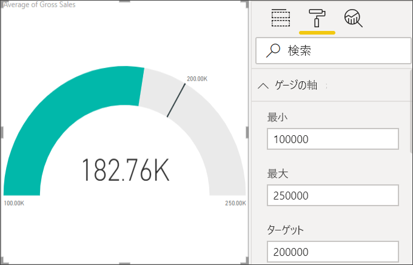

# Power BI の放射状ゲージ グラフ

[!INCLUDE [power-bi-visuals-desktop-banner](../includes/power-bi-visuals-desktop-banner.md)]

放射状ゲージ グラフには、1 つの円弧があり、目標または主要業績評価指標 (KPI) に向けた進行状況を測定した 1 つの値が表示されます。 線 (*指針*) によって目標 (ターゲット値) が示されます。 網掛け表示は、その目標への進行状況を示します。 円弧の内側の値は進行状況の値を示します。 Power BI では、考えられるすべての値は、最小値 (左端の値) から最大値 (右端の値) に向けて、円弧に沿って均等に割り振られます。

この例は、自動車販売店を想定したもので、営業部門の月平均売上の推移を追跡記録しています。 指針には、140 台の売上目標が示されています。 考えられる最小の平均売上は 0 であり、最大売上は 200 です。  青色の網掛けは、現時点でチームの今月の平均売上が約 120 に達していることを示しています。 幸いなことに、目標に到達するまでに、まだ 1 週間の猶予があります。

Will が単一のメトリック ビジュアル (ゲージ、カード、KPI) を作成するのをご覧ください。
   > [!NOTE]
   > このビデオでは、古いバージョンの Power BI Desktop を使用しています。
   > 
   > 
<iframe width="560" height="315" src="https://www.youtube.com/embed/xmja6EpqaO0?list=PL1N57mwBHtN0JFoKSR0n-tBkUJHeMP2cP" frameborder="0" allowfullscreen></iframe>

## 放射状ゲージを使用すべきケース

次の場合は、放射状ゲージが最適な選択になります。

* 目標に向けた進行状況を示す。

* 百分位の測定値を表す (KPI など)。

* 1 つの測定基準の正常性を示す。

* すばやく精査して把握できる情報を表示する。

## 前提条件

このチュートリアルでは、[財務サンプルの Excel ファイル](http://download.microsoft.com/download/9/6/D/96DDC2FF-2568-491D-AAFA-AFDD6F763AE3/Retail%20Analysis%20Sample%20PBIX.pbix)を使用します。

1. メニューバーの左上にある **[データを取得]**  >  **[Excel]** を選択します。
   
2. **財務サンプルの Excel ファイル**のコピーを見つけます。

1. **財務サンプルの Excel ファイル**をレポート ビュー  で開きます。

1. **[財務]** および **[Sheet1]** を選択します。

1. **[読み込み]** をクリックします。

1. 選択  を選択して、新しいページを追加します。

## 基本的な放射状ゲージを作成する

### 手順 1:総売上を追跡するためにゲージを作成する

1. 空のレポート ページで開始します。

1. **[フィールド]** ウィンドウから、 **[Gross Sales]** を選択します。

   

1. 集計を **[平均]** に変更します。

   ![[Gross Sales] と [平均] が強調された [フィールド] ウィンドウのスクリーンショット。](media/power-bi-visualization-radial-gauge-charts/changetoaverage-new.png)

1. ゲージ アイコン  を選択して、縦棒グラフをゲージ グラフに変換します。

    

    **財務サンプル**をいつダウンロードしたかに応じて、これらの数字とは異なる数字が表示される場合があります。

    > [!TIP]
    > 既定では、Power BI は、現在の値 (この例では、 **[Average of Gross Sales]** ) がゲージの中間点に当たると仮定してゲージ グラフを生成します。 **[Average of Gross Sales]** が 182.76K ドルであるため、開始値 (最小値) は 0 に設定され、終了値 (最大値) は現在の値の 2 倍に設定されます。

### 手順 3:対象値を設定する

1. **[フィールド]** ウィンドウから、 **[COGS]** も **[目標値]** にドラッグします。

1. 集計を **[平均]** に変更します。

   Power BI により、ターゲット値の **145.48K ドル**を示す指針が追加されます。

   ![[Average of COGS] が追加されたゲージ グラフのスクリーンショット。](media/power-bi-visualization-radial-gauge-charts/gaugeinprogress-new.png)

    ターゲットを超えていることに注目してください。

   > [!NOTE]
   > 対象値も手動で入力できます。 「[手動の書式オプションを使用して、最小値、最大値、目標値を設定する](#use-manual-format-options-to-set-minimum-maximum-and-target-values)」セクションを参照してください。

### 手順 4:最大値を設定する

手順 2 では、Power BI は **[値]** フィールドを使用して、自動的に最小値と最大値を設定しました。 独自の最大値を設定するには、どうすればよいのでしょうか。 可能な最大値として、現在の 2 倍の値を使用するのではなく、データセット内で最大の総売上額を設定することにしましょう。

1. **[フィールド]** ウィンドウから、 **[最大値]** に **[Gross Sales]** もドラッグします。

1. 集計を **[最大値]** に変更します。

   ![[Gross Sales] と [最大値] が強調された [フィールド] ウィンドウのスクリーンショット。](media/power-bi-visualization-radial-gauge-charts/setmaximum-new.png)

   ゲージは、新しい終了値 (総売上 121 万) で再描画されます。

   

### 手順 5:レポートの保存

1. [レポートを保存](../service-report-save.md)します。

## 手動の書式オプションを使用して、最小値、最大値、目標値を設定する

1. **[最大値]** に **[総売上]** もドラッグします。

1. ペイント ローラー アイコンを選択して、 **[書式]** ウィンドウを開きます。

   ![ゲージ グラフと、ペイント ローラー アイコンが強調された [書式] ウィンドウのスクリーンショット。](media/power-bi-visualization-radial-gauge-charts/power-bi-roller.png)

1. **[ゲージの軸]** を展開し、 **[最小]** と **[最大]** の値を入力します。

    ![[ゲージの軸] オプションのスクリーンショット。](media/power-bi-visualization-radial-gauge-charts/power-bi-gauge-axis.png)

1. **[フィールド]** ウィンドウで **[COGS]** オプションをオフにして、目標値を削除します。

    ![オフにした [COGS] オプションのスクリーンショット。](media/power-bi-visualization-radial-gauge-charts/pbi-remove-target.png)

1. **[ゲージの軸]** の下に **[Target]** フィールドが表示されたら、値を入力します。

     ![[Target] が強調された [ゲージの軸] オプションのスクリーンショット。](media/power-bi-visualization-radial-gauge-charts/power-bi-gauge-target.png)

1. 必要に応じて、ゲージ グラフの書式設定を続けます。

これらの手順が完了すると、次のようなゲージ グラフが表示されます。

## 次の手順

* [主要業績評価指標 (KPI) ビジュアル](power-bi-visualization-kpi.md)

* [Power BI での視覚化の種類](power-bi-visualization-types-for-reports-and-q-and-a.md)

他にわからないことがある場合は、 [Power BI コミュニティを利用してください](http://community.powerbi.com/)。
