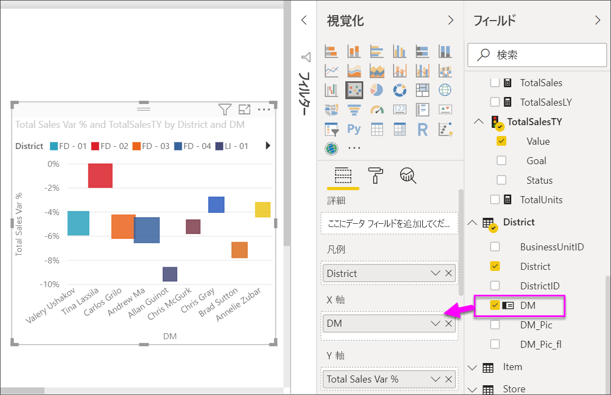

# Power BI での散布図、バブル チャート、およびドット プロット グラフ

[!INCLUDE [power-bi-visuals-desktop-banner](../includes/power-bi-visuals-desktop-banner.md)]

散布図には、必ず 2 つの値軸があり、横軸に沿って数値データの 1 つのセットが表示され、縦軸に沿って数値データのもう 1 つのセットが表示されます。 このグラフには x と y の数値が交差する位置に点が表示され、この 2 つの値が 1 つのデータ ポイントに結合されます。 Power BI では、これらのデータ ポイントが横軸に沿って均等または不均等に分布されます。 これはグラフで表されるデータによって異なります。

このビデオで散布図の作成方法を確認した後、以下の手順に従って自分で作成してみてください。
   > [!NOTE]
   > このビデオでは、古いバージョンの Power BI Desktop を使用しています。
   > 
   > 
<iframe width="560" height="315" src="https://www.youtube.com/embed/PVcfPoVE3Ys?list=PL1N57mwBHtN0JFoKSR0n-tBkUJHeMP2cP" frameborder="0" allowfullscreen></iframe>

データ ポイント数を最大 10,000 まで設定することができます。  

## 散布図、バブル チャート、ドット プロット グラフの使い分けについて

### 散布図およびバブル チャート

散布図は、2 つの数値の間の関係を表します。 バブル チャートでは、データ ポイントがバブルに置き換えられます。バブルの "*サイズ*" は、3 つ目の追加データ ディメンションを表します。

散布図は、次のような場合に最適な選択肢になります。

* 2 つの数値の間の関係を示す。

* 2 つのグループの数値を x 座標と y 座標の 1 つの系列としてプロットする。

* 水平軸のスケールを変更する場合に、折れ線グラフの代わりに使用する。

* 水平軸を対数スケールに変更する。

* ペアまたはグループになった値のセットを含むワークシート データを表示する。

    > [!TIP]
    > 散布図では、2 つの軸のスケールを独立して調整し、グループ化された値についてより多くの情報を引き出すことができます。

* 大きなデータ セットからパターンを表示する。たとえば、線形の傾向や非線形の傾向、クラスター、外れ値を見つけることができます。

* 時間に関係なく、大量のデータ ポイントを比較する。  散布図に含めるデータが多いほど、正確に比較を行うことができます。

散布図では上記のことが可能ですが、バブル チャートは、次のような場合に最適な選択肢になります。

* それぞれ値のセットを含む 3 つのデータ系列で構成されたデータがある。

* 財務データを表示する。  バブル サイズを変更すると、特定の値を視覚的に強調できます。

* 象限 (四分円) を使用する。

### ドット プロット グラフ

ドット プロット グラフは、バブル チャートや散布図と似ていますが、カテゴリ データを X 軸にプロットするのに使用されます。

ドット プロット グラフは、カテゴリ データを X 軸に含める場合に最適な選択肢になります。

## 前提条件

このチュートリアルでは、[小売の分析のサンプル PBIX ファイル](http://download.microsoft.com/download/9/6/D/96DDC2FF-2568-491D-AAFA-AFDD6F763AE3/Retail%20Analysis%20Sample%20PBIX.pbix)を使用します。

1. メニューバーの左上にある **[ファイル]**  >  **[開く]** を選択します。
   
2. **小売の分析のサンプル PBIX ファイル**を探します。

1. **小売の分析のサンプル PBIX ファイル**をレポート ビュー  で開きます。

1. 選択  を選択して、新しいページを追加します。

## 散布図を作成する

1. 空のレポート ページから開始し、 **[フィールド]** ウィンドウで次のフィールドを選択します。

    * **[Sales]**  >  **[Sales Per Sq Ft]**

    * **[Sales]**  >  **[Total Sales Variance %]**

    * **[District]**  >  **[District]**

    ![集合縦棒グラフ、[視覚化] ウィンドウ、[フィールド] ウィンドウ、および選択したフィールドのスクリーンショット](media/power-bi-visualization-scatter/power-bi-bar-chart.png)

1. **[視覚化]** ウィンドウで、 を選択して、 集合縦棒グラフを散布図に変換します。

   

1. **[District] \(地域)** を **[詳細]** から **[凡例]** にドラッグします。

    Power BI によって表示された散布図では、Y 軸に**総売上差異 %** 、X 軸に**平方フィートあたりの売上高**がプロットされています。 データ ポイントの色は地区を表しています。

    

次に、3 番目のディメンションを追加してみましょう。

## バブル チャートを作成する

1. **[フィールド]** ウィンドウから、 **[Sales]\(売上\)**  >  **[This Year Sales]\(今年の売上\)**  >  **[値]** を **[サイズ]** ウェルにドラッグします。 データ ポイントは、売り上げ高の値に比例してボリュームに展開します。

   ![売上高の値を [サイズ] ウェルに追加することでバブル チャートに変換された散布図のスクリーンショット。](media/power-bi-visualization-scatter/power-bi-scatter-chart-size.png)

1. バブルの上にマウスを置きます。 バブルのサイズは、 **[This Year Sales]** の値を反映しています。

    

1. バブル チャートに表示するデータ ポイントの数を設定するには、 **[視覚化]** ウィンドウの **[形式]** セクションで、 **[全般]** を展開し、 **[データ ボリューム]** を調整します。

    ![[視覚化] ウィンドウと、形式アイコン、[全般] ドロップダウン、および [データ ボリューム] オプションのスクリーンショット。](media/power-bi-visualization-scatter/pbi-scatter-data-volume.png)

    10,000 までの任意の値に最大データ量を設定できます。 数字が大きくなったら、最初にテストをして、良いパフォーマンスが得られることを確認することをお勧めします。

    > [!NOTE]
    > データ ポイントが多いほど読み込み時間が長くなります。 スケールの上限に制限のあるレポートを発行する場合は、Web とモバイルでレポートをテストし、 グラフでユーザーが望むパフォーマンスが得られることを確認する必要があります。

1. [視覚化の色、ラベル、タイトル、背景などの書式を設定する](service-getting-started-with-color-formatting-and-axis-properties.md)ことができます。

    [アクセシビリティを向上させる](../desktop-accessibility.md)には、行ごとにマーカー図形を追加することを検討します。 マーカーの形状を選択するには、 **[図形]** を展開し、 **[マーカーの図形]** を選択して図形を選択します。

    ![[図形] ドロップダウンと [マーカーの図形] オプションのスクリーンショット。](media/power-bi-visualization-scatter/pbi-scatter-marker.png)

    マーカーの図形をひし形、三角形、または正方形に変更できます。 各線に別のマーカーの図形を使用すると、レポートの使用者は個々の線 (または領域) を区別するのが容易になります。

## ドット プロット グラフを作成する

ドット プロット グラフを作成するには、 **[X 軸]** 数値フィールドをカテゴリ フィールドに置き換えます。

**[X 軸]** ウィンドウで、 **[平方フィート単位の売上]** を削除し、 **[地区]**  >  **[District Manager]\(地区マネージャー\)** に置き換えます。

## 考慮事項とトラブルシューティング

### 散布図グラフにデータ ポイントが 1 つだけ表示される

散布図に、X 軸上と Y 軸上のすべての値を集計した 1 つのデータ ポイントのみが表示されていますか?  あるいは、1 本の横線または縦線に沿ってすべての値が集計されていますか?

**[詳細]** ウェルにフィールドを追加して、値をグループ化する方法を Power BI に指示してください。 フィールドは、プロットするポイントごとに一意である必要があります。 シンプルな行番号や ID フィールドの場合はこれで十分です。

![RowNum が [詳細] ウェルに追加されている散布図のスクリーンショット。](media/power-bi-visualization-scatter/pbi-scatter-tshoot.png)

そのようなデータがない場合は、X と Y の値を連結してポイントごとに一意の値を持つフィールドを作成します。

![TempTime が [詳細] ウェルに追加されている散布図のスクリーンショット。](media/power-bi-visualization-scatter/pbi-scatter-tshoot2.png)

新しいフィールドを作成するには、[Power BI Desktop クエリ エディターを使ってデータセットにインデックス列を追加します](../desktop-add-custom-column.md)。 その後、この列を視覚化の **[詳細]** ウェルに追加します。

## 次の手順

* [Power BI 散布図の高密度サンプリング](desktop-high-density-scatter-charts.md)

* [Power BI での視覚化の種類](power-bi-visualization-types-for-reports-and-q-and-a.md)

他にわからないことがある場合は、 [Power BI コミュニティを利用してください](http://community.powerbi.com/)。
