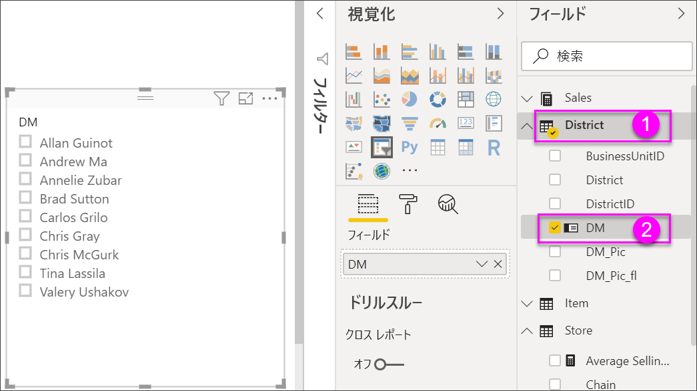
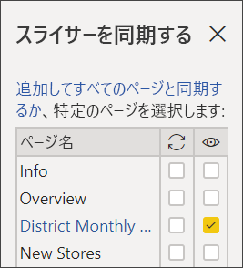
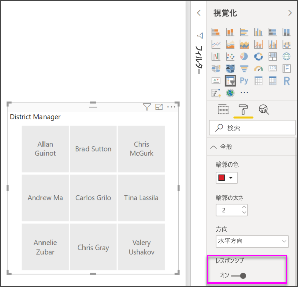
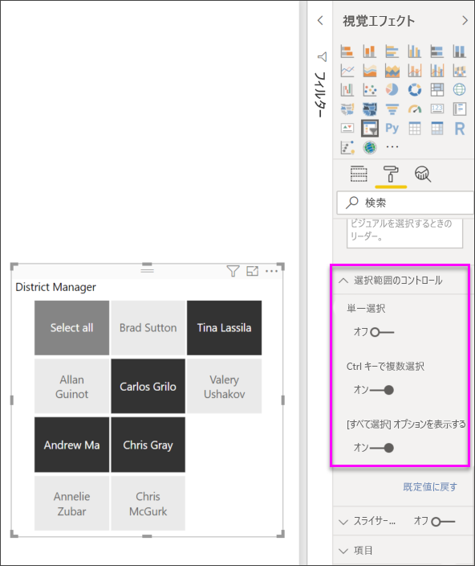
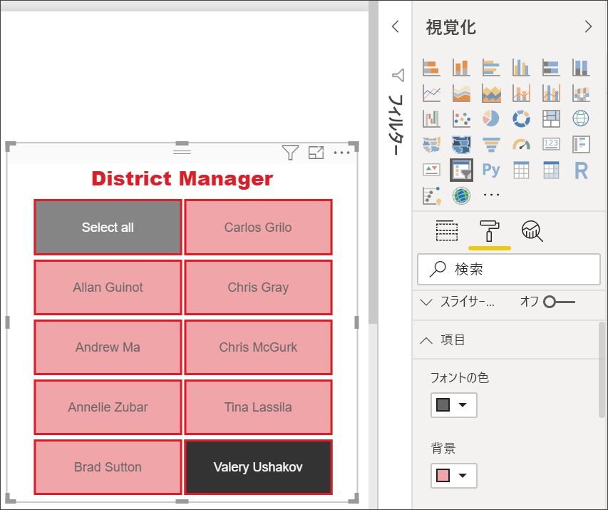

# Power BI のスライサー

[!INCLUDE [applies-to](../includes/applies-to.md)] [!INCLUDE [yes-desktop](../includes/yes-desktop.md)] [!INCLUDE [yes-service](../includes/yes-service.md)]

レポートを見る人が売り上げ全体の指標を調べることができるだけでなく、個々の地域マネージャーや異なる期間の実績に注目することもできるようにしたい場合があります。 個別のレポートや比較グラフを作成してもかまいません。 または、"*スライサー*" を使用することもできます。 スライサーはフィルターの代わりになる手段であり、レポートの他の視覚化に表示されるデータセットの一部を絞り込むことができます。 

この記事では、無料の[小売りの分析のサンプル](../create-reports/sample-retail-analysis.md)を使用して、基本的なスライサーを作成して書式設定する手順を説明します。 また、スライサーによって影響を受けるビジュアルを制御する方法と、他のページのスライサーと同期する方法についても説明します。 ここで、特定の種類のスライサーの作成方法について説明している他の記事をいくつか紹介します。

- [数値範囲スライサー](../create-reports/desktop-slicer-numeric-range.md)。
- [相対日付スライサー](desktop-slicer-filter-date-range.md)。
- レスポンシブで[サイズ変更可能なスライサー](../create-reports/power-bi-slicer-filter-responsive.md)。
- 複数のフィールドがある[階層スライサー](../create-reports/power-bi-slicer-hierarchy-multiple-fields.md)。

## スライサーを使用する場合
スライサーは、次のような場合に最適です。

* レポート キャンバスによく使うフィルターまたは重要なフィルターを表示してアクセスしやすくする。
* ドロップダウン リストを開くことなく、現在のフィルターされた状態を簡単に表示する。 
* データ テーブルで不要な非表示の列でフィルター処理する。
* 重要なビジュアルの隣にスライサーを配置することにより、レポートを絞り込む。

Power BI スライサーでは次の機能はサポートされていません。

- 入力フィールド
- ドリルダウン

## スライサーの作成

このスライサーでは、地区マネージャーによってデータをフィルター処理します。 この手順に従って作業する場合は、[小売りの分析のサンプル PBIX ファイル](https://download.microsoft.com/download/9/6/D/96DDC2FF-2568-491D-AAFA-AFDD6F763AE3/Retail%20Analysis%20Sample%20PBIX.pbix)をダウンロードしてください。

1. Power BI Desktop を開き、メニュー バーの **[ファイル]**  >  **[開く]** を選択します。
   
1. **Retail Analysis sample PBIX.pbix** ファイルを参照し、 **[開く]** を選択します。

1. 左側のペインで、 **[レポート]** アイコン ![[レポート] アイコン](media/power-bi-visualization-kpi/power-bi-report-view.png) を選択し、レポート ビューでファイルを開きます。

1. **Overview** ページを開き、レポート キャンバスで何も選択されていない状態で、 **[視覚化]** ウィンドウの **[スライサー]** アイコン ![[スライサー] アイコン](media/power-bi-visualization-slicers/slicer-icon.png) を選択して新しいスライサーを作成します。 

1. 新しいスライサーが選択されている状態で、 **[フィールド]** ウィンドウから **District** > **DM** の順に選択し、スライサーを設定します。 

    これで、新しいスライサーに地区マネージャーの名前とその選択ボックスの一覧が設定されます。
    
    
    
1. キャンバス上の要素のサイズを変更してドラッグし、スライサーのスペースを確保します。 スライサーのサイズを小さくしすぎると、項目が切れてしまうので注意してください。 

1. スライサーの名前を選択し、ページ上の他の視覚エフェクトに与える影響を確認します。 名前を再び選んで選択を解除したり、**Ctrl** キーを押しながら複数の名前を選択したりします。 すべての名前を選ぶと、何も選ばない場合と同じ効果になります。 

1. または、 **[視覚化]** ペインで **[書式]** (ペイント ローラー アイコン) を選択して、スライサーの書式を設定します。 

   オプションは非常に多いため、ここですべてを説明することはできません。いろいろ試して最適なスライサーを作成してください。 次の図の 1 番目のスライサーは、横方向に配置され、項目の背景が色付きになっていいます。 2 番目のスライサーは、縦方向の配置で色付きのテキストと、より標準的な外観になっています。

   

   >[!TIP]
   >スライサーのリスト項目は、既定では昇順に並べられます。 並べ替え順序を逆の降順にするには、スライサーの右上隅にある省略記号 ( **...** ) を選択し、ドロップダウン リストで **[降順で並べ替え]** を選択します。

## スライサーによって影響を受けるページ ビジュアルを制御する
既定では、レポート ページ上のスライサーは、他のスライサーも含めて、そのページ上にある他のすべての視覚エフェクトに影響します。 作成したリスト スライサーと日付スライダーで値を選択して、他の視覚エフェクトへの影響を確認してください。 フィルター選択されるデータは、両方のスライサーで選択した値の積集合です。 

一部のページ視覚エフェクトを他のスライサーの影響から除外するには、ビジュアル対話を使用します。 **Overview** ページの **Total Sales Variance by FiscalMonth and District Manager** グラフには、月ごとの地区マネージャーの全体的な比較データが表示されており、これは常に表示しておく必要があります。 ビジュアル対話を使用して、スライサーを選択してもこのグラフがフィルター処理されないようにします。 

1. レポートの **Overview** ページに移動し、前に作成した **DM** スライサーを選択します。

1. Power BI Desktop のメニューで、 **[ビジュアル ツール]** の **[書式]** メニューを選択し、 **[相互作用を編集]** を選択します。
   
   それぞれに **[フィルター]** オプションと **[なし]** オプションが含まれるフィルター コントロール  が、ページ上のすべてのビジュアルの上に表示されます。 最初は、すべてのコントロールの **[フィルター]** オプションがあらかじめ選択されています。
   
1. **Total Sales Variance by FiscalMonth and District Manager** グラフの上のフィルター コントロールで **[なし]** オプションを選択して、**DM** スライサーのフィルター処理を停止します。 

1. **OpenDate** スライサーを選択し、**Total Sales Variance by FiscalMonth and District Manager** グラフの上の **[なし]** オプションを選択して、このスライサーのフィルター処理を停止します。 

   これで、スライサーで名前や日付範囲を選択しても、**Total Sales Variance by FiscalMonth and District Manager** グラフは変更されません。

相互作用の編集について詳しくは、「[Power BI レポート内でのビジュアルの相互作用を変更する](../create-reports/service-reports-visual-interactions.md)」をご覧ください。

## 他のページでスライサーを同期して使用する
Power BI の 2018 年 2 月更新以降では、スライサーを同期し、レポートの任意のページまたはすべてのページで使用できます。 

現在のレポートの **District Monthly Sales** ページには **District Manager** スライサーがありますが、そのスライサーが **New Stores** ページでも必要な場合はどうでしょうか。 **New Stores** ページにはスライサーがありますが、**Store Name** 情報のみが提供されています。 **[スライサーの同期]** ペインでは、いずれかのページでスライサーを選択すると、3 つすべてのページの視覚エフェクトに反映されるよう、**District Manager** スライサーをこれらのページと同期できます。

1. Power BI Desktop の **[表示]** メニューで、 **[スライサーの同期]** を選択します。

    ![[スライサーの同期] を選択](media/power-bi-visualization-slicers/power-bi-slicer-view-sync.png)

    **[スライサーの同期]** ペインが、 **[フィルター]** ペインと **[視覚化]** ペインの間に表示されます。

    ![[スライサーの同期] ペイン](media/power-bi-visualization-slicers/power-bi-slicer-sync-pane.png)

1. レポートの **District Monthly Sales** ページで、**District Manager** スライサーを選択します。 

    **Overview** ページに **District Manager** (**DM**) スライサーを既に作成してあるため、 **[スライサーの同期]** ペインは次のように表示されます。
    
    
    
1. **[スライサーの同期]** ペインの **[同期]** 列で、**Overview**、**District Monthly Sales**、**New Stores** の各ページを選択します。 

    この選択により、**District Monthly Sales** スライサーが、これら 3 つのページ間で同期されます。 
    
1. **[スライサーの同期]** ペインの **[表示]** 列で、**New Stores** ページを選択します。 

    この選択により、**District Monthly Sales** スライサーが、これら 3 つのページで表示されるようになります。 **[スライサーの同期]** ペインの表示は次のようになります。

    ![[スライサーの同期] でページを選択する](media/power-bi-visualization-slicers/power-bi-sync-slicer-finished.png)

1. スライサーの同期の効果を観察し、他のページで表示されるようにします。 **District Monthly Sales** ページで、**District Manager** スライサーに **Overview** ページと同じ選択が表示されるようになったことに注意してください。 **New Stores** ページでは、**District Manager** スライサーが表示されるようになり、その選択により、**Store Name** スライサーに表示される選択が影響を受けます。 
    
    >[!TIP]
    >同期されたページのスライサーは、最初は元のページと同じサイズおよび位置に表示されますが、各ページで個別に、同期されたスライサーを移動したり、サイズや書式設定を変更したりできます。 

    >[!NOTE]
    >他のページへのスライサーの同期だけを設定して、表示を設定しない場合でも、他のページで行われたスライサーの選択により、そのページのデータがフィルター処理されます。
 
## スライサーのフィルター処理
ビジュアル レベルのフィルターをスライサーに適用すれば、スライサーに一覧表示される値の数を減らすことができます。 たとえば、リスト スライサーから空白値をフィルターで除外したり、範囲スライサーから特定の日付をフィルターで除外したりすることができます。 これを行う場合、影響を受けるのは "*スライサーに表示される値*" のみであり、選択時に "*スライサーによって他のビジュアルに適用されるフィルター*" は影響を受けません。 たとえば、特定の日付のみを表示するように、範囲スライサーにフィルターを適用するとします。 スライサー上の選択では、その範囲の最初と最後の日付しか表示されませんが、ご利用の他のビジュアルには引き続き他の日付が表示されます。 スライサーで選択範囲を変更すると、他のビジュアルが更新されるのがわかります。 スライサーをクリアすると、すべての日付が再度表示されます。

ビジュアル レベルのフィルターの詳細については、[フィルターの種類](../create-reports/power-bi-report-filter-types.md)に関するページを参照してください。

## スライサーの書式設定
スライサーの種類に応じて、異なる書式設定オプションを使用できます。 **横**方向、**レスポンシブ** レイアウト、および**項目**の色分けを使用して、標準の一覧項目ではなくボタンやタイルを生成し、異なる画面サイズやレイアウトに合わせてスライサー項目のサイズが変化するようにできます。  

1. いずれかのページで **District Manager** スライサーを選択した状態で、 **[視覚化]** ウィンドウで **[書式]** アイコン ![[書式] アイコン](media/power-bi-visualization-slicers/power-bi-paintroller.png) を選択して書式設定コントロールを表示します。 
    
    ![[書式] の選択](media/power-bi-visualization-slicers/3-format.png)
    
1. 各カテゴリの横にあるドロップダウン矢印を選択してオプションを表示し、編集します。 

### [全般] オプション
1. **[書式]** で **[全般]** を選択し、 **[輪郭の色]** で赤を選択してから、 **[輪郭の太さ]** を *2* に変更します。 

    この設定により、ヘッダーと項目の輪郭と下線の色と太さが変更されます。

1. **[方向]** では、 **[縦]** が既定で選択されます。 **[横]** を選択すると、タイルやボタンが横方向に配置され、スライサーに収まらない項目にアクセスするためのスクロール矢印が付いた、スライサーが作成されます。
    
    ![[全般] の選択](media/power-bi-visualization-slicers/4-horizontal.png)
    
1. ビュー画面とスライサーのサイズに応じて、スライサーの項目のサイズと配置を変更するには、 **[レスポンシブ]** レイアウトを **[オン]** にします。 

    リスト スライサーの場合、レスポンシブ レイアウトは小さい画面で項目が切り取られるのを防ぎます。 横方向でのみ使用できます。 範囲スライダー スライサーのレスポンシブ書式設定では、スライダーのスタイルが変更されて、より柔軟なサイズ変更を提供します。 どちらの種類のスライサーも、小さいサイズではフィルター アイコンになります。
    
    
    
    >[!NOTE]
    >レスポンシブ レイアウトの変更により、ユーザーが設定した特定の見出しと項目の書式設定がオーバーライドされることがあります。 
    
1. **[X 方向の位置]** 、 **[Y 方向の位置]** 、 **[幅]** 、 **[高さ]** でスライサーの位置とサイズを数値で指定するか、キャンバス上で直接スライサーを移動およびサイズ変更します。 

    項目のサイズと配置を変えてテストし、それに従ってレスポンシブ書式設定がどのように変化するかを確認してください。 これらのオプションは、横方向を選択した場合にのみ使用できます。 

    

横方向およびレスポンシブ レイアウトについて詳しくは、「[Power BI でサイズを変更することが可能なレスポンシブ スライサーの作成](../create-reports/power-bi-slicer-filter-responsive.md)」をご覧ください。

### [選択範囲のコントロール] のオプション (リスト スライサーのみ)
1. **[選択範囲のコントロール]** で、 **[[すべて選択] オプションを表示する]** を **[オン]** にして、スライサーに **[すべて選択]** 項目を追加します。 

    **[[すべて選択] オプションを表示する]** は、既定では **[オフ]** になっています。 このオプションを有効にして替えると、すべての項目が選択または選択解除されます。 すべての項目を選択してから、1 つの項目の選択を解除すると、"*ではないもの*" タイプのフィルターを設定できます。
    
    
    
1. **Ctrl** キーを押し続けなくても複数の項目を選択できるようにするには、 **[単一選択]** を **[オフ]** にします。 

    **[単一選択]** は、既定では **[オン]** になっています。 1 つの項目を選択し、**Ctrl** キーを押しながら複数の項目を選択します。 項目を再度選択すると、選択が解除されます。

### タイトルのオプション
**[タイトル]** は、既定で **[オン]** になります。 この選択により、スライサーの上部にデータ フィールド名が表示されます。 
- この記事では、タイトルのテキストを次のように書式設定します。 
   - **フォントの色**: 赤
   - **文字のサイズ**:**14 pt**
   - **配置**: **中央**
   - **フォント ファミリ**:**Arial Black**

### [項目] のオプション (リスト スライサーのみ)
1. この記事では、 **[項目]** のオプションを次のように書式設定します。
    - **フォントの色**: 黒
    - **背景**: 明るい赤
    - **文字のサイズ**:**10 pt**
    - **フォント ファミリ**:**Arial**
 
1. **[アウトライン]** で **[フレーム]** を選択し、 **[全般]** オプションで設定したサイズと色で各項目を境界線で囲みます。 
    
    
    
    >[!TIP]
    >- **[全般]**  >  **[方向]**  >  **[横]** を選択した場合は、選択されていない項目は指定したテキスト色と背景色で表示されますが、選択された項目ではシステムの既定値 (通常は黒い背景と白いテキスト) が使用されます。
    >- **[全般]**  >  **[方向] > [縦]** を選択した場合は、項目は常に選択したした色で表示され、チェック ボックスはオンの場合は常に黒で表示されます。 

### 日付/数値入力とスライダーのオプション (範囲スライダー スライサーのみ)
- リスト スライサーの場合、日付/数値入力のオプションは、アウトラインまたは下線がないことを除けば、 **[項目]** オプションと同じです。
- **[スライダー]** オプションでは、範囲スライダーの色を設定でき、スライダーを **[オフ]** にすると数値入力だけが表示されます。

### その他の書式設定オプション
その他の書式設定オプションは、既定では **[オフ]** です。 これらのオプションを制御するには **[オン]** にします。 
- **背景**: スライサーに背景色を追加し、透過性を設定します。
- **縦横比を固定する**: スライサーのサイズを変更するときに形状を維持します。
- **罫線**: スライサーの周囲に枠線を追加し、その色を設定します。 このスライサーの枠線は、 **[全般]** の設定とは別であり影響を受けません。 

## 次の手順
詳細については、次の記事を参照してください。

- [Power BI での視覚化の種類](power-bi-visualization-types-for-reports-and-q-and-a.md)

- [Power BI のテーブル](power-bi-visualization-tables.md)
