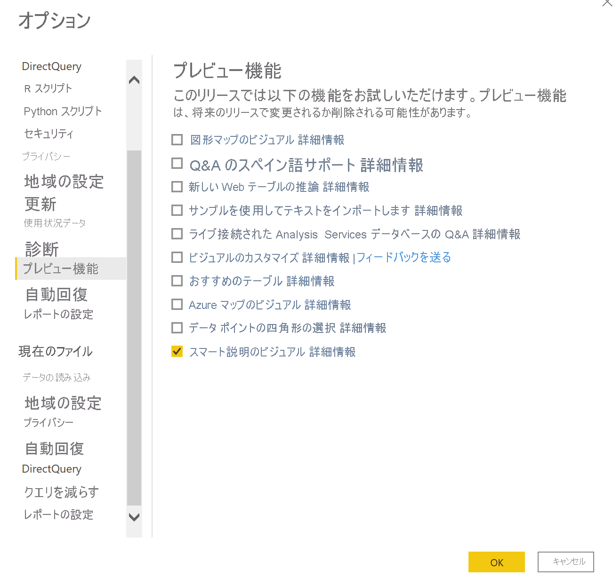
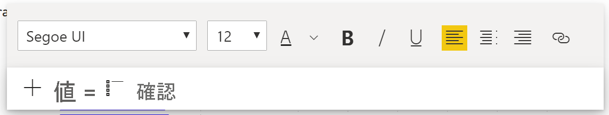
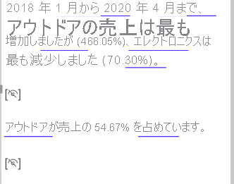

# スマート説明を作成する (プレビュー)

[!INCLUDE[consumer-appliesto-nyyn](../includes/consumer-appliesto-nyyn.md)]    

[!INCLUDE [power-bi-visuals-desktop-banner](../includes/power-bi-visuals-desktop-banner.md)]

スマート説明の視覚化を使用すると、カスタマイズ可能なすぐに利用できる関連分析情報を提供することで、視覚化とレポートをすばやくまとめることができます。

作成者はこの機能を使って、レポートに説明を追加できます。重要な習得事項を説明したり、傾向を指摘したり、特定の読者に向けて言語の編集と書式設定を行ったりできます。 レポートのスクリーンショットを PowerPoint に貼り付けて重要な習得事項を追加する代わりに、レポートを更新するたびに更新される説明をレポートに追加できるようになりました。 エンド ユーザーは、説明を利用してデータを理解し、重要なポイントをすばやく把握し、他のユーザーにデータを説明することができます。

>[!NOTE]
> この機能はプレビュー段階であるため、まず機能スイッチをオンにする必要があります。それには [ファイル] > [オプションと設定] > [オプション] > [プレビュー機能] に移動して、 **[Smart narrative visual]\(スマート説明視覚エフェクト\)**  がオンになっていることを確認します。

Online Sales シナリオ用に使用される pbix については、[こちら](https://github.com/microsoft/powerbi-desktop-samples/blob/master/Monthly%20Desktop%20Blog%20Samples/2020/2020SU09%20Blog%20Demo%20-%20September.pbix)のドキュメントを参照してください。

## 開始するには 

[視覚化] ペインの新しいスマート説明アイコンをクリックすると、自動的に概要が生成されます。

 ページ上のすべての視覚エフェクトに基づいて説明が作成されることがわかります。 たとえば、アイコンをクリックすると、このレポート内の収益、Web サイト訪問者数、売上について説明した各視覚エフェクトの概要が自動的に生成されます。 Power BI によって自動的に傾向分析が行われ、収益と訪問者数が両方とも増加していることが示されていることがわかります。さらに、どの程度の成長率であるかも計算されています。この場合は 72% の増加です。
 
 
 
 視覚エフェクトを右クリックして **[概要]** を選択することもできます。 その視覚エフェクトの概要が自動的に生成されます。 たとえば、さまざまなトランザクションを示す散布図に対して右クリック > [概要] を選択すると、Power BI によってデータが分析され、トランザクションあたりの収益が最も高い、またトランザクションの数が最も多い都市や地域が示されます。 また、これらのメトリックについて予想される値の範囲も示されます。これにより、ほとんどの都市はトランザクションあたりの収益が $45 未満であり、トランザクション数が 10 回未満であったことを把握できます。
 
  
 
 
 ## 概要を編集する
 
 概要には高度な**カスタマイズが可能**です。通常のテキスト ボックスと同じコントロールを使用して新しいテキストを追加したり、既存のテキストを編集したりできます。 たとえば、テキストを太字にしたり、テキストの色を変更したりできます。
 
  
  
  また、**動的な値**を追加することによって概要をカスタマイズし、独自の分析情報を追加することもできます。 テキストを既存のフィールドやメジャーにマップしたり、自然言語を使用してテキストにマップする新しいメジャーを定義したりできます。 たとえば、返品数に関する情報を追加したい場合、gif に示されているように値の追加エクスペリエンスを使用できます。 動的な値を追加するための Q&A エクスペリエンスが統合されています。 入力すると、Q&A 視覚エフェクトのようにドロップダウンに候補が表示されるので、これを値として保存するだけです。  そのため、Q&A でデータについて質問できるだけでなく、DAX すら実行せずに独自の計算を作成することができます。 
  
   
  
  動的な値の書式を設定することができます。たとえば、通貨として表示したり、小数点以下の桁数や桁区切り記号を指定したりできます。 
   
   
   
   これを行うには、概要の値を直接クリックして書式を設定するか、テキスト ボックス コントロールの [確認] タブで値に対応する編集ボタンをクリックします。 
   
   ![動的な値の書式設定 [確認] タブ](media/power-bi-visualization-smart-narratives/9.png)
   
   [確認] タブでは、以前に定義した値の確認、削除、再利用を行うこともできます。  プラス アイコンをクリックすると、その値が概要に挿入されます。 また、下部にあるオプションを切り替えて自動生成された値を表示することもできます。

"現在のデータとフィルターではこの値に対する結果がありません" という内容の、非表示の概要シンボルが表示されることがあります。 これは、伝えるべき情報がないため概要が空になる可能性があるためです。 たとえば、折れ線グラフの高値と低値を調べる概要は、それが平坦な線であれば空になる可能性がありますが、他の条件下では空でない可能性もあります。 これらのシンボルは、概要を編集しようとしたときにのみ表示されます。

   
   
   ## ビジュアル対話
   概要は動的です。クロスフィルターを使用すると、生成されたテキストと動的な値が自動的に更新されます。 たとえば、ドーナツ グラフで Electronics 製品を選択すると、レポートの残りの部分はクロスフィルターされます。概要もクロスフィルターされて Electronics 製品に焦点が当てられます。  この場合、訪問者数と収益の傾向が異なるため、それを反映するようにテキストが更新されます。 また、追加した返品数の値が $4196 に更新されます。 クロスフィルターを行うと、一部の空の概要も更新される可能性があります。
   
   
   
   さらに高度なフィルター処理を行うこともできます。 たとえば、複数の異なる製品の傾向を調べる次の視覚エフェクトについて、ある四半期の傾向だけに興味がある場合は、関連するデータ ポイントを選択するだけでそのフラグメント用に更新された概要を得られます。
   
   
   
   ## 制限事項
   - ダッシュボードへのピン留めはサポートされていません。
   - 動的な値と条件付き書式設定 (データ バインドされたタイトルなど) の使用はサポートされていません。
   - Azure Analysis Services、オンプレミス AS はサポートされていません。
   - KPI、カード、複数行カード、マップ、テーブル、マトリックス、R/Python 視覚エフェクト、カスタム視覚エフェクトでは、概要作成がサポートされていません。 これらの視覚エフェクトの一部は、今後追加される予定です。
   - 他の列によってグループ化された列を含む視覚エフェクトや、データ グループ フィールドに基づいて構築された視覚エフェクトでは、概要作成がサポートされていません。 
   - 視覚エフェクト外のクロスフィルター処理はサポートされていません。
   - 動的な値の名前変更や、自動生成された動的な値の編集はサポートされていません。
   - QnA 算術や総計のパーセントなど、実行時の計算を含む視覚エフェクトの概要作成はサポートされていません。
   

