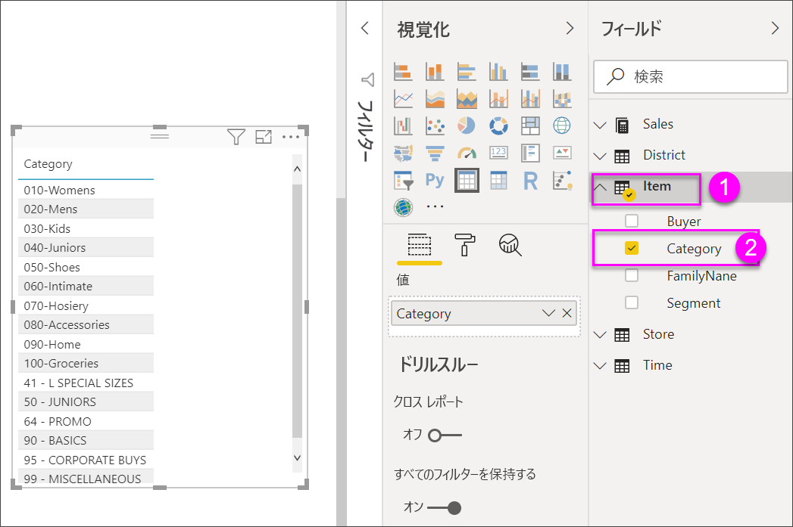
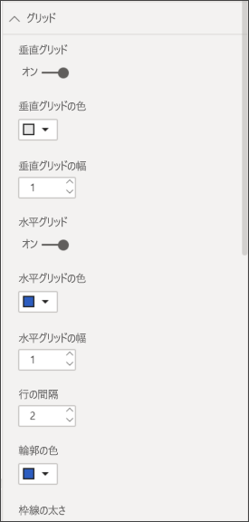
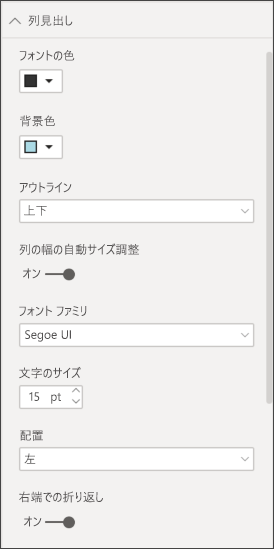
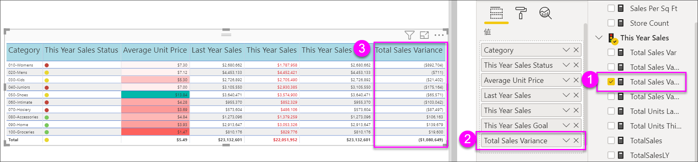
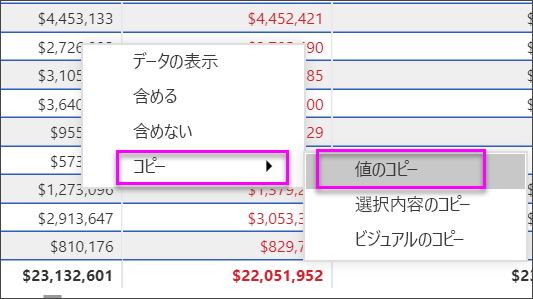
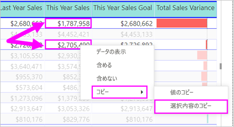

# Power BI のレポートとダッシュボードのテーブル

[!INCLUDE [power-bi-visuals-desktop-banner](../includes/power-bi-visuals-desktop-banner.md)]

テーブルは、関連性のあるデータが論理的な一連の行と列に格納されたグリッドです。 ヘッダーと合計行が含まれる場合もあります。 テーブルは、1 つのカテゴリの多くの値を調べるときの定量的な比較で役に立ちます。 たとえば、次のテーブルには、**カテゴリ**に対する 5 つの異なるメジャーが表示されています。

レポート内でテーブルを作成し、そのテーブル内の要素を、同じレポート ページ上の他のビジュアルを使用してクロス強調表示します。 行、列、個々のセルを選択して、クロス強調表示できます。 個々のセルおよび複数のセルを選択してコピーし、他のアプリケーションに貼り付けることもできます。

## テーブルを使う場合

テーブルは、次のような場合に最適です。

* 詳細なデータと正確な値を表示して比較する (視覚的な表現ではなく)。

* データを表形式で表示する。

* 数値データをカテゴリ別に表示する。

## 前提条件

このチュートリアルでは、[小売の分析のサンプル PBIX ファイル](https://download.microsoft.com/download/9/6/D/96DDC2FF-2568-491D-AAFA-AFDD6F763AE3/Retail%20Analysis%20Sample%20PBIX.pbix)を使用します。

1. メニューバーの左上にある **[ファイル]**  >  **[開く]** を選択します。
   
2. **小売の分析のサンプル PBIX ファイル**を探します。

1. **小売の分析のサンプル PBIX ファイル**をレポート ビュー  で開きます。

1. 選択  を選択して、新しいページを追加します。

## テーブルを作成する

この記事の最初に示したテーブルを作成して、売上高の値を品目カテゴリ別に表示します。

1. **[フィールド]** ウィンドウで、 **[品目]**  >  **[カテゴリ]** を選択します。

    すべてのカテゴリを一覧表示するテーブルが自動的に作成されます。

    

1. **[Sales]\(売上\) > [Average Price]\(平均単価\)** および **[Sales]\(売上\) > [Last Year Sales]\(前年度の売上\)** を選択します

1. 次に、 **[Sales]\(売上\) > [This Year Sales]\(今年の売上\)** を選択し、 **[値]** 、 **[目標]** 、 **[状況]** の 3 つオプションすべてを選択します。

1. **[視覚化]** ウィンドウで **[値]** ウェルを探し、グラフの列の順序がこのページの最初の図と一致するまで値を選択します。 必要に応じて、ウェルで値をドラッグします。 **[値]** ウェルは次のようになります。

    ![[値] ウェル](media/power-bi-visualization-tables/power-bi-table2.png)

## テーブルの書式を設定する

テーブルの書式を設定する方法は多数あるので、 ここではごく一部を紹介します。 他の書式設定オプションについては、 **[形式]** ウィンドウ (ペイント ローラー アイコン ) を開いて確認することをお勧めします。

* テーブル グリッドの書式を設定してみましょう。 ここでは、青色の垂直グリッドを追加し、行にスペースを追加して、アウトラインとテキスト サイズを増やします。

    

    

* 列ヘッダーについては、背景色を変更し、アウトラインを追加して、フォント サイズを増やします。

    

    

* 個々の列および列ヘッダーに書式設定を適用することもできます。 最初に **[フィールドの書式]** を展開し、ドロップダウン リストから書式を設定する列を選択します。 列の値に応じて、 **[フィールドの書式]** では表示単位、フォントの色、小数点以下の桁数、背景、配置などを設定できます。 設定を調整した後は、同じ設定をヘッダーや合計行にも適用するかどうかを決定します。

    ![[This Year Sales]\(今年の売上\) フィールドの書式](media/power-bi-visualization-tables/power-bi-field-formatting.png)

    ![テーブルの [This Year Sales]\(今年の売上\) フィールドの書式](media/power-bi-visualization-tables/power-bi-field-formatting-1.png)

* 他にも書式をいくつか設定すると、次のようなテーブルが完成します。

    

### 条件付き書式

"*条件付き書式*" は書式設定の一種です。 Power BI では、 **[視覚化]** ウィンドウ **[値]** ウェル のフィールドに条件付き書式設定が適用されます。

テーブルで条件付き書式を使用すると、グラデーション カラーの使用など、セルの値に基づいてカスタマイズされたセルの背景色とフォントの色を指定できます。

1. **[視覚化]** ウィンドウで **[フィールド]** アイコン  を選択します。

1. 書式を設定する **[値]** ウェルの値の横にある下向きの矢印を選択します (または、フィールドを右クリックします)。

    > [!NOTE]
    > 条件付き書式を管理できるのは、 **[フィールド]** ウェルの **[値]** 領域のフィールドだけです。

    ![[バックグラウンドのカラー スケール] へのパス](media/power-bi-visualization-tables/power-bi-conditional-formatting-background.png)

1. **[背景色]** を選択します。

1. 表示されるダイアログ ボックスで、色や **最小**値、**最大**値を構成できます。 **[左右逆方向]** オプションをオンにした場合は、オプションの**中央**値も構成できます。

    ![[バックグラウンドのカラー スケール] 画面](media/power-bi-visualization-tables/power-bi-conditional-formatting-background2.png)

    カスタムの書式設定をいくつか [Average Unit Price] 値に適用してみましょう。 **[左右逆方向]** を選択し、色をいくつか追加し、 **[OK]** を選択します。

    
1. 正と負の値両方があるテーブルに新しいフィールドを追加します。 **[Sales]、[Total Sales Variance]** の順に選択します。

    

1. **[Total Sales Variance]** の横にある下向きの矢印を選択して、データ バーの条件付き書式を追加し、 **[条件付き書式]、[データ バー]** の順に選択します。

    ![[データ バー] を選択するパス](media/power-bi-visualization-tables/power-bi-conditional-formatting-data-bars.png)

1. 表示されるダイアログで **[正のバー]** と **[負のバー]** の色を設定し、 **[バーのみを表示]** オプションを選択します。また、必要に応じて他の変更を行います。

    ![[バーのみを表示] のチェックマーク](media/power-bi-visualization-tables/power-bi-data-bars.png)

1. **[OK]** を選択します。

    データ バーによってテーブル内の数値が置き換えられ、スキャンしやすくなります。

    

視覚化から条件付き書式を削除するには、再度フィールドを右クリックし、 **[条件付き書式の削除]** を選択します。

> [!TIP]
> 条件付き書式は、 **[形式]** ウィンドウからも使用できます。 値を選択して書式を設定し、 **[カラー スケール]** または **[データ バー]** を **[オン]** に設定して既定の設定を適用するか、設定をカスタマイズして **[詳細コントロール]** を選択します。

## Power BI のテーブルから値をコピーして他のアプリケーションで使用する

ご利用のテーブルまたはマトリックスには、Dynamics CRM レポート、Excel レポート、さらにはその他の Power BI レポートなど、他のアプリケーションで使用したいコンテンツが含まれている場合があります。 Power BI では、セル内を右クリックすると、1 つのセルまたはセルの選択範囲のデータをクリップボードにコピーして、他のアプリケーションに貼り付けることができます。

1 つのセルの値をコピーするには:

1. コピーするセルを選択します。

1. セル内を右クリックします。

1. **[コピー]**  >  **[値のコピー]** を選択します。

    

    クリップボードのセルの値が書式設定されていなくても、その値を別のアプリケーションに貼り付けることができます。

複数のセルをコピーするには:

1. セルの範囲を選択するか、または **Ctrl** キーを使用して 1 つまたは複数のセルを選択します。

1. 選択したいずれかのセル内で右クリックします。

1. **[コピー]**  >  **[選択範囲のコピー]** を選択します。

    

## テーブルの列の幅を調整する

Power BI では、レポートまたはダッシュボードの列見出しが切り捨てられることがあります。 列名全体を表示するには、見出しの右側の空白部分をポイントして二重矢印を表示し、選択してドラッグします。

## 考慮事項とトラブルシューティング

列の書式設定を適用する場合、選択できる配置オプションは 1 列あたり 1 つのみです:**自動**、**左**、**中央**、**右**。 通常、列に含まれるのはテキストのみか、数値のみであり、混在することはありません。 列に数値とテキストの両方が含まれる場合、 **[自動]** ではテキストは左に、数値は右に配置されます。 この動作は、左から右に読む言語をサポートします。

## 次の手順

* [Power BI のツリーマップ](power-bi-visualization-treemaps.md)

* [Power BI での視覚化の種類](power-bi-visualization-types-for-reports-and-q-and-a.md)
