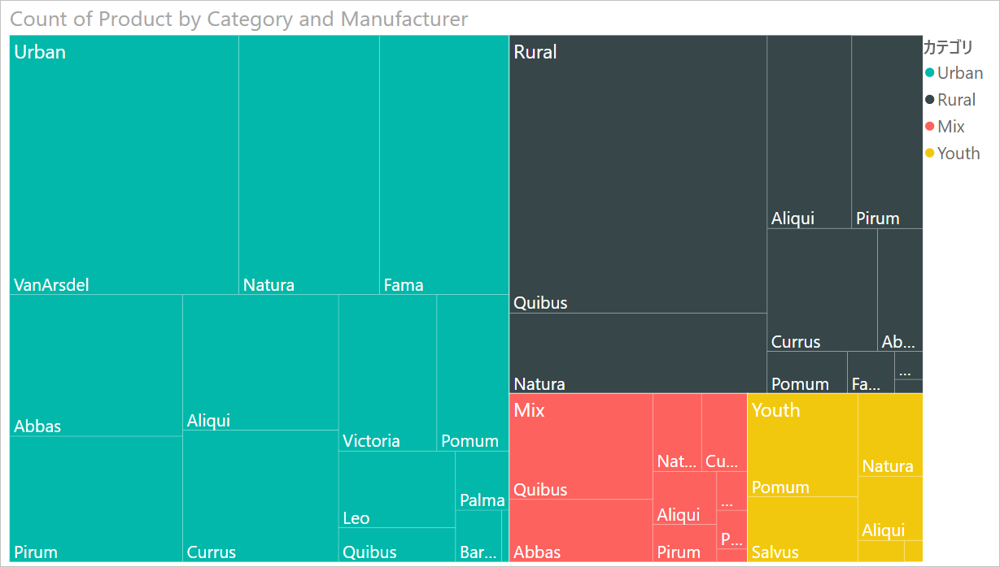
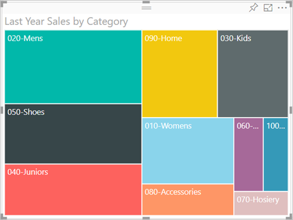
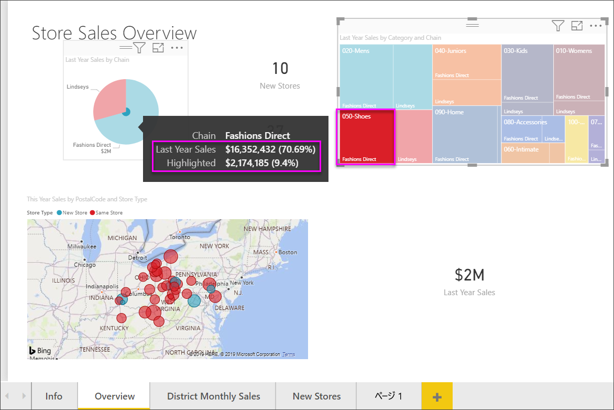

# Power BI のツリーマップ

[!INCLUDE[consumer-appliesto-nyyn](../includes/consumer-appliesto-nyyn.md)]

[!INCLUDE [power-bi-visuals-desktop-banner](../includes/power-bi-visuals-desktop-banner.md)]

ツリーマップでは、入れ子になった一連の四角形で階層データが表示されます。 階層の各レベルは、色付きの四角形 (ブランチ) で表され、ブランチには四角形 (リーフ) が含まれます。 Power BI では、各四角形内のスペースのサイズは測定値に基づいています。 各四角形は大きさの順に左上 (最大) から右下 (最小) に向かって配置されます。

たとえば、売上を分析する場合、衣料カテゴリに対して次の最上位レベル ブランチが存在することがあります: **Urban** (都市部向け)、**Rural** (地方向け)、**Youth** (若者向け)、**Mix** (組み合わせ)。 Power BI により、カテゴリ内の衣料メーカー用の製造メーカーについては、カテゴリ四角形をリーフに分割されます。 これらは売上数に基づいてサイズが決まり、網掛け表示されます。

上の **Urban** ブランチでは、**VanArsdel** の衣料の売上が多く、 **Natura** と **Fama** の売上はそれよりも少なく、 **Leo** の売上はわずかです。 そのため、このツリーマップの **Urban** ブランチは次のようになります。

* 左上隅にある **VanArsdel** の四角形が最も大きい。

* **Natura** と **Fama** の四角形はそれよりもやや小さい。

* 他のすべての衣料売上に関する多くの四角形がある。

* **Leo** の四角形は非常に小さい。

各リーフ ノードのサイズと網掛けの比較によって、その他の衣料カテゴリ全体の売上品目数を比較することができます。つまり、四角形が大きく網掛けが濃いほど、値は大きいことになります。

## ツリーマップを使用すべきケース

ツリーマップは、次のような場合に最適な選択肢です。

* 大量の階層データを表示する。

* 横棒グラフで多数の値を効果的に処理できない。

* 各部分と全体の間の割合を示す。

* 階層内のカテゴリの各レベルにわたってメジャーの分布のパターンを示す。

* サイズと色分けを使用して属性を示す。

* パターン、外れ値、最も重要な要因、および例外を見分ける。

## 前提条件

このチュートリアルでは、[小売の分析のサンプル PBIX ファイル](https://download.microsoft.com/download/9/6/D/96DDC2FF-2568-491D-AAFA-AFDD6F763AE3/Retail%20Analysis%20Sample%20PBIX.pbix)を使用します。

1. メニューバーの左上にある **[ファイル]**  >  **[開く]** を選択します。
   
2. **小売の分析のサンプル PBIX ファイル**を探します。

1. **小売の分析のサンプル PBIX ファイル**をレポート ビュー  で開きます。

1. 選択  を選択して、新しいページを追加します。

> [!NOTE]
> Power BI を使用する同僚とレポートを共有するには、それぞれのユーザーが個別の Power BI Pro ライセンスを持っているか、レポートが Premium 容量に保存されている必要があります。    

**小売りの分析のサンプル** データセットを取得したら、作業を開始できます。

## 基本的なツリーマップの作成

レポートを作成し、基本的なツリーマップを追加します。

1. **[フィールド]** ウィンドウで、 **[Sales]\(売上\)**  >  **[Last Year Sales]\(前年度の売上\)** を選択します。

   ![選択されている [Sales]\(売上\) > [Last Tear Sales]\(前年度の売上\) と、結果のビジュアルのスクリーンショット。](media/power-bi-visualization-treemaps/treemapfirstvalue-new.png)

1. ツリーマップ アイコン  を選択して、グラフをツリーマップに変換します。

   

1. **[品目]**  >  **[カテゴリ]** を選択します。これにより、 **[グループ]** ウェルに **[カテゴリ]** が追加されます。

    四角形のサイズが総売上高に基づき、色でカテゴリが表されるツリーマップが Power BI によって作成されます。 つまり、カテゴリ別の総売上高の相対的な大きさを視覚的に説明する階層が作成されます。 **[Mens]\(男性向け\)** カテゴリの売上高が最高で、 **[Hosiery]\(靴下・下着類\)** カテゴリの売上高が最低です。

    

1. **[ストア]**  >  **[チェーン]** を選択します。これにより、 **[詳細]** ウェルに **[チェーン]** が追加され、ツリーマップが完成します。 これで、前年の売上高をカテゴリおよびチェーン別に比較できます。

   ![[ストア] > [チェーン] が詳細に追加されたツリーマップのスクリーンショット。](media/power-bi-visualization-treemaps/power-bi-details.png)

   > [!NOTE]
   > [色の彩度] と [詳細] を同時に使用することはできません。

1. **[Chain]** (チェーン) エリアにポインターを合わせると、 **[カテゴリ]** のその部分のヒントが表示されます。

    たとえば、 **[090-Home]** の四角形内の **[Fashions Direct]** にポインターを合わせると、Home カテゴリの Fashion Direct の部分のツールヒントが表示されます。

   

## 強調表示とクロス フィルター処理

ツリーマップ内の **[カテゴリ]** または **[詳細]** を強調表示すると、レポート ページ上の他の視覚エフェクトがクロス強調表示またはクロスフィルター処理されます。 先に進むには、このレポート ページにいくつかのビジュアルを追加するか、このレポートの他のページのいずれかにツリーマップをコピーします。 次の図では、ツリーマップが**概要**ページにコピーされました。 

1. ツリーマップ上で、 **[カテゴリ]** 、または **[カテゴリ]** 内の **[チェーン]** のいずれかを選択します。 これにより、ページ上の他の視覚化がクロス強調表示されます。 たとえば、 **[050-Shoes]** を選択すると、前年の靴の売上高が **16,352,432 ドル**で、そのうち**ファッション ディレクター** アカウントの売上高が **2,174,185 ドル**であったことが示されます。

   

1. **[Last Year Sales by Chain]\(チェーン別の前年売上高\)** 円グラフで、 **[Fashions Direct]** スライスを選択し、ツリーマップをクロス フィルター処理します。
   

1. グラフ相互間のクロスフィルター処理とクロス強調表示を管理するには、「[Power BI レポート内でのビジュアルの相互作用を変更する](../create-reports/service-reports-visual-interactions.md)」を参照してください。

## 次の手順

* [Power BI のウォーターフォール図](power-bi-visualization-waterfall-charts.md)

* [Power BI での視覚化の種類](power-bi-visualization-types-for-reports-and-q-and-a.md)

