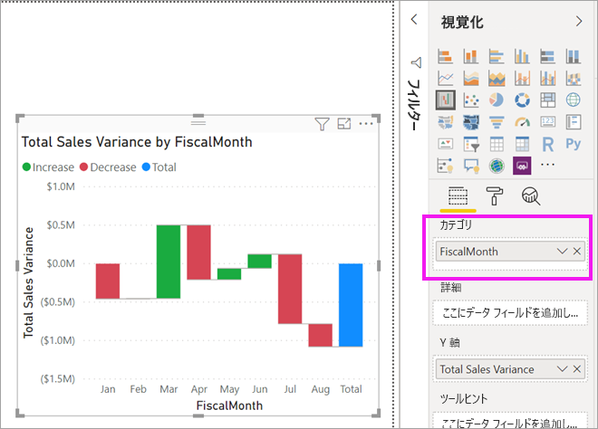

# Power BI のウォーターフォール図

[!INCLUDE[consumer-appliesto-nyyn](../includes/consumer-appliesto-nyyn.md)]

[!INCLUDE [power-bi-visuals-desktop-banner](../includes/power-bi-visuals-desktop-banner.md)]

ウォーターフォール図は、Power BI で値が加算または減算されるときの累計を示します。 一連の加算と減算の変化によって、初期値 (純利益など) が、どのように影響を受けるかを理解するために役立ちます。

各縦棒が色分けされるため、ひと目で増減を識別できます。 最初と最後の値の縦棒は、通常は[横軸を起点](https://support.office.com/article/Create-a-waterfall-chart-in-Office-2016-for-Windows-8de1ece4-ff21-4d37-acd7-546f5527f185#BKMK_Float "横軸を起点とする")としますが、中間値の縦棒は浮動縦棒です。 この形式から、ウォーターフォール図はブリッジ図と呼ばれることもあります。

## ウォーターフォール図を使用すべきケース

ウォーターフォール図は、次のような場合に最適な選択肢です。

* 時間、系列、またはさまざまなカテゴリにわたりメジャーに変化がある場合。

* 合計値に影響を与える大きな変化を監査する場合。

* 収益のさまざまな要因を示すことによって、会社の年間利益をプロットして、総利益 (または損) に到達するよう表示する場合。

* 会社のある年の年始と年末の社員数をグラフに示す場合。

* 毎月の収入と支出、および口座の現在の残高を視覚化する場合。

## 前提条件

このチュートリアルでは、[小売の分析のサンプル PBIX ファイル](https://download.microsoft.com/download/9/6/D/96DDC2FF-2568-491D-AAFA-AFDD6F763AE3/Retail%20Analysis%20Sample%20PBIX.pbix)を使用します。

1. メニューバーの左上にある **[ファイル]**  >  **[開く]** を選択します。
   
2. **小売の分析のサンプル PBIX ファイル**を探します。

1. **小売の分析のサンプル PBIX ファイル**をレポート ビュー  で開きます。

1. 選択  を選択して、新しいページを追加します。

> [!NOTE]
> Power BI を使用する同僚とレポートを共有するには、それぞれのユーザーが個別の Power BI Pro ライセンスを持っているか、レポートが Premium 容量に保存されている必要があります。    

## ウォーターフォール図の作成

ここでは、月別の売上差異 (予想売上高と実際の売上高の差異) を示すウォーターフォール図を作成します。

### ウォーターフォール図を作成する

1. **[フィールド]** ウィンドウで、 **[Sales]**  >  **[Total Sales Variance]** を選択します。

   ![[Sales] > [Total Sales Variance] が選択された状態および結果のビジュアルのスクリーンショット。](media/power-bi-visualization-waterfall-charts/power-bi-bar.png)

1. ウォーターフォール アイコン 

    

1. **[Time]**  >  **[FiscalMonth]** を選択して、 **[カテゴリ]** に追加します。

    

### ウォーターフォール図を並べ替える

1. Power BI でウォーターフォール図が月別の時系列で並べ替えられるようにします。 グラフの右上隅で、 **[その他のオプション]** (...) を選択します。

    この例の場合、 **[並べ替え]** を選択し、 **[FiscalMonth]** を選択します。 選択の横にある黄色のインジケーターによって、選択オプションが適用されていることが示されます。

    ![[並べ替え] > [FiscalMonth] の選択](media/power-bi-visualization-waterfall-charts/power-bi-sort-by-fiscalmonth.png)
    
    月を時系列で表示するには、 **[昇順で並べ替え]** を選択します。 前の手順と同様に、 **[昇順で並べ替え]** の左横に黄色のインジケーターがあることを確認します これは、選択したオプションが適用されていることを示します。

    ![[並べ替え] > [昇順] を選択](media/power-bi-visualization-waterfall-charts/power-bi-waterfall-ascending.png)

    

    FiscalMonth の 1 月から 8 月までグラフが並べ替えられることにご注目ください。  

### ウォーターフォール図をいろいろ試す

さらに調べると、月別の変化の要因がわかります。

1.  **[ストア]**  >  **[担当地域]** を選択します。これにより、 **[詳細]** バケットに **[担当地域]** が追加されます。

    ![[詳細] バケットでのストアの表示](media/power-bi-visualization-waterfall-charts/power-bi-waterfall-breakdown.png)

    Power BI では、視覚化にデータを追加する目的で **[詳細]** の値が使用されます。 会計月別の増減に寄与した上位 5 個の要素が追加されます。 つまり、たとえば、2 月の場合、データ ポイントが 1 つだけではなく、6 つ与えられます。  

    ![[詳細] バケットでのストアの表示](media/power-bi-visualization-waterfall-charts/power-bi-waterfall-breakdown-default.png)

    あなたが上位 2 個の要素にのみ関心があるとします。

1. **[書式]** ウィンドウで **[詳細]** を選択し、 **[最大ブレークダウン]** を **2** に設定します。

    ![[書式] > [詳細]](media/power-bi-visualization-waterfall-charts/power-bi-waterfall-breakdown-two.png)

    ウォーターフォール図をざっと見ると、オハイオ州とペンシルバニア州の地域が売上の増加と減少の両方に最も大きく貢献していることがわかります。

    

## 次の手順

* [Power BI レポート内でのビジュアルの相互作用を変更する](../service-reports-visual-interactions.md)

* [Power BI での視覚化の種類](power-bi-visualization-types-for-reports-and-q-and-a.md)
