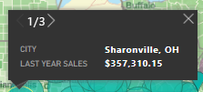

# Power BI での ArcGIS マップとの対話
このトピックは、Power BI サービス、Desktop、またはモバイルで ArcGIS マップを使用するユーザーを対象として書かれています。 デザイナーから ArcGIS Maps for Power BI ビジュアルを共有されると、そのビジュアルとはさまざまな方法でやりとりすることができます。  ArcGIS マップの作成の詳細については、[Esri の ArcGIS マップのチュートリアル](../visuals/power-bi-visualization-arcgis.md)をご覧ください。

ArcGIS マップと Power BI を組み合わせると、マッピングをマップ上のポイントの表現を越える、まったく新しいレベルに引き上げることができます。 レポート デザイナーは、マップから開始して、人口統計データのレイヤーをそのマップにアタッチします。 空間分析を使用してマップ上で場所に基づくデータのレイヤー (国勢調査データなど) を組み合わせることで、より深く理解できる視覚化されたデータを伝達できます。

> [!TIP]
> GIS は Geographic Information System (地理情報システム) の略です。
> 

この ArcGIS Maps for Power BI ビジュアルでは、昨年の売上が都市別に表示され、道路ベースのマップと平均世帯所得の参照レイヤーが使用されます。 マップには、2 つのピン (赤と黄) と 1 つのドライブ時間半径 (紫) が含まれています。

> [!TIP]
> 多くの例やユーザーの声を参照するには、[Esri のページを Power BI で](https://www.esri.com/powerbi)アクセスしてください。 その後、Esri の [ArcGIS Maps for Power BI の基本操作](https://doc.arcgis.com/en/maps-for-powerbi/get-started/about-maps-for-power-bi.htm)に関するページを参照してください。
> 
> 

## ユーザーの同意

仕事仲間から初めて ArcGIS マップを共有されると、Power BI に同意プロンプトが表示されます。 ArcGIS Maps for Power BI は Esri (https://www.esri.com) ) によって提供されており、ArcGIS Maps for Power BI の利用には Esri の使用条件およびプライバシー ポリシーが適用されます。 ArcGIS Maps for Power BI 視覚エフェクトの使用を希望する Power BI ユーザーは、同意ダイアログを受け入れる必要があります。

## レイヤーを理解する

ArcGIS Maps for Power BI ビジュアルには、人口統計の場所情報のさまざまな種類のレイヤーを含めることができます。

### ベース マップ

各 ArcGIS Maps for Power BI ビジュアルは、ベース マップから開始されます。 ベース マップは、データのキャンバスと考えることができます。 ベース マップは、暗いか明るい基本的なキャンバス、

 

、または道路や交通機関の詳細を含むキャンバスとなる場合があります。 

  

ベース マップはキャンバス全体に適用されます。パンとズームを行うと、マップが更新されます。 ズーム インすると、ますますより詳細な道路や交通に関する情報が表示されます。 大陸間でパンすると、詳細レベルは一定に保たれます。 ここでは、ポルトガルから北京にパンしました。

  

### 参照レイヤー

レポート "*デザイナー*" は、参照レイヤーを 1 つ追加できます。 参照レイヤーは、Esri によってホストされ、場所に関する人口統計情報の追加レイヤーを提供します。 次の例では、人口密度の参照レイヤーが使用されています。 色が濃いほど、密度が高くなります。

  

### インフォグラフィック

レポート "*デザイナー*" は、多くのインフォグラフィック レイヤーを追加できます。 インフォグラフィックは、視覚的なキャンバスの右側に表示される視覚的なクイック インジケーターです。 インフォグラフィックは、Esri によってホストされ、場所に関する人口統計情報の追加レイヤーを提供します。 次の例では、3 つのインフォグラフィックが適用されています。 それらは、マップ自体に表示されるのではなく、カード上に表示されます。 マップ上の領域をズーム、パン、および選択すると、インフォグラフィック カードが更新されます。

  

### ピン留め

ピンは市区町村や住所などの正確な場所を表します。 場合によって、レポート "*デザイナー*" は、ドライブ時間半径と一緒にピンを使用します。 この例では、ノースカロライナ州、シャーロットから半径 50 マイル以内にある店舗を示しています。

 

## ArcGIS Maps for Power BI ビジュアルとの対話
ご利用いただける機能は、レポートが共有された方法と、ご自分の Power BI アカウントの種類によって異なります。 質問がある場合は、システム管理者に確認してください。 ArcGIS Maps for Power BI ビジュアルは、レポート内の他のビジュアルと同様に動作します。 [視覚エフェクトの作成に使用されるデータの表示](../consumer/end-user-show-data.md)、[フォーカス モードと全画面表示モード](../consumer/end-user-focus.md)でのマップの表示、[コメントの追加](../consumer/end-user-comment.md)、レポート "*デザイナー*" によって設定された[フィルターとのやりとり](../consumer/end-user-report-filter.md)などを行うことができます。 ArcGIS ビジュアルでは、レポート ページ上の他のビジュアルをクロスフィルター処理したり、その逆のフィルター処理を行ったりすることができます。

ベース マップの場所 (たとえば、バブル) の上にマウス ポインターを置くと、ヒントが表示されます。 さらに、ArcGIS ビジュアル選択ツールを使用すると、追加のヒントを表示したり、ベース マップまたは参照レイヤー上で特定の選択を行ったりすることができます。  

### 選択ツール

ArcGIS Maps for Power BI では 5 つの選択モードを使用できます。 一度に最大 250 のデータ ポイントを選ぶことができます。

#### 単一選択ツール

 

参照レイヤーからデータ ポイント、バブル、ピン、または個々のデータ ポイントを選択します。 Power BI に、ご自分の選択内容の詳細を示すヒントが表示されます。 単一選択を行うと、選択内容に基づいてレポート ページ上の他のビジュアルがクロス フィルター処理され、選択した領域のインフォグラフィック カードが更新されます。 

ここでは、ベース マップから茶色のバブル データ ポイントを選択しました。 Power BI では、次のことが行われます。
- 選択内容を強調表示する。
- そのデータ ポイントのヒントを表示する。 
- インフォグラフィック カードを更新して、選択内容に対応するデータのみを表示する。
- 縦棒グラフをクロス強調表示する。

マップに参照レイヤーがある場合は、場所を選択するとヒントに詳細が表示されます。 ここでは、セネカ郡を選択しました。レポート "*デザイナー*" がマップに追加した参照レイヤー (人口密度) からのデータが表示されています。 この例では、データ ポイントに 2 つの異なる郡が含まれているため、ヒントには 2 つのページがあります。 各ページにグラフが含まれています。 グラフ上の棒を選択すると、追加の詳細が表示されます。 

> [!TIP]
  > 場合によっては、ズーム インして特定の場所を選択することで、ヒントのページ数を減らすことができます。  または、重複している場所がある場合は、Power BI により一度に複数のヒントが表示されることがあります。 ヒント間を移動するには、矢印を選びます。
  > 
  > 

#### 複数選択ツール

 

マップに四角形を描画し、含まれるデータ ポイントを選択します。 複数の四角形の領域を選ぶには、Ctrl キーを使います。 複数選択を行うと、選択した領域のインフォグラフィック カードが更新され、選択内容に基づいてレポート ページ上の他のビジュアルがクロス強調表示されます。

 

#### 参照レイヤー ツール

 

参照レイヤー内で境界または多角形を使用して、含まれるデータ ポイントを選択することができます。 見にくいですが、参照レイヤーには黄色の枠線があります。 単一選択ツールとは異なり、ヒントは表示されません。 代わりに、その枠線の境界内に含まれるデータ ポイントに関するデータが得られます。 この例では、選択内容にデータ ポイントが含まれています。ウィンストン セイラムにあるリンジー店舗に対応しています。

 

#### バッファー ツール

 

バッファー レイヤーを使用してデータ ポイントを選択できます。 たとえば、このツールを使用すると、ドライブ時間半径を選択し、引き続きレポートの残りの部分とやりとりすることができます。 ドライブ時間半径はアクティブのままであり、インフォグラフィック カードはドライブ時間半径を引き続き反映します。しかし、マップ上の他のデータ ポイントを選択すると、レポート ページ上の他のビジュアルがクロスフィルター処理されます。

 

#### 類似検索ツール

 

類似した属性を持つ場所を検索できます。 関心のある 1 つまたは複数のポイント (参照場所) を選択して、分析に使用する最大 5 つのディメンションを定義することから始めます。 ご自分で定義した参照場所に最も類似した 10 の場所がご利用のマップ上で、類似検索によって計算されます。 これにより、インフォグラフィック カードを使用して各結果の人口統計の詳細を調べたり、ドライブ時間領域を作成してこれらの各場所のドライブ距離内にあるものを把握したり、類似検索ツール自体を使用してご自分のレポートをフィルター処理してその他の分析情報を取得したりできます。 最も重要なのは、すべての計算はご利用のコンピューター上でローカルに実行されるため、機密データが確実に保護されるようにすることができるという点です。

## 考慮事項と制限事項
ArcGIS Maps for Power BI は、次のサービスとアプリケーションで使うことができます。

|サービス/アプリ  |使用できるかどうか  |
|---------|---------|
|Power BI Desktop     |     はい    |
|Power BI サービス (app.powerbi.com)     |    はい     |
|Power BI モバイル アプリケーション     |  はい      |
|Power BI Publish to Web     |  いいえ       |
|Power BI Embedded     |     いいえ    |
|Power BI サービスの埋め込み (PowerBI.com)  | いいえ |

## ArcGIS Maps for Power BI が連携するしくみ
ArcGIS Maps for Power BI は Esri (https://www.esri.com) によって提供されます。 Power BI の ArcGIS マップのご利用の際には、Esri の[使用条件](https://go.microsoft.com/fwlink/?LinkID=8263222)および[プライバシー ポリシー](https://go.microsoft.com/fwlink/?LinkID=826323)が適用されます。 Power BI の ArcGIS マップ ビジュアルの使用を希望される Power BI ユーザーは、同意ダイアログを受け入れる必要があります (詳細については「ユーザーの同意」をご覧ください)。  Esri の ArcGIS Maps for Power BI の使用には Esri の使用条件とプライバシー ポリシーが適用され、同意ダイアログからもリンクされています。 各ユーザーは、ArcGIS Maps for Power BI を初めて使う前に同意する必要があります。 ユーザーが同意すると、ビジュアルにバインドされたデータは少なくともジオコーディングのために Esri のサービスに送信され、マップで表すことができる緯度と経度の情報に場所情報が変換されます。 データの視覚エフェクトにバインドされているすべてのデータが Esri のサービスに送信されるものと想定する必要があります。 Esri は、基本マップ、空間分析、ジオコーディングなどのサービスを提供します。ArcGIS Maps for Power BI のビジュアルは、Esri によって提供および保持されている証明書によって保護された SSL 接続を使って、これらのサービスと対話します。 ArcGIS Maps for Power BI に関する追加情報は、Esri の [ArcGIS Maps for Power BI 製品ページ](https://www.esri.com/powerbi)から入手できます。

### Power BI Plus

ユーザーが ArcGIS Maps for Power BI を通じて Esri から提供されている Plus サブスクリプションにサインアップすると、ユーザーは Esri と直接的な関係を結ぶことになります。 Power BI は、Esri にユーザーの個人情報を送信しません。 ユーザーは、自分の AAD ID を使って、Esri 提供の AAD アプリケーションにサインインして信頼します。 これにより、ユーザーは Esri と直接個人情報を共有します。 ユーザーが Plus コンテンツを ArcGIS Maps for Power BI のビジュアルに追加した場合、それを表示または編集したい同僚も Esri からの Plus サブスクリプションが必要になります。 

Esri の ArcGIS Maps for Power BI の仕組みの技術的な詳細については、サポート サイトから Esri に問い合わせてください。

## 考慮事項とトラブルシューティング

**ArcGIS マップが表示されません。**     
ArcGIS Maps for Power BI を使うことができないサービスまたはアプリケーションでは、視覚エフェクトが Power BI のロゴを含む空のビジュアルとして表示されます。

**すべての情報がマップに表示されません**    
マップ上に緯度/経度をジオコーディングする際、最大 30,000 のデータ ポイントが表示されます。 郵便番号や住所などのデータ ポイントをジオコーディングする場合、ジオコード化されるのは最初の 15,000 データ ポイントのみです。 場所の名前または国のジオコード化は、1500 個の住所制限の対象には含まれません。

**Power BI の ArcGIS マップを使用する場合、料金はかかりますか。**

すべての Power BI ユーザーは追加コストなしで ArcGIS Map for Power BI を使うことができます。 これは **Esri** によって提供されるコンポーネントであり、ご利用の際には、この記事の前述のとおり、**Esri** が示す使用条件およびプライバシー ポリシーが適用されます。 ArcGIS **Plus** にサブスクライブすると、料金が発生します。

**キャッシュに空きがないというエラー メッセージが表示されます**

この動作は対処中のバグです。  それまでの間は、エラー メッセージに表示されるリンクを選んで、Power BI キャッシュをクリアする手順を参照してください。

**オフラインで自分の ArcGIS マップを表示できますか。**

いいえ、Power BI でマップを表示するには、ネットワーク接続が必要です。

## 次の手順
ヘルプの表示:**Esri** は、**Power BI の ArcGIS マップ**の機能セットに関する[包括的なドキュメント](https://go.microsoft.com/fwlink/?LinkID=828772)を提供します。

[**Power BI の ArcGIS マップ**](https://go.microsoft.com/fwlink/?LinkID=828771)に関する Power BI コミュニティ スレッドで、質問、最新情報の検索、問題の報告、および回答の検索を行うことができます。

[Power BI の ArcGIS マップ製品ページ](https://www.esri.com/powerbi)
