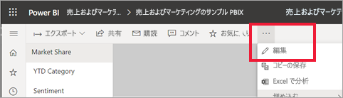
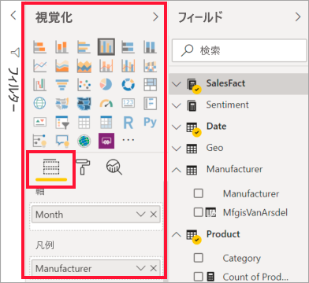
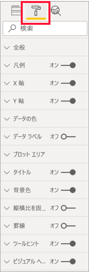
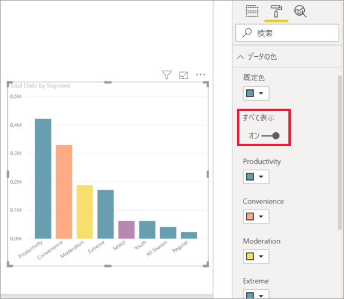
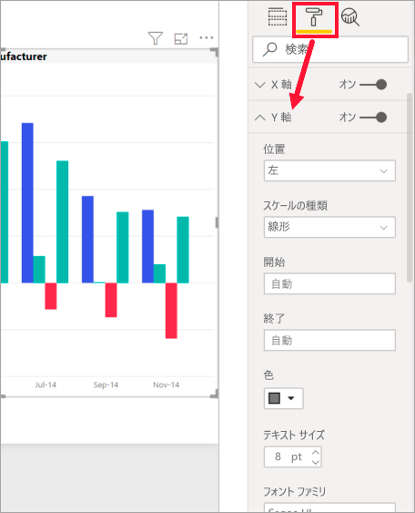
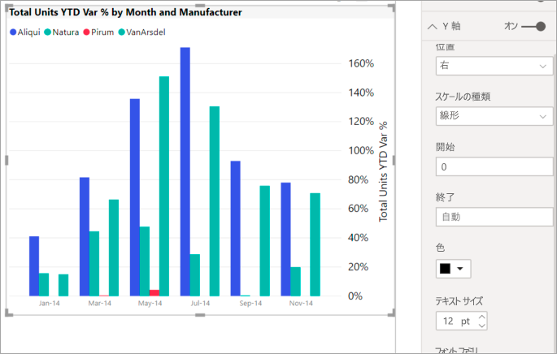
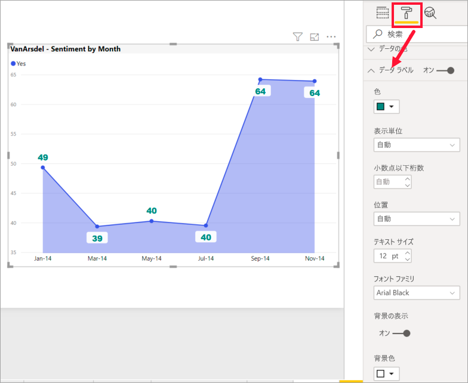

# 書式設定ウィンドウの概要

[!INCLUDE[consumer-appliesto-nyyn](../includes/consumer-appliesto-nyyn.md)]    

レポートに対する編集権限を持っている場合は、さまざまな書式設定オプションを使用できます。 Power BI レポートでは、データ系列、データ ポイント、そして視覚化の背景の色も変更できます。 X 軸と Y 軸の表示方法を変更できます。 視覚化、図形、およびタイトルのフォント プロパティの書式を設定することもできます。 Power BI では、レポートの表示方法を完全に制御できます。

開始するには、Power BI Desktop または Power BI サービスでレポートを開きます。 どちらも、ほぼ同じ書式設定オプションが提供されています。 Power BI サービスでレポートを開くときは、必ずメニュー バーから **[編集]** を選択してください。 

レポートを編集していて、視覚化が選択されている場合は、 **[視覚化]** ペインが表示されます。 視覚化を変更するには、このペインを使用します。 **[視覚化]** ペインのすぐ下には、 **[フィールド]** アイコン (横並びの縦棒)、 **[書式]** アイコン (ペイント ローラー)、 **[分析]** アイコン (虫眼鏡) という 3 つのアイコンがあります。 次の図では、アイコンの下に黄色のバーによって、 **[フィールド]** アイコンが選択されていることが示されています。

**[書式]** を選択すると、アイコンの下の領域に、現在選択されている視覚化に対して設定できるカスタマイズが表示されます。  

それぞれ視覚化のさまざまな要素をカスタマイズすることができます。 使用できるオプションは、選択したビジュアルによって変わります。 これらのオプションの一部を次に示します。

* 凡例
* X 軸
* Y 軸
* データの色
* データ ラベル
* 図形
* プロット エリア
* タイトル
* 背景
* 縦横比を固定する
* 罫線
* ヒント
* ビジュアル ヘッダー
* 図形
* 位置    
その他にも用途はあります。

> [!NOTE]
>  
> 視覚化のすべての種類でこれらすべての要素が表示されるわけではありません。 選択した視覚化によって、設定できるカスタマイズは異なります。たとえば、円グラフを選択すると、X 軸は表示されません。円グラフに X 軸がないためです。

また視覚化を何も選択しないと、アイコンの代わりに**フィルター**が表示されます。これにより、ページ上のすべての視覚化にフィルターを適用できます。

[書式設定] オプションの使用方法を学ぶ最善の方法は、試してみることです。いつでも変更を元に戻し、既定値に戻すことができます。 非常に多くのオプションが用意されており、常に新しいものが追加されています。 1 つの記事ですべての書式設定オプションを説明することはできません。 ただし、手始めに、その一部を見てみましょう。 

1. ビジュアルで使用される色を変更する   
2. スタイルを適用する    
3. 軸のプロパティを変更する    
4. データ ラベルを追加する    

## 色の扱い

視覚化の色をカスタマイズするために必要な手順を段階的に見てみましょう。

1. 視覚化を選んでアクティブにします。

2. ペイント ローラー アイコンを選択して、[書式設定] タブを開きます。[書式設定] タブには、選択したビジュアルで使用できるすべての書式設定要素が表示されます。

    ![[書式設定] ペイン タブが選択されたグラフ](media/service-getting-started-with-color-formatting-and-axis-properties/power-bi-formatting.png)

3. **[データの色]** を選択して、使用できるカスタマイズを展開します。  

    ![[書式設定] ペインが開き、[データの色] が展開されているグラフ](media/service-getting-started-with-color-formatting-and-axis-properties/power-bi-data-colors.png)

4. **[すべて表示]** を [オン] に変更し、列に別の色を選択します。

    

ここでは、色を操作する際に役立つヒントをいくつか紹介します。 次のリストにある番号は以下の画面にも示されていて、こうした役立つ要素にアクセスしたり変更したりできる場所を示しています。

1. 色が気に入りませんか。 問題ありません。 **[既定値に戻す]** を選択するだけで、選択箇所が既定の設定に戻ります。 

2. 色の変更が気に入りませんか。 **[データの色]** セクションの下部にある **[既定値に戻す]** を選択し、色を既定の設定に戻します。 

3. パレットにない色を使いたいですか? **[ユーザー設定の色]** を選択し、スペクトルからを選択します。  

   ![色パレットが開いている状態の [データの色] セクション](media/service-getting-started-with-color-formatting-and-axis-properties/power-bi-color-extras.png)

直前に行った変更が気に入りませんか? いつものように **CTRL + Z** を使用すると、元に戻すことができます。

## テーブルへのスタイルの適用
Power BI の一部の視覚化には、 **[スタイル]** オプションがあります。 1 回のクリックで、すべての書式設定オプションが一度に視覚化に適用されます。 

1. テーブルまたはマトリックスを選択してアクティブにします。   
1. [書式設定] タブを開き、 **[スタイル]** を選択します。

   ![[書式設定] タブからスタイルを選択する](media/service-getting-started-with-color-formatting-and-axis-properties/power-bi-style.png)

1. ドロップダウンからスタイルを選択します。 

   ![[太字ヘッダーの目立つ色の行] が適用された同じテーブル](media/service-getting-started-with-color-formatting-and-axis-properties/power-bi-style-flashy.png)

スタイルを適用した後も、その視覚化の色などのプロパティの書式設定を続けることができます。

## 軸のプロパティの変更

X 軸または Y 軸を変更すると役立つ場合がよくあります。 色を扱う場合と同様、次のイメージに示されているように、変更対象の軸の左にある下矢印を選択して軸を変更できます。  

次の例では、Y 軸を次のように書式設定しています。
- 視覚化の右側にラベルを移動する

- 開始値を 0 に変更する。

- ラベルのフォントの色を黒に変更する

- ラベルのフォント サイズを 12 に増やす

- Y 軸のタイトルを追加する

    

X 軸ラベルを完全に削除するには、 **[X 軸]** または **[Y 軸]** の横にあるラジオ ボタンを切り替えます。 また、 **[タイトル]** の横にあるラジオ ボタンを選択して、軸タイトルのオン/オフを切り替えることができます。  

## データ ラベルの追加    

独自の調査を始める前に、最後の書式設定の例を 1 つ紹介します。  面グラフにデータ ラベルを追加してみましょう。 

これは "*前の*" 画像です。 

また、"*後の*" 画像を次に示します。

視覚化を選択してアクティブにし、[書式設定] タブを開きました。 **[データ ラベル]** を選択し、[オン] にしました。 次に、フォントを 12 に増やし、フォント ファミリを Arial Black に変更し、 **[背景の表示]** を [オン] にして、背景色を 5% の透明度の白にしました。

これらは、使用できる書式設定タスクのほんの一部です。 編集モードでレポートを開き、[書式設定] ペインを操作して、見栄えのよい視覚化を作成してみてください。

## 次の手順
詳しくは、次の資料を参照してください。 

* [レポートの共有](../collaborate-share/service-share-reports.md)

* [Power BI における色の書式設定に関するヒントとコツ](service-tips-and-tricks-for-color-formatting.md)  
* [テーブルでの条件付き書式設定](../create-reports/desktop-conditional-table-formatting.md)

