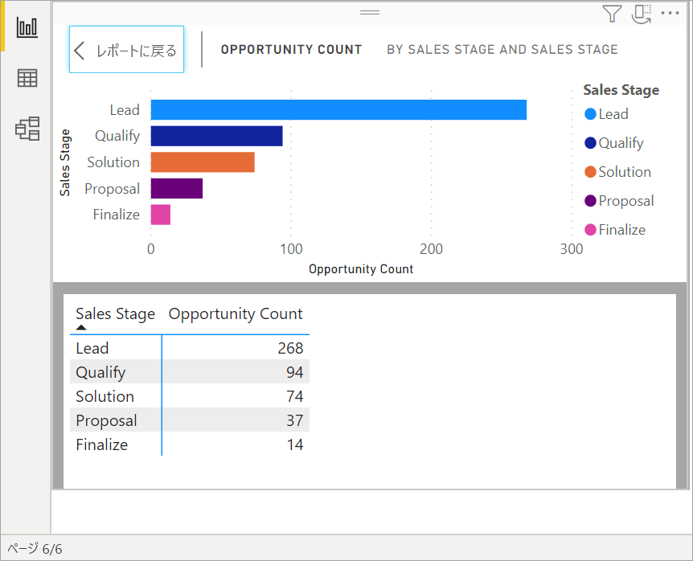
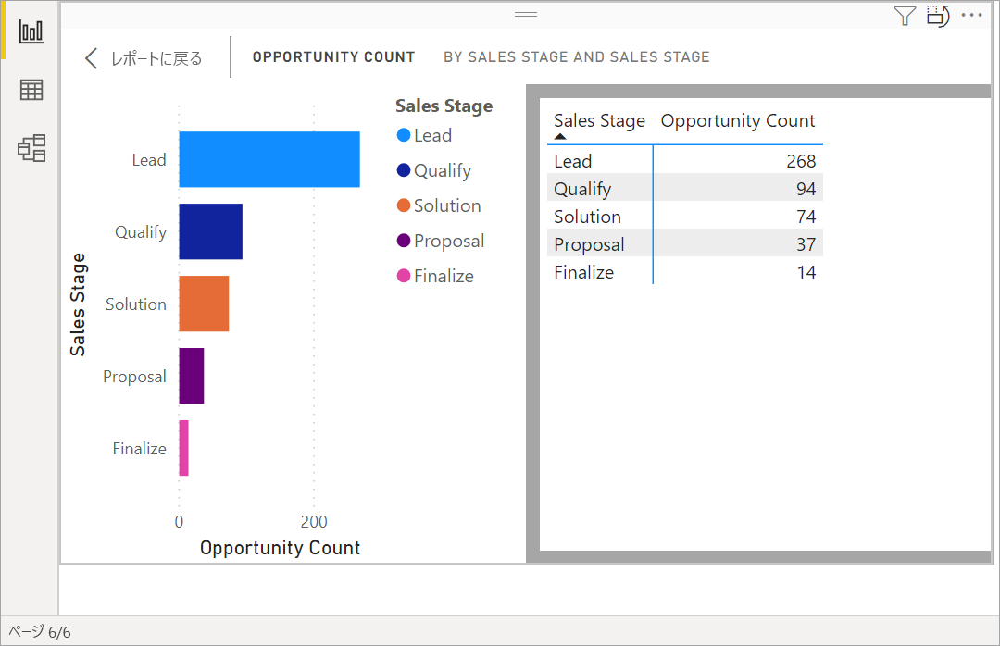
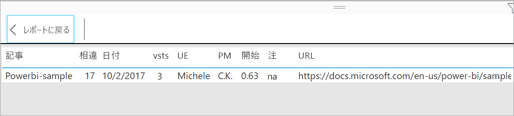

# 視覚エフェクトの基になるデータを表示する

[!INCLUDE[consumer-appliesto-yyyn](../includes/consumer-appliesto-nyyn.md)]    

## データの表示
Power BI のビジュアルは、データセットからのデータを使用して作成されます。 目に見えない部分を確認する場合は、ビジュアルの作成に使用されているデータを Power BI によって*表示*することができます。 **[データの表示]** を選択すると、ビジュアルの下 (または横に) データが表示されます。

また、ビジュアルの作成に使用されているデータを .xlsx ファイルまたは .csv ファイルとしてエクスポートして Excel で表示することもできます。 詳細については、「[Power BI ビジュアルからデータをエクスポートする](power-bi-visualization-export-data.md)」を参照してください。

> [!NOTE]
> [*データの表示*] と [*データのエクスポート*] は両方とも、Power BI サービスと Power BI Desktop で使用できます。 ただし、Power BI Desktop では、詳細を示すレイヤーが 1 つ追加されています。[[*レコードの表示*] にはデータセットからの実際の行が表示されます](../create-reports/desktop-see-data-see-records.md)。
> 
> 

## "*データの表示*" の使用 
1. Power BI Desktop でビジュアルを選択してアクティブにします。

2. **[その他の操作]** (...) を選択し、 **[データの表示]** を選択します。 
    ![[データの表示] の表示オプション](media/service-reports-show-data/power-bi-more-action.png)

3. 既定では、データはビジュアルの下に表示されます。
   
   

4. 方向を変更するには、ビジュアルの右上隅にある縦方向のレイアウト  を選択します。
   
   
5. データを .csv ファイルにエクスポートするには、省略記号を選択し、 **[データのエクスポート]** を選択します。
   
    ![[データのエクスポート] の選択](media/service-reports-show-data/power-bi-export-data-new.png)
   
    Excel へのデータのエクスポートの詳細については、「[Power BI ビジュアルからデータをエクスポートする](power-bi-visualization-export-data.md)」を参照してください。
6. データを非表示にするには、 **[探索]**  >  **[データの表示]** の選択を解除します。

## レコードの確認の使用
視覚エフェクト内の 1 つのデータ レコードに注目して、その背後にあるデータにドリルダウンできます。 

1. **[レコードの確認]** を使用するには、アクティブにするビジュアルを選択します。 

2. [デスクトップ] リボンで、 **[ビジュアル ツール]** のタブ >  **[データ/ドリル]**  >  **[レコードの確認]** の順に選択します。 

    ![[レコードの確認] が選択されているスクリーンショット。](media/service-reports-show-data/power-bi-see-record.png)

3. ビジュアルのデータ ポイントまたは行を選択します。 この例では、左から 4 つ目の列を選択しています。 Power BI によって、このデータ ポイントのデータセット レコードが表示されます。

    

4. **[レポートに戻る]** を選択して、Desktop のレポート キャンバスに戻ります。 

## 考慮事項とトラブルシューティング

- リボンで **[レコードの確認]** ボタンが無効になって淡色表示されている場合は、選択したビジュアルで [レコードの確認] がサポートされていないことを意味します。
- [レコードの確認] ビューでデータを変更してレポートに保存することはできません。
- 視覚化で多次元モデルの計算メジャーが使用されている場合、[レコードの確認] を使用することはできません。
- ライブ多次元 (MD) モデルに接続されている場合は、[レコードの確認] を使用できません。  

## 次の手順
[Power BI ビジュアルからデータをエクスポートする](power-bi-visualization-export-data.md)    

他にわからないことがある場合は、 [Power BI コミュニティを利用してください](https://community.powerbi.com/)。

