# Power BI における色の書式設定に関するヒントとコツ

[!INCLUDE[consumer-appliesto-nyyn](../includes/consumer-appliesto-nyyn.md)]    

Power BI は、ダッシュボードとレポートをカスタマイズするためのさまざまな方法を提供しています。 この記事では、Power BI の視覚化を、説得力のある興味をひくものにして、お客様のニーズに合わせてカスタマイズできる各種ヒントについて詳しく説明しています。

ヒントには次のものがあります。 優れた別のヒントをお持ちですか。 成功しました。 そのヒントを是非マイクロソフトまでお送りください。この一覧への追加を検討させていただきます。

* レポート全体にテーマを適用する
* 1 つのデータ ポイントの色を変更する
* 条件付き書式
* グラフの色を 1 つの数値に基づいて決める
* データ ポイントの色を 1 つのフィールドの値に基づいて決める
* カラー スケールで使用する色をカスタマイズする
* 左右逆方向のカラー スケールを使用する
* テーブルの行に色を追加する
* Power BI で元に戻す方法

変更を加えるには、レポートに対する編集アクセス許可が必要です。 Power BI Desktop の **[レポート]** ビューでレポートを開きます。 Power BI サービスでは、次の図に示すように、レポートを開いてメニュー バーから **[編集]** を選択することを意味します。

![[編集] メニューの場所](media/service-tips-and-tricks-for-color-formatting/power-bi-edit-report.png)

**[フィルター]** および **[視覚化]** ウィンドウがレポート キャンバスの右側に表示されたら、カスタマイズを開始できます。 ウィンドウが表示されない場合は、右上隅の矢印を選択してそれらを開きます。

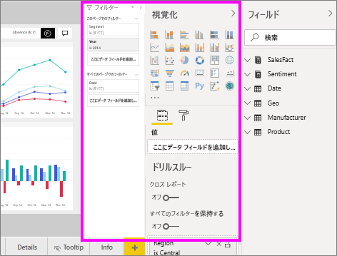

## テーマを適用する
レポートのテーマでは、コーポレート カラーを使用したり、アイコン セットを変更したり、ビジュアルの新しい既定の形式を適用したりなど、デザインの変更をお使いのレポート全体に適用できます。 レポートのテーマを適用すると、お使いのレポートのすべてのビジュアルで、ご自身が選択したテーマの色と書式設定が使用されます。 詳細については、[レポートのテーマの使用](../create-reports/desktop-report-themes.md)に関するページを参照してください。

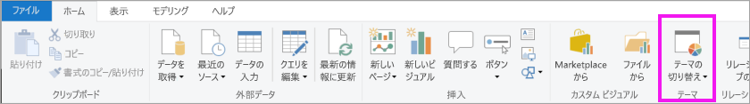

ここでは、売上とマーケティングのレポートに **[イノベーション]** のテーマが適用されています。

![適用されている [イノベーション] テーマ](media/service-tips-and-tricks-for-color-formatting/power-bi-theme-innovate.png)

## 1 つのデータ ポイントの色を変更する
特定の 1 つのデータ ポイントを強調表示したい場合があります。 新発売の製品の売上高や、新しい計画の開始後に向上した品質スコアなどがこれに当てはまります。 Power BI を使用すれば、特定のデータ ポイントの色を変更することで、それを強調表示できます。

次の視覚エフェクトでは、製品区分別に販売されたユニット数がランク付けされています。 

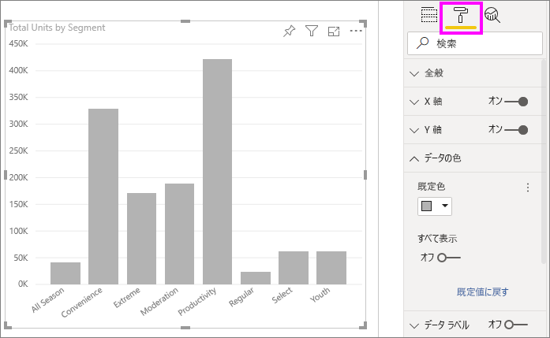

ここで、**Convenience** 区分を取り出して、この新しい区分のパフォーマンスを色を使用して示すものとします。 この手順を以下に示します。

**[データの色]** カードを展開し、 **[すべて表示]** のスライダーをオンにします。 これにより、視覚化内の各データ要素の色が表示されます。 これで、任意のデータ ポイントを変更できるようになります。

![[すべて表示] がオンになっている [書式] ペイン](media/service-tips-and-tricks-for-color-formatting/power-bi-show.png)

**Convenience** をオレンジ色に設定します。 

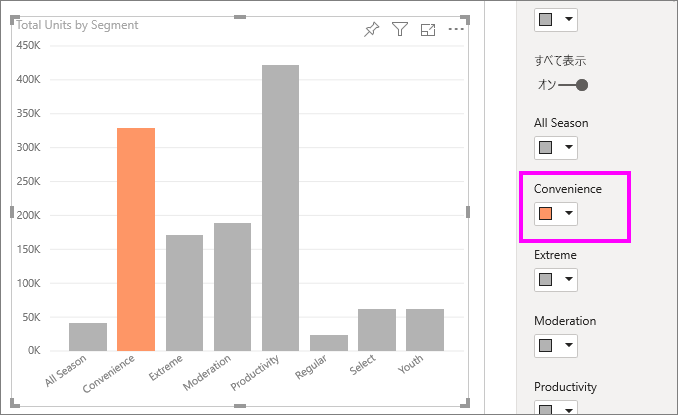

選択すると、**Convenience** のデータ ポイントがオレンジの網掛けになり、確実に目立ちます。

視覚化の種類を変更してから処理を終了した場合でも、Power BI では選んだ内容が記憶され、 **Convenience** をオレンジのままに保ちます。

視覚エフェクトの 1 つ、複数、またはすべてのデータ要素について、データ ポイントの色を変更できます。 おそらく、お使いのビジュアルにご自身のコーポレート カラーの黄色、緑、青を使用したいことでしょう。 

色を使用すると、さまざまなことを行えます。 次のセクションでは、条件付き書式を見ていきます。

## 視覚化の条件付き書式
フィールドの数値に基づいて視覚化の色が動的に設定されるようにするとよい場合がよくあります。 このようにすると、1 つのバーのサイズに使用された値とは異なる値を示して、1 つのグラフに 2 つの値を表示できます。 また、このような設定を使用して、特定の値の上 (または下) のデータ ポイントを強調表示することもできます (低い収益性の領域を強調表示するような場合)。

次のセクションでは、ある数値に基づいて色を決めるためのさまざまな方法を示します。

### データ ポイントの色を 1 つの値に基づいて決める
値に基づいて色を変更するには、アクティブにする視覚化を選択します。 ペイント ローラーのアイコンを選んで、[書式設定] ペインを開き、 **[データの色]** カードを開きます。 カードの上にマウス ポインターを置き、表示されている 3 つの縦向きドットを選択して、 **[条件付き書式設定]** を選択します。  

**[既定の色]** ウィンドウで、ドロップダウンを使って、条件付き書式に使用するフィールドを指定します。 この例では、 **[Sales fact]\(売上ファクト\)**  >  **[Total Units]\(合計ユニット数\)** フィールドの順に選択し、 **[最小値]** では明るい青色、 **[最大値]** では濃い青色を選びました。 

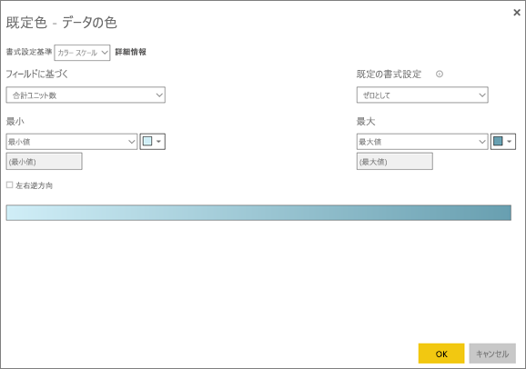

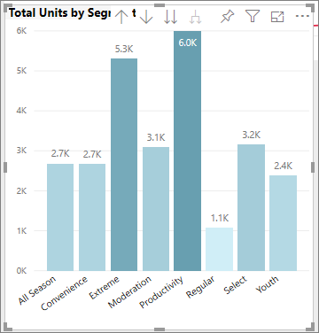

視覚化の一部ではないフィールドを使用して、視覚化の色の書式を設定することもできます。 次の図では、 **[市場シェア供給年度累計 %]** が使用されています。 

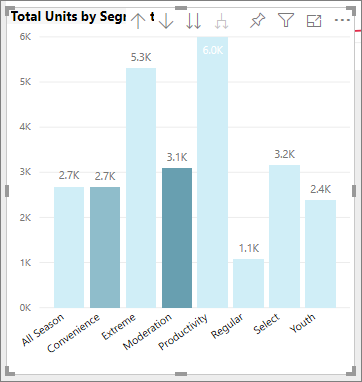

ご覧のように、販売されたユニット数では**生産性**と**エクストリーム**の方が多くなっていますが (棒が高い)、 **[市場シェア供給年度累計 %]** では**モデレーション**の方が多くなっています (色が濃い)。

### カラー スケールで使用する色をカスタマイズする
また、値をこれらの色にマップする方法を変更することもできます。 次の図では、 **[最小]** と **[最大]** の色がオレンジ色と緑に、それぞれ設定されています。

この最初の図で、横棒に示されたグラデーションがどのようにグラフの縦棒に反映されているかにご注目ください。つまり、最大値が緑、最小値がオレンジ色で、それらの間の各縦棒は、緑とオレンジ色の間のスペクトルの網掛けで色が設定されています。

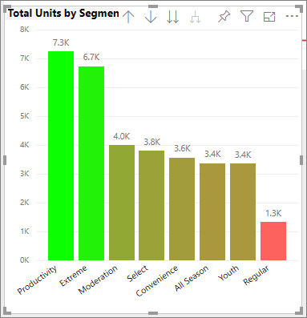

ここで、 **[最小]** と **[最大]** の値のボックスに数値を指定した場合にどうなるかを見てみましょう。 **[最小]** と **[最大]** の両ドロップダウン ボックスで **[カスタム]** を選択し、 **[最小]** を 3,500 に設定して、 **[最大]** を 6,000 に設定します。

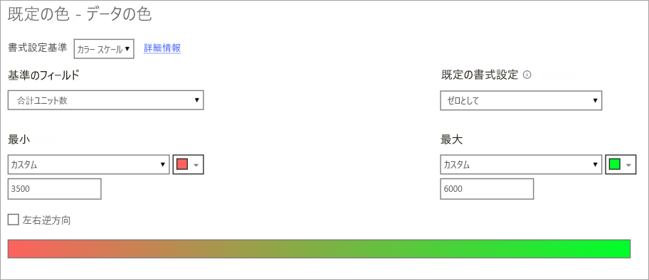

これらの値を設定すると、 **[最小]** よりも低いか、または **[最大]** よりも高いグラフの値には、グラデーションが適用されなくなります。つまり、 **[最大]** 値よりも高い値を持つすべての縦棒には緑、 **[最小]** 値よりも低い値を持つすべての縦棒には赤が設定されます。

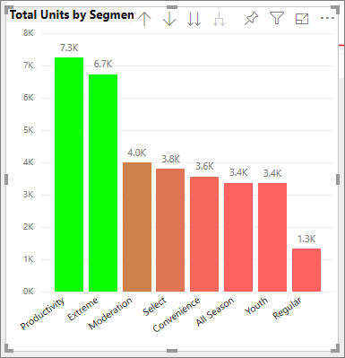

### 左右逆方向のカラー スケールを使用する
データに、もともと左右逆方向の尺度がある場合があります。 たとえば、温度の範囲には氷点に中央があり、収益性スコアには中間点 (ゼロ) があります。

左右逆方向のカラー スケールを使用するには、 **[左右逆方向]** のチェックボックスをオンにします。 **[左右逆方向]** がオンの場合、次の図に示すように、追加のカラー セレクター ( **[中央]** という) が表示されます。

![[カラー スケール] が選択された [既定の色] ダイアログ](media/service-tips-and-tricks-for-color-formatting/power-bi-diverging-colors.png)

**[左右逆方向]** スライダーがオンの場合、 **[最小]** 、 **[最大]** 、および **[中央]** の色を別々に設定することができます。 次の図では、 **[中央]** が **[市場シェア供給年度累計 %]** に対して 0.2 に設定されているため、値が 0.2 を上回る縦棒は緑のグラデーションの網かけ、0.2 を下回る縦棒は赤の網かけになります。

## テーブルの行に色を追加する
テーブルとマトリックスには、色の書式設定に関する多くのオプションが用意されています。 

テーブルまたはマトリックスに色を適用する最も簡単な方法の 1 つは、[書式設定] タブを開き、 **[スタイル]** を選択することです。  次の図では、 **[太字ヘッダーの目立つ色の行]** を選択しています。

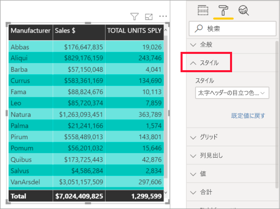

他の色の書式設定オプションを試してみてください。 この図では、 **[列ヘッダー]** の背景色を変更し、 **[値]** (行) の **[背景色]** と **[代替の背景色]** の両方を変更しました。

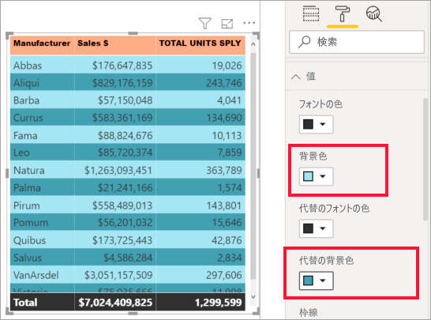

## Power BI で元に戻す方法
他の多くの Microsoft のサービスやソフトウェアと同様に、Power BI には、最後のコマンドを元に戻すための簡単な方法が備わっています。 たとえば、データ ポイントの色または一連のデータ ポイントを変更した場合に、それらが視覚化に表示されるときの色が好みでない場合があります。 そして、前にどの色だったか正確には思い出せないけれども、その色に戻したいことがあります。

ご自身の直前の操作は、単に CTRL + Z と入力し**元に戻す**ことができます。

[書式設定] カードに対して行ったすべての変更を破棄するには、 **[既定値に戻す]** を選択します。

![下部に [既定値に戻す] が表示されている [書式設定] カード](media/service-tips-and-tricks-for-color-formatting/power-bi-revert.png)

## フィードバック
共有したいヒントがありますか? そのヒントを是非マイクロソフトまでお送りください。このページに記載することを検討させていただきます。

## 次の手順
[色の書式設定と軸のプロパティの概要](service-getting-started-with-color-formatting-and-axis-properties.md)

[レポートの共有](../collaborate-share/service-share-reports.md)。

